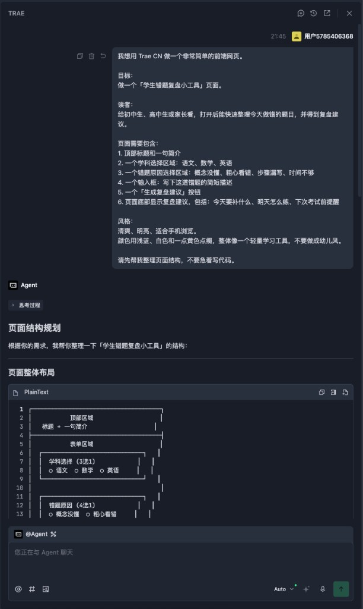
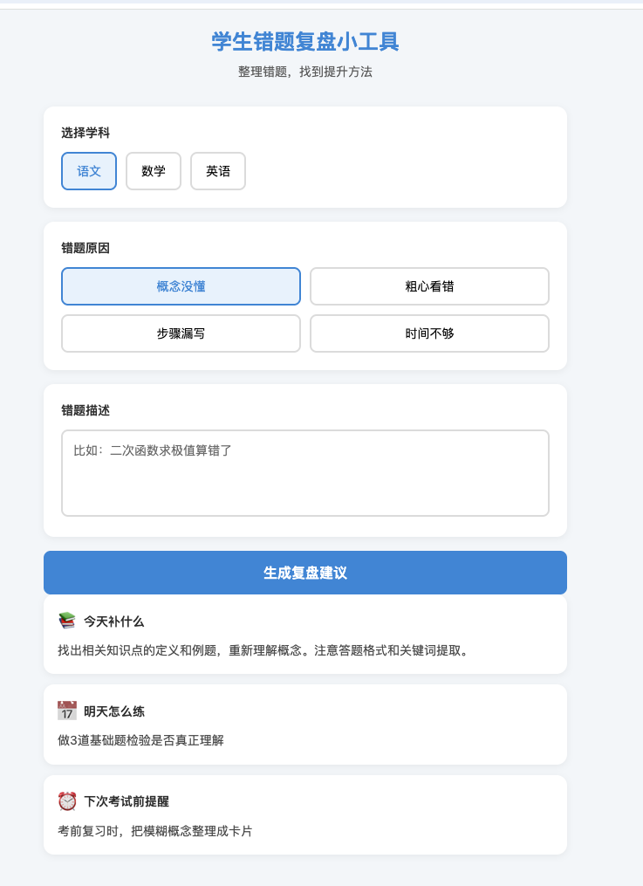

# Trae CN 目前免费：普通人 10 分钟做出网页


> 零成本 · 跟着做就能出页面
>
> 关注 AI技趣星球，一起用技术创造乐趣。

前面几篇，我们已经聊过 AI 能做什么，也把大模型、提示词、Agent 这些名词翻成了人话。

但很多朋友看到这里，还是会卡在一个问题：

> 「我知道 Agent 是会自己干活的 AI 了，可我到底该打开哪个软件试？」

今天就从一个免费、中文友好、适合新手体验的工具开始：**Trae CN**。

**一句话结论：Trae CN 可以理解成一个带 AI 助手的编程软件。目前国内个人版可以免费用，海外版已经有付费订阅。对普通人来说，它是接触 Agent IDE 最省事的第一站。**

上手难度：⭐⭐  
需要安装一个软件，跟着提示词试一次，大概 10 到 20 分钟能跑完。

> 先说清楚：
>
> 价格和权益可能会变。本文写作时，Trae CN 个人版显示免费，企业版收费；海外版已有 Pro 等付费订阅。你实际使用前，以官网页面为准。

下面文章里的几张图，都是按本文 Prompt 实际操作出来的截图。

你可以先快速扫一眼：先看 Trae 怎么理解需求，再看第一次生成的页面，最后看继续美化后的效果。

---

## 先说人话：Trae CN 像一个会写代码的装修队

如果你想做一个小网页，传统流程大概是这样：

```text
学 HTML
  → 学 CSS
  → 学 JavaScript
  → 装开发工具
  → 自己写代码
  → 出错了自己查
```

这对普通人不太友好。

Trae CN 的感觉更像是：

```text
你说清楚想要什么
  → AI 帮你拆任务
  → AI 写代码
  → AI 修改文件
  → 你看效果
  → 不满意继续提要求
```

你可以把它想成一个会写代码的装修队。

你不需要自己会砌墙、铺地板、接电线。

但你要说清楚：房间做什么用、想要什么风格、哪些东西必须有。

做网页也是一样。

你不是在背代码。

你是在练习把需求说清楚。

---

## Trae CN 是什么？和普通聊天 AI 有什么区别

Trae CN 是一个 AI 编程工具，也可以叫 AI IDE。

IDE 这个词不用怕。

你可以先理解成「写代码用的软件」。

普通聊天 AI 像微信里的朋友。

你问它一句，它回你一段。

但 Trae CN 更进一步。

它可以直接看到你的项目文件，帮你创建文件、改代码、解释报错。

| 你要做的事 | 普通聊天 AI | Trae CN |
|------------|-------------|---------|
| 生成一段代码 | 可以 | 可以 |
| 直接创建网页文件 | 不方便 | 可以 |
| 根据项目继续修改 | 需要你复制粘贴 | 更顺手 |
| 运行后看哪里报错 | 你要把报错贴给它 | 可以围绕项目继续处理 |

所以它更接近我们前面说的 Agent：

> 你给目标，它自己分几步去完成。

当然，别把它想成万能按钮。

现在最适合新手用它做的，是小网页、小工具、学习项目、代码练习。

真正复杂的商业系统，还是需要懂产品、测试和发布。

---

## 为什么值得试 Trae CN？

Trae CN 背后是字节跳动——就是抖音、剪映、飞书那家公司。

它一向擅长做「普通人也能打开就用」的产品。

Trae CN 可以理解为同一条路：把偏专业的写代码，变成你和 AI 助手一起协作。

对我们这个系列来说，重点就一件事：**今天能不能打开软件，做出一点看得见的东西。**

更现实一点说，它适合当你的第一把钥匙。

因为后面还有更进阶的工具。

比如 Claude Code、一些命令行 Agent、MCP 工具链。

这些工具很强，但新手第一次用会遇到很多前置步骤：

```text
安装 Node.js
  → 配终端环境
  → 配命令行工具
  → 配账号和 Key
  → 处理报错
```

如果你一上来就卡在这些地方，很容易还没体验到 AI 的威力，就先被安装过程劝退。

Trae CN 的好处是：先把 Agent IDE 装起来。

等你以后想用 Claude Code 这类进阶工具，也可以让 Trae 帮你一步步检查环境、解释报错、生成安装命令。

所以我的建议很简单：

> 先装一个 Trae CN，先做出一个小东西。
>
> 不要一开始就把自己扔进复杂工具链里。

可以先这样理解这条路线：

| 阶段 | 适合工具 | 你要做什么 |
|------|----------|------------|
| 第一次体验 Agent IDE | Trae CN | 安装软件，写 Prompt，生成一个小页面 |
| 进一步做真实项目 | Trae CN + 项目文件 | 让 AI 帮你改页面、解释报错、整理代码 |
| 更进阶的自动化开发 | Claude Code 等命令行工具 | 需要装环境、配命令行、理解更多开发概念 |

所以本文不是说 Trae CN 是唯一选择。

而是说：**如果你刚开始接触 Agent IDE，它目前是最适合先上手的一种方式。**

---

## 第一步：安装和打开 Trae CN

打开官网下载：[https://www.trae.cn/](https://www.trae.cn/)

更详细的安装说明可以看官方文档：[快速入门](https://www.volcengine.com/docs/86677/2227856)

安装过程和普通软件差不多。

大致就是：

```text
打开官网
  → 下载 Trae CN
  → 安装
  → 用手机号登录账号
  → 新建或打开一个文件夹
```

建议你第一次不要打开一堆旧项目。

新建一个空文件夹就行。

比如叫：

```text
my-first-trae-page
```

这样 AI 改什么文件，你一眼就能看明白。

> 新手规则：第一次只做一个小页面，不要一上来做 App、商城、后台系统。

---

## 第二步：先用对话区讲清楚需求

打开 Trae CN 后，你会看到 AI 对话区域（有的版本入口叫「对话」或 Chat，都是同一个意思）。

你可以先不要急着让它写代码。

先让它帮你确认需求。

你可以复制这段：

```text
我想用 Trae CN 做一个非常简单的前端网页。

目标：
做一个「学生错题复盘小工具」页面。

读者：
给初中生、高中生或家长看，打开后能快速整理今天做错的题目，并得到复盘建议。

页面需要包含：
1. 顶部标题和一句简介
2. 一个学科选择区域：语文、数学、英语
3. 一个错题原因选择区域：概念没懂、粗心看错、步骤漏写、时间不够
4. 一个输入框：写下这道错题的简短描述
5. 一个「生成复盘建议」按钮
6. 页面底部显示复盘建议，包括：今天要补什么、明天怎么练、下次考试前提醒

风格：
清爽、明亮、适合手机浏览。
颜色用浅蓝、白色和一点黄色点缀，整体像一个轻量学习工具，不要做成幼儿风。

请先帮我整理页面结构，不要急着写代码。
```

这一步很重要。

因为很多人用 AI 写代码，一上来就说：

```text
帮我做个网页。
```

这太模糊。

AI 不知道你要做给谁看，也不知道页面上该有什么。

先让它整理结构，相当于先画草图。

我按上面那段 Prompt 发出去后，Trae CN 会先给出页面结构规划（还不会立刻写代码）。

这是第一张真实操作截图：



你能看到：它没有直接莽着写代码，而是先把需求拆成「顶部 / 表单 / 按钮 / 结果区」，还附带了一个线框图。

确认结构没问题，再进入下一步写代码。

---

## 第三步：再让 Trae CN 生成页面

等它把结构说清楚后，你再发第二段：

```text
现在请根据上面的结构，帮我生成一个可直接打开的前端页面。

要求：
1. 使用 HTML、CSS、JavaScript 写在同一个 index.html 文件里
2. 页面适配手机和电脑
3. 学科和错题原因可以点击选择，并有选中状态
4. 点击「生成复盘建议」按钮后，在页面底部根据选择内容显示建议
5. 代码要尽量简单，适合新手看懂

请直接创建或修改项目里的 index.html 文件。
```

这段提示词里有几个关键点：

| 写法 | 为什么有用 |
|------|------------|
| `同一个 index.html 文件` | 新手最容易打开 |
| `适配手机和电脑` | 避免只在电脑上好看 |
| `点击按钮后显示结果` | 让页面不只是静态海报 |
| `适合新手看懂` | 让 AI 少写复杂代码 |

生成完成后，你可以在文件列表里找到 `index.html`。

如果 Trae CN 提供预览或运行按钮，就直接点。

如果没有，也可以在电脑上用浏览器打开这个 HTML 文件。

> 不同版本的 Trae CN，界面上的入口名字可能略有差别（比如叫「对话」「Chat」「智能体」）。不用纠结名字，流程一样：先聊清楚结构，再让它写 `index.html`。

---

## 第一次生成：能用了，但还可以更好看

按第二段 Prompt 生成并打开 `index.html` 后，**第一次**效果通常是这样。

功能已经齐全，但样式还比较朴素：



页面上已经有：

- 顶部标题和简介
- 学科选择（语文、数学、英语）
- 错题原因选择
- 错题描述输入框
- 点击「生成复盘建议」后的底部建议

到这一步，说明 **Agent 流程已经跑通**：你说需求，它改文件，浏览器能打开。

别急着追求完美。先确认能点、能出结果，再像改稿一样慢慢美化。

---

## 不满意怎么办？继续像改稿一样改

第一次生成的页面，不一定完美。

这很正常。

你不要急着重开。

直接让 Trae CN 修改。

比如：

```text
请继续修改这个页面：

1. 顶部标题太普通，请改得更像一个学习效率工具
2. 学科按钮和错题原因按钮之间的间距再大一点
3. 按钮颜色改成更明显的蓝色
4. 手机屏幕下按钮自动换行，不要挤在一行
5. 页面底部增加一句「复盘建议仅供学习参考，真正掌握还需要自己重新做一遍」

只修改现有 index.html，不要新建其他文件。
```

还想再好看一点？可以再发一段，专门要「视觉效果」：

```text
请继续美化这个页面，让整体更美观、更像学习工具：

1. 学科和错题原因选项增加图标或 emoji，选中状态更明显
2. 按钮和卡片用清爽渐变，层次更清楚
3. 生成复盘建议按钮更醒目
4. 保持适合手机浏览，不要加复杂动画
5. 页面底部保留「复盘建议仅供学习参考」的提醒

只修改现有 index.html，不要新建其他文件。
```

我按上面两段改稿 Prompt 迭代后，页面会变成这样。

你会发现：图标、渐变、选中态都更清晰，已经有点像一个轻量学习工具了。


你看，这就像让同事改稿。

第一次先出初稿（能用的页面）。

第二次改布局、间距、颜色。

第三次专门要「更好看」。

AI 写代码并不神秘。

它只是把「改稿」这件事，扩展到了网页和软件里。

一句话：**你说一段需求，真的能变成一个能打开的页面；不满意就继续说一句。**

---

## 新手最容易踩的 4 个坑

**第一，目标太大。**

不要一上来做「小红书同款 App」「完整电商网站」「自动赚钱系统」。

先做一页网页。

**第二，需求太虚。**

「高级一点」「好看一点」「像大厂一样」都不够清楚。

你最好说：颜色、内容、按钮、布局、适合手机还是电脑。

**第三，不看效果就继续加功能。**

每生成一次，先打开看。

看完再改。

**第四，把 AI 当成不会出错的专家。**

AI 可能写出看似能用、实际有问题的代码。

所以新手练习项目没问题。

涉及钱、账号、隐私数据，就要格外谨慎。

错题复盘这种页面如果以后要「保存记录」，也别一上来就让 AI 接真实学生姓名、学校等隐私信息。

---

## 一个更稳的 Prompt 模板

以后你想让 Trae CN 做小页面，可以套这个模板：

```text
我想做一个【页面主题】。

目标读者：
【谁会打开这个页面】

页面目的：
【打开后希望他做什么】

页面内容：
1. 【模块一】
2. 【模块二】
3. 【模块三】

交互：
【有没有按钮、筛选、输入框、点击效果】

风格：
【清爽 / 专业 / 可爱 / 科技感 / 适合手机】

技术要求：
请用 HTML、CSS、JavaScript 写成一个 index.html。
代码尽量简单，适合新手看懂。
请直接创建或修改当前项目文件。
```

你不需要把技术词背得很熟。

先把方括号里的内容换成自己的需求。

这就够你开始了。

---

## 今天的小结

今天只需要记住 5 件事：

- Trae CN 是一个 AI 编程工具，适合体验入门级 Agent IDE。
- 目前 Trae CN 国内个人版可以免费体验，海外版已有付费订阅。
- 它和普通聊天 AI 的区别，是能围绕项目文件帮你做事。
- 第一次练习不要贪大，做一个 `index.html` 小网页最稳。
- Prompt 要写清楚目标读者、页面内容、交互和风格。

下一步你可以直接照着本文的 Prompt，在 Trae CN 里生成「学生错题复盘小工具」页面。

如果生成出来不好看，不要觉得失败。

继续发一句：

```text
请根据当前页面继续改进，让它更适合手机阅读，视觉更清爽，按钮更明显，但不要增加复杂功能。
```

这就是普通人接触 Agent 最好的方式：

不用先学一堆术语。

先让它帮你做出一个看得见的小东西。

等这个小东西跑通了，再去研究 Claude Code、命令行工具、自动化工作流，就不会那么慌。

**先装一个 Trae CN，开启你的 AI Agent IDE 之旅。**
