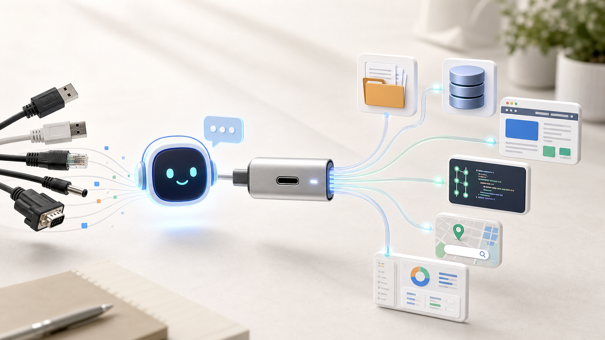
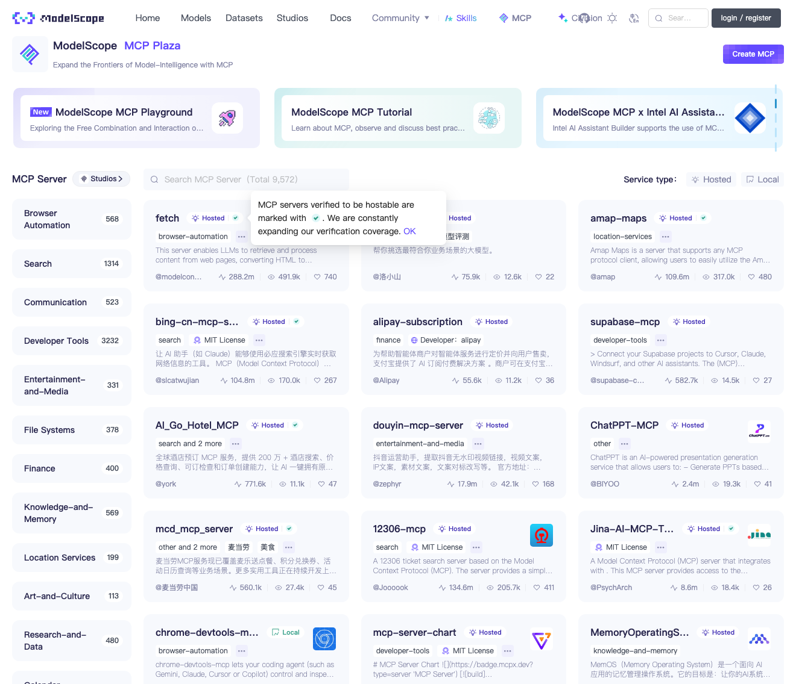
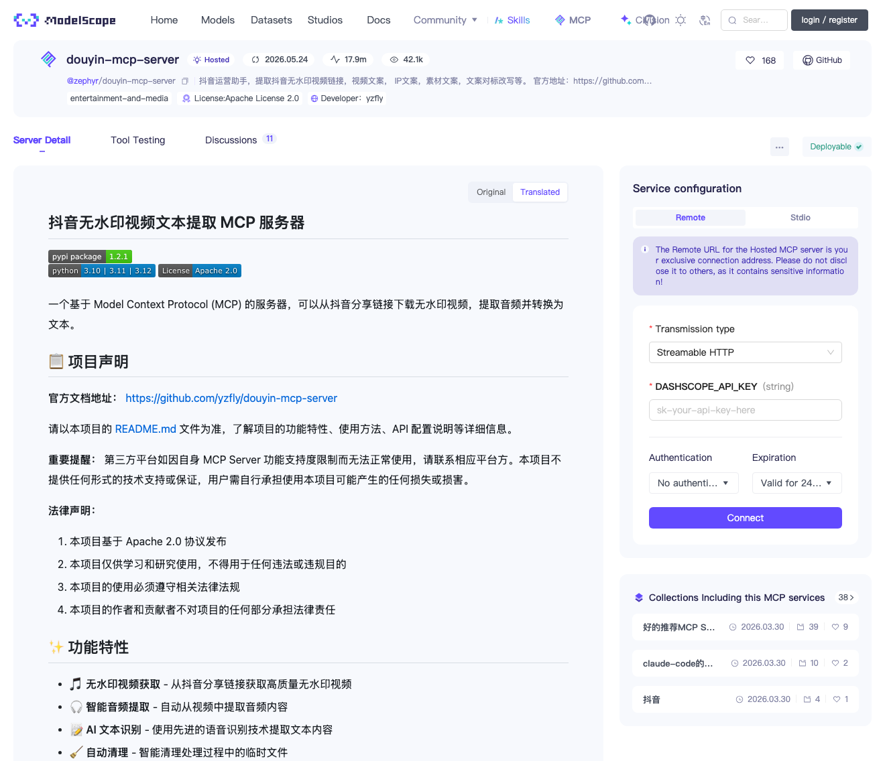

# MCP：就是我们日常使用的 Type-C 接口

> 从概念到实操，手把手带你接上第一个 MCP 工具
>
> 技趣星球 · 用技术创造乐趣。



你有没有遇到过这种尴尬——

想让 AI 帮你读个本地文件？不行。
想让 AI 查一下你的数据库？也不行。
想让 AI 直接翻翻 GitHub 上的代码？还是不行。

每次只能复制粘贴，贴到一半上下文满了，再删了重来。

我第一次真正觉得 MCP 有用，是在做页面开发的时候。

以前拿到 Figma 设计稿，流程大概是这样：

```text
打开设计稿
 → 截图
 → 手动看字号、间距、颜色
 → 把页面结构描述给 AI
 → AI 写代码
 → 你再一点点对齐
```

接上 Figma MCP 之后，感觉就不一样了。

AI 可以读取设计稿里的页面结构、图层信息、颜色和尺寸，再结合项目代码，辅助你生成页面代码。

你不再是在给 AI 口述设计稿。

你是在把设计稿这根“线”，直接插进 AI 的工具箱里。

类似的场景还有很多：

| 场景 | 以前怎么做 | 接上 MCP 后 |
|------|------------|-------------|
| 做页面开发 | 截图、量尺寸、反复描述 | AI 读取设计稿，再生成页面代码 |
| 总结本地资料 | 手动复制文件内容 | AI 直接读指定文件夹 |
| 查业务数据 | 自己写 SQL 或找同事查 | AI 调只读查询工具拿结果 |
| 看内容平台页面 | 自己截图、自己整理 | AI 对有权访问的页面做截图、摘要和信息提取 |
| 做发布前检查 | 手动打开页面逐项看 | AI 帮你检查标题、封面、文案和页面信息 |

比如你现在在 ModelScope 上看到的 [douyin-mcp-server](https://modelscope.cn/mcp/servers/zephyr/douyin-mcp-server)，就属于内容平台相关的 MCP 工具。



你可以把它理解成：

```text
让 AI 打开一个你有权访问的内容页面，
帮你截图、读取页面信息，
再把标题、作者、发布时间、页面结构、文案重点整理出来。
```



它适合被理解成“帮 AI 看懂页面和整理信息”的工具。

不是“帮你搬运别人内容”的工具。

但这里要先说清楚：

> 能截图，不代表能随便搬运；能读取，不代表能绕过平台规则。

特别是抖音、小红书、B 站这类内容平台，涉及作者版权、肖像、评论隐私、平台服务条款。

你可以用它做个人学习、页面理解、自己账号内容归档、发布前检查。

不要用它批量抓取、搬运别人的内容、绕过登录限制，或者把别人视频/图片二次发布成自己的素材。

这就是为什么最近 Cursor、Claude Desktop、VS Code、Cherry Studio 全都在讲一个词：**MCP**。

别被名字吓到。一句话：**MCP 就是 AI 调用外部工具的「Type-C 接口」。以前每个工具都要单独接线，有了它，一套接口全搞定。**

上手难度：⭐⭐⭐ 
只用现成 MCP 服务，难度不高；自己写 MCP Server，需要一点编程基础。

---

## 1. MCP 是什么：一个比喻讲清楚

AI 很聪明，会思考、会写字、会拆任务。

但如果没有手和脚，它就只能在你跟它聊天那个框里打转。

比如你想让 AI：读文件、查数据库、搜网页、操作浏览器、访问 GitHub……

光靠聊天窗口是不行的。

以前的解决办法是：每个工具单独给 AI 接一根线。

这就好比你家里以前那堆数据线——老安卓一根、相机一根、MP3 一根、硬盘又是一根。每次出门都在纠结"这根到底是干嘛的"。

后来 Type-C 出来了。不是说所有设备内部都一样，而是大家尽量用同一种接口连接。出门只带一根线，省心。

**MCP 就是这个思路在 AI 世界里的翻版。**

全名 Model Context Protocol（模型上下文协议），说白了就干一件事：规定 AI 客户端和外部工具之间怎么"说话"。

数据流长这样：

```text
AI 客户端 → MCP Server → 文件 / 数据库 / 浏览器 / 搜索 / 内部系统
```

三个角色，其实就对应一句话：

| 角色 | 人话解释 | 例子 |
|------|----------|------|
| MCP Host | 你用的 AI 应用 | Claude Desktop、Cursor、VS Code、Cherry Studio |
| MCP Client | Host 里负责连接的那个模块 | AI 应用内置 |
| MCP Server | 真正干活的工具服务 | 文件系统、GitHub、数据库、浏览器 |

不用背术语。记住这句就够了：

> MCP Server 把工具能力递给 AI，AI 客户端接进来用。

接下来，咱们从普通人视角讲到开发者视角，没写过代码的能看懂大概，写代码的能看懂数据怎么流。

---

## 2. MCP 怎么来的：从复制粘贴到统一接口

MCP 不是某个天才一拍脑袋想出来的。

它是 AI 从「会聊天」走向「会干活」的过程中，自然长出来的。

### 2.1 早期：AI 主要靠复制粘贴

最早大家用 ChatGPT、Claude 这类工具，主要是问答。

你要分析一个文件，就把文件内容复制进去。

你要让 AI 看一段代码，就把代码贴进去。

你要让 AI 查资料，就把搜索结果粘进去。

这当然能用，但很累。

问题也明显：

```text
上下文太长，容易超限
复制粘贴容易漏内容
AI 不知道文件后续有没有变化
AI 不能直接执行工具
```

所以大家开始想：

能不能让 AI 直接连到数据源？

### 2.2 中期：插件和函数调用开始出现

后来，各家模型平台开始提供插件、Function Calling、Tools 之类的能力。

这一步很重要。

它让 AI 不只是回答文字，还能调用外部函数。

比如：

```text
查天气
查订单
查数据库
调用搜索 API
生成图片
运行代码
```

但这里也有一个麻烦：

每个平台都有自己的接法。

一个工具想同时接入 Claude、ChatGPT、Cursor、公司内部 Agent，往往要写多套适配。

这就像你做了一个插座，但每个房间的接口都不一样。

### 2.3 2024 年：Anthropic 开源 MCP

2024 年 11 月 25 日，Anthropic 正式发布并开源 Model Context Protocol。

它的目标很直接：

> 给 AI 应用和外部数据源之间，提供一套开放协议。

早期 MCP 重点解决的是上下文连接问题。

也就是让模型能更稳定地访问文件、工具和业务系统。

Anthropic 同时提供了 MCP 规范、SDK 和一些官方示例 Server。

这让开发者可以按同一套方式，把 GitHub、文件系统、数据库、Slack、浏览器等能力接给 AI。

### 2.4 2025 年：MCP 进入主流，变成生态连接层

MCP 真正火起来，是 2025 年上半年的事：

| 时间线 | 变化 |
|--------|------|
| 2024-11 | Anthropic 发布并开源 MCP |
| 2025 上半年 | Claude Desktop、Cursor、Windsurf、VS Code 陆续支持 |
| 2025 上半年 | OpenAI Agents SDK 支持 MCP |
| 2025 上半年 | GitHub Copilot、VS Code 生态加强 MCP 支持 |
| 2025 年以来 | 国内平台开始提供 MCP 广场、导航和一键配置 |

趋势很清楚：**AI 工具不再只拼模型能力，开始拼「能连多少真实工具」。**

今天看 MCP，它不是一个 App，更像一层连接标准。价值在于让工具开发者少写适配、AI 客户端容易接入、企业系统暴露给 AI、普通人装个现成 Server 就能扩展能力。

一句话：**模型负责思考，MCP 负责连接，Server 负责干活。**

---

## 3. 上手 MCP：两条路线，先挑简单的

用 MCP 分两条路：

1. **普通用户路线**：装现成的 Server，复制配置就能用
2. **开发者路线**：自己写一个 Server

这篇文章先带你走第一条。准备好了吗？

### 3.1 先准备一个支持 MCP 的客户端

你需要先有一个支持 MCP 的 AI 工具。

常见选择有：

| 客户端 | 适合谁 | 说明 |
|--------|--------|------|
| Claude Desktop | 想体验官方生态的人 | MCP 早期支持比较完整 |
| Cursor | 写代码的人 | 适合把 MCP 接到项目开发流程里 |
| VS Code + Copilot | 已经习惯 VS Code 的开发者 | 可以在编辑器里使用 MCP 工具 |
| Cherry Studio | 想要中文界面和多模型管理的人 | 国内用户上手相对友好 |
| Trae / Trae CN | 想体验 AI IDE 的新手 | 适合从项目开发场景切入 |

不同客户端的配置文件格式会有差异。

但核心思路都差不多：

```text
找到 MCP 配置入口
 → 添加一个 MCP Server
 → 填入启动命令或远程地址
 → 保存并重启客户端
 → 在对话里授权 AI 调用工具
```

### 3.2 安装一个最简单的 MCP Server

很多 MCP Server 是用 Node.js 包发布的。

常见配置长这样：

```json
{
 "mcpServers": {
 "filesystem": {
 "command": "npx",
 "args": [
 "-y",
 "@modelcontextprotocol/server-filesystem",
 "/Users/你的用户名/Desktop"
 ]
 }
 }
}
```

这段配置的意思是：

```text
启动一个文件系统 MCP Server
只允许它访问桌面目录
AI 客户端可以通过 MCP 调用它
```

第一次建议只开放一个测试文件夹。

不要直接把整个电脑根目录开放给 AI。

### 3.3 在对话里怎么使用 MCP

配置好以后，你可以这样问 AI：

```text
请读取我桌面 test-mcp 文件夹里的 README.md，
总结这个项目是做什么的，
并列出里面最重要的 3 个文件。
```

如果客户端配置成功，AI 会看到可用工具。

它可能会先询问你是否允许调用。

你同意后，它就能读取指定目录里的文件。

再比如你接入了 GitHub MCP Server，可以这样问：

```text
请查看这个仓库最近 5 次提交，
总结每次提交改了什么，
并判断是否有明显的破坏性变更。
```

接入数据库 MCP Server 后，可以这样问：

```text
请查询最近 7 天订单数量，
按日期分组，
给我一张简单的统计表。
只读查询，不要修改任何数据。
```

这里要注意一句话：

> MCP 给 AI 的不是无限权力，而是一组你配置过的工具权限。

权限给得越大，风险也越大。

### 3.4 从一次调用看懂 MCP（从入门到专业，按需阅读）

> 只看怎么用？读完「一次完整调用」就够了。想深入理解？继续往下看。

#### 一次完整调用长什么样

你在聊天框说："查一下用户 10086 最近 3 笔订单，给订单号、金额和状态就好。"

普通聊天 AI 只能猜。接了 MCP 的 AI 是这样做的：

```text
你提出任务
 → AI 判断需要查询订单
 → MCP Client 发起工具调用
 → MCP Server 调用真实订单系统
 → 订单系统返回结果
 → AI 把结果整理成人话
```

MCP Server 本质上就是个「工具转接头」——把真实系统的能力，整理成 AI 能看懂、能调用的工具。

它提供的能力分三类：

| 能力 | 人话解释 | 例子 |
|------|----------|------|
| Tools | 可以执行的动作 | 查询订单、创建 issue、搜索 |
| Resources | 可以读取的资料 | 文件内容、数据库表、文档 |
| Prompts | 可复用的任务模板 | 代码审查模板、周报模板 |

其中 Tool 最常见，你就把它当成「AI 能调用的一个动作」。

---

#### 跟前端调接口有什么不一样（写给会写代码的人）

如果你做过前端，理解 MCP 会特别快——它跟调接口很像：

**网页里的数据流**：
```text
用户点击 → 前端 fetch → 后端处理 → 返回 JSON → 前端更新页面
```

**MCP 里的数据流**：
```text
用户任务 → AI 选工具 → Client 发 tool call → Server 执行 → 返回结果 → AI 回答
```

代码感觉上就像：
```js
const result = await callTool("query_orders", { userId: "10086", limit: 3 });
```

对应关系一目了然：

| 前端概念 | MCP 里的对应 |
|----------|-------------|
| API 接口 | Tool |
| 接口返回的 JSON | Tool result |
| 接口文档 | Tool schema |
| 请求参数 | Tool arguments |
| 后端服务 | MCP Server |
| 浏览器 / App | MCP Host / Client |

MCP Tool 会告诉 AI 三件事：叫什么、能做什么、要什么参数。跟写接口文档一个道理。比如：

```json
{
 "name": "query_orders",
 "description": "查询某个用户最近的订单",
 "inputSchema": {
 "type": "object",
 "properties": {
 "userId": { "type": "string", "description": "用户 ID" },
 "limit": { "type": "number", "description": "返回订单数量" }
 },
 "required": ["userId"]
 }
}
```

AI 看到这个，就知道什么时候该调、参数怎么填、结果怎么解释。**MCP 不是让 AI 蒙着猜接口，是用结构化方式把能力告诉它。**

---

#### 从系统设计角度看 MCP（写给做平台 / 后端的人）

MCP 关注的是「模型应用怎么拿到上下文、怎么调用工具、怎么拿回结果」。一个完整的调用链条：

```text
Host 连接 MCP Server → Client 初始化会话 → Server 声明能力
 → Host 把可用工具展示给模型 → 模型选工具 → Client 发 tool call
 → Server 执行并返回 → 模型继续推理或输出最终回答
```

核心概念速查：

| 概念 | 作用 |
|------|------|
| Tools | 暴露可执行动作（查询、搜索、创建任务） |
| Resources | 暴露可读取内容（文件、文档、表结构） |
| Prompts | 暴露可复用提示模板（代码审查、周报） |
| Transport | 传输方式（本地 stdio 或远程 HTTP） |
| Schema | 参数约束，让 AI 知道该传什么 |

从工程角度，MCP 不是让你改造现有系统——它是一个**适配层**：

```text
AI 客户端 → MCP 协议 → MCP Server → 你的业务 API / 数据库 / 文件系统
```

设计 MCP Server 时先想清楚四件事：

```text
暴露哪些能力
每个能力需要哪些参数
返回结果是否足够结构化
权限和审计放在哪里
```

企业场景再加两条：调用是否可追踪、写入是否可撤回。

**给公司内部系统接 MCP，建议先从只读开始**：查客户信息、查订单状态、查库存、搜内部文档、读项目看板。等权限和审计机制清楚了，再上写入类（创建工单、改状态、发消息）。

最后一句实话：MCP 帮你解决工具能力描述、上下文读取、模型调用工具这些事，**但不自动解决权限治理、数据脱敏、审计、限流和业务回滚**——这些还得你在系统设计里补。

---

## 4. 国内 MCP 汇总网址和使用方式

国内用户用 MCP，最常见的问题不是概念。

而是三个现实问题：

```text
哪里找 MCP Server
哪些服务国内网络能访问
怎么快速复制配置
```

下面这些入口可以先收藏。

> 提醒：MCP 生态变化很快。下面链接适合作为入口，具体服务是否可用、是否收费、是否需要账号，以页面实时说明为准。

### 4.1 ModelScope 魔搭 MCP 广场

网址：[https://modelscope.cn/mcp](https://modelscope.cn/mcp)

适合人群：国内用户、想找中文生态 MCP Server 的人。

魔搭是阿里系的 AI 开源社区。

它的 MCP 广场会整理可用的 MCP Server，并提供服务说明。

常见使用方式：

```text
打开 MCP 广场
 → 搜索你需要的能力
 → 查看 Server 说明
 → 复制配置方式
 → 粘贴到支持 MCP 的客户端
 → 按要求填写 API Key 或账号信息
```

适合找这些类型的能力：

```text
搜索
地图
浏览器
知识库
数据查询
开发工具
国内平台 API
```

如果你在国内网络环境下使用，建议优先从这里找。

### 4.2 阿里云百炼 MCP

网址：[https://bailian.console.aliyun.com/](https://bailian.console.aliyun.com/)

适合人群：已经在用阿里云、百炼或企业 AI 应用的人。

百炼更偏企业和平台化使用。

它不只是给你看 MCP 列表，还会和模型应用、智能体编排、企业服务接在一起。

常见使用方式：

```text
登录阿里云百炼
 → 进入智能体或工具相关页面
 → 查看 MCP 工具或服务接入
 → 绑定需要的 API Key
 → 在智能体里调用对应工具
```

如果你只是个人体验，ModelScope MCP 广场更轻。

如果你要做企业项目，百炼这类平台更适合统一管理权限和服务。

### 4.3 MCP.so

网址：[https://mcp.so/](https://mcp.so/)

适合人群：想快速搜索全球 MCP Server 的人。

MCP.so 是一个 MCP Server 导航站。

它的好处是覆盖面广，搜索方便。

常见使用方式：

```text
打开 MCP.so
 → 输入关键词
 → 查看 Server 的 GitHub、文档、安装命令
 → 判断是否维护活跃
 → 复制配置到客户端
```

使用时建议重点看三件事：

| 检查项 | 为什么重要 |
|--------|------------|
| 最近更新时间 | 太久不更新，可能已经失效 |
| GitHub Star 和 issue | 可以粗略判断维护情况 |
| 权限说明 | 看清楚它会访问哪些数据 |

MCP.so 不只面向国内，但国内用户也经常用它查资料。

### 4.4 Glama MCP Server Directory

网址：[https://glama.ai/mcp/servers](https://glama.ai/mcp/servers)

适合人群：想找更完整分类和对比信息的人。

Glama 的 MCP Server 目录分类比较清楚。

你可以按能力查找，比如数据库、搜索、浏览器、文件、开发工具。

常见使用方式和 MCP.so 类似：

```text
搜索能力
 → 打开 Server 页面
 → 查看安装命令
 → 看文档和权限
 → 放进客户端配置
```

如果 MCP.so 没找到，可以换 Glama 再搜一次。

### 4.5 GitHub 官方与社区列表

官方组织：[https://github.com/modelcontextprotocol](https://github.com/modelcontextprotocol)

适合人群：开发者、想看源码和官方示例的人。

这里可以找到 MCP 规范、SDK、官方示例和一些 Server 项目。

常见使用方式：

```text
进入 GitHub 官方组织
 → 找 SDK 或 Server 项目
 → 阅读 README
 → 按说明安装
 → 遇到问题查 issue
```

如果你想自己开发 MCP Server，这是必须看的入口。

---

## 5. 新手四步走：从装好到用顺

别一上来就自己写 Server。按这 4 步来，不容易翻车：

### 第一步：先用一个现成客户端

选择一个你已经熟悉的工具。

如果你平时写代码，用 Cursor 或 VS Code。

如果你想中文界面，可以试 Cherry Studio 或 Trae CN。

如果你想体验 MCP 原生生态，可以试 Claude Desktop。

### 第二步：只接一个低风险 Server

建议从文件系统 Server 开始。

但只开放一个测试目录。

比如：

```text
~/Desktop/mcp-test
```

不要一开始就开放：

```text
/
~/Documents
整个公司项目目录
包含密钥的配置目录
```

### 第三步：让 AI 做一个真实小任务

可以准备一个测试文件夹，里面放 3 个 Markdown 文件。

然后问：

```text
请读取 mcp-test 文件夹里的所有 Markdown 文件，
帮我整理成一份目录，
每篇文章给出 3 句话摘要，
最后指出哪些内容重复。
```

这个任务足够简单，也能明显感受到 MCP 的价值。

### 第四步：再接搜索、GitHub、数据库

当你确认 MCP 配置和授权流程都没问题，再逐步接更强的能力。

推荐顺序是：

```text
文件系统
 → 搜索
 → GitHub
 → 浏览器
 → 数据库只读
 → 内部系统只读
 → 写入类操作
```

越往后，越要重视权限。

---

## 6. 安全红线：这几件事别做

MCP 好用的前提是——安全。连接能力越大，翻车风险也越大。记住下面五条：

### 6.1 不要把敏感目录直接开放给 AI

不要随手开放这些目录：

```text
包含密钥的项目目录
浏览器配置目录
SSH 配置目录
公司内部资料目录
整个用户主目录
整个电脑根目录
```

更好的做法是：

```text
单独建一个工作目录
只放本次任务需要的文件
用完后清理
```

### 6.2 API Key 要用最小权限

如果某个 MCP Server 需要 API Key，尽量创建专用 Key。

不要把管理员 Key 直接塞进去。

最好做到：

```text
只读优先
限制额度
限制访问范围
定期轮换
不用就删除
```

### 6.3 写入操作要人工确认

查询数据、读取文件、总结资料，风险相对可控。

但下面这些操作要谨慎：

```text
删除文件
修改数据库
发送邮件
创建订单
改线上配置
发布内容
提交代码
```

建议你给自己定一条规则：

> MCP 可以帮我准备动作，但真正会影响外部世界的动作，要先让我确认。

### 6.4 不要随便安装来路不明的 Server

MCP Server 本质上也是程序。

如果你安装了不可信的 Server，它可能读取你的文件、调用网络、拿到你的 Key。

安装前至少看三点：

```text
来源是否可信
README 是否清楚说明权限
代码或社区是否有人维护
```

### 6.5 内容平台场景要看版权和规则

网页截图、视频页解析、内容摘要这类 MCP 很实用。

但它也最容易踩线。

尤其是抖音、小红书、B 站、公众号这类内容平台。

使用前先问自己 4 个问题：

```text
这个页面我有没有权限访问？
截图或摘要是不是只用于个人学习 / 内部分析？
有没有抓取评论、头像、手机号等隐留言息？
会不会把别人的视频、图片、文案搬到自己的账号里？
```

比较安全的用法是：

```text
给自己的页面做截图归档
分析公开页面的版式和信息结构
总结自己有权使用的资料
做发布前检查和选题研究
```

高风险用法要避开：

```text
批量抓取平台内容
绕过登录或反爬限制
下载并二次发布别人的视频
把评论区用户信息整理成名单
未经授权商用别人的图片、文案和声音
```

一句话：

> MCP 可以提高效率，但不能替你拿到版权授权，也不能替你绕过平台规则。

---

## 7. 常见问题（快问快答）

**MCP 和插件有什么区别？**

插件是某个 App 自己的扩展，MCP 是多个 AI 工具都能用的一套连接方式。

**MCP 和 Agent 是什么关系？**

Agent 负责决定下一步做什么，MCP 负责把工具递给 Agent。

**MCP 一定要写代码吗？**

用现成的 Server 不用，复制配置就行。自己开发 Server 才要写。

**MCP 能替代 API 吗？**

不能。MCP 是包在 API 外面的一层适配，底层干活还是靠文件、数据库、HTTP。

**国内用 MCP 最大的坑？**

安装慢、国外 API 不稳、配置格式不一样。解决思路：优先国内平台、找中文文档、先跑通最小示例、别一口气装一堆。

---

## 今天只需要记住这 5 件事

1. **MCP 就是 AI 的 Type-C**——一套统一接口，告别每个工具单独接线。
2. **它跟调接口很像**——有工具名、有参数、有返回结果，AI 按规则调用。
3. **Anthropic 2024 年开源，2025 年爆发**——Claude、Cursor、VS Code 全线支持。
4. **普通人先装现成 Server，别急着自己写**——国内优先看 ModelScope MCP 广场。
5. **先只读后写入，敏感操作要确认**——权限越大，翻车风险越大。

现在你就可以做一个 5 分钟实验：

```text
新建一个 mcp-test 文件夹，
扔 3 篇 Markdown 进去，
配一个只允许访问这个文件夹的文件系统 Server，
让 AI 帮你总结、分类、找重复。
```

流程跑通的那一刻，你就不是"知道 MCP"了——你是"用上 MCP"了。

它不是什么高深协议，它就是让 AI 从「会聊天」走向「真干活」的那根线。

---

## 参考资料

- Anthropic: [Introducing the Model Context Protocol](https://www.anthropic.com/news/model-context-protocol)
- MCP 官方文档：[https://modelcontextprotocol.io/](https://modelcontextprotocol.io/)
- MCP 官方 GitHub：[https://github.com/modelcontextprotocol](https://github.com/modelcontextprotocol)
- OpenAI Agents SDK MCP 文档：[https://openai.github.io/openai-agents-python/mcp/](https://openai.github.io/openai-agents-python/mcp/)
- VS Code MCP 文档：[https://code.visualstudio.com/docs/copilot/chat/mcp-servers](https://code.visualstudio.com/docs/copilot/chat/mcp-servers)
- ModelScope MCP 广场：[https://modelscope.cn/mcp](https://modelscope.cn/mcp)
- MCP.so：[https://mcp.so/](https://mcp.so/)
- Glama MCP Server Directory：[https://glama.ai/mcp/servers](https://glama.ai/mcp/servers)
