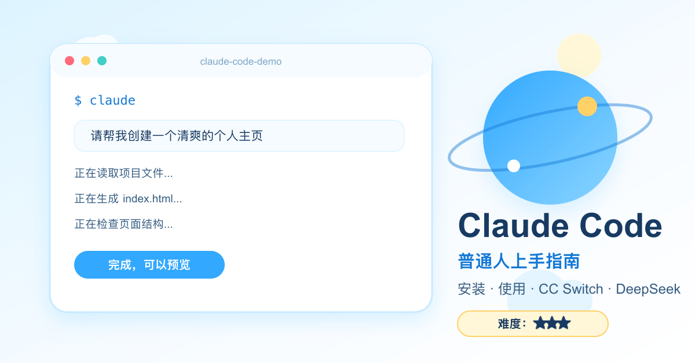
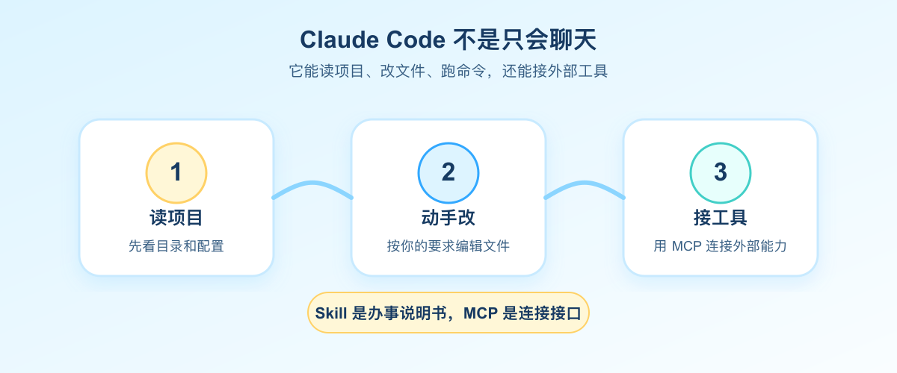
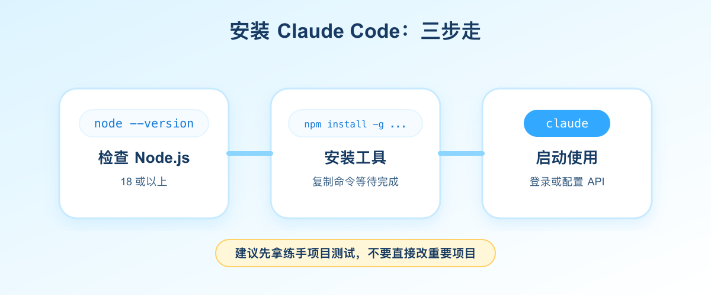
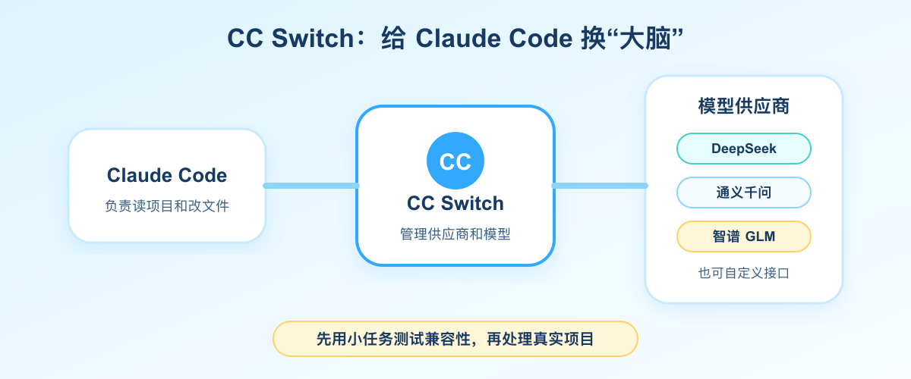

# Claude Code 怎么用？普通人也能上手的 AI 编程助手



> Claude Code 上手指南
>
> 技趣星球 · 用技术创造乐趣。
>
> 照着做还是装不上？留言区告诉我，安装和配置问题可以帮你一起排查。

你可能听过一句话：

> “Claude Code 写代码很强。”

但你真正去搜时，看到的往往是英文文档、命令行、API Key、环境变量、MCP、Skill。

一堆词砸过来，刚想试一下，就想关掉。

这篇少堆术语，只讲能照着做的步骤，不要求你有编程基础。

我们只解决三个问题：

1. Claude Code 到底是干什么的？
2. 怎么把它装起来、跑起来？
3. 如果官方账号或 API 不方便用，怎么用 CC Switch 接 DeepSeek 这类模型？

**一句话结论：Claude Code 不是聊天工具，而是一个会读项目、改文件、跑命令的 AI 编程助手。你把需求说清楚，它能直接在项目里动手。**

难度：⭐⭐⭐

需要装 Node.js、复制几行命令、配置一次模型。第一次可能会卡一下，但照着做，普通人也能跑通。

---

## 先说人话：Claude Code 像“坐在旁边的程序员助理”

普通 AI 聊天工具像什么？

像你在上问朋友：

> “这个网页怎么写？”

朋友发你一段建议，剩下的还得你自己打开文件、复制代码、调错。

Claude Code 不太一样。

它更像一个坐在你旁边的程序员助理。你说：

> “帮我把这个网页改好看一点，顺便检查有没有报错。”

它可以直接去看你的项目文件，然后修改、运行、发现问题，再继续修。



它能做的事情包括：

| 你想做什么 | Claude Code 能帮什么 |
|------------|----------------------|
| 看懂项目 | 扫描目录、读配置、解释每个文件干什么 |
| 改代码 | 直接编辑项目文件，而不是只给建议 |
| 查问题 | 运行测试、看报错、定位原因 |
| 写文档 | 整理 README、补安装说明、写使用示例 |
| 接工具 | 通过 MCP 接数据库、GitHub、浏览器等外部工具 |

所以你可以先记住一句话：

> ChatGPT 更像“问答窗口”，Claude Code 更像“能进项目干活的 AI 助手”。

---

## 为什么它值得学：不是只因为 Claude 模型强

Claude Code 值得学，不只是因为它能写代码。

更重要的是，它把两个思路带火了：**Skill** 和 **MCP**。

### Skill：给 AI 的办事说明书

Skill 可以理解成“给 AI 的工作说明书”。

比如你经常写技趣星球的文章，就可以写一份说明：

```text
写文章时：
- 先用生活例子开头
- 不堆术语
- 每段不要太长
- 结尾给一个立刻能做的小动作
```

以后你说“按我的风格写一篇”，AI 就能照着这份说明做。

它不是让 AI 变聪明，而是让 AI 更懂你的习惯。

### MCP：AI 世界的 Type-C 接口

MCP 更像“AI 世界的 Type-C 接口”。

以前 AI 想接 GitHub、数据库、浏览器、文件系统，每个工具都要单独适配。

MCP 做的事，是把连接方式统一起来。

工具按 MCP 的规矩提供能力，AI 就能接上去用。

关于 Skill 和 MCP，我们前面写过两篇：

- Skill 是什么？先去 SkillHub 逛一圈就懂了
- MCP：就是我们日常使用的 Type-C 接口

这篇先不展开。你只要知道：Claude Code 不是一个孤立工具，它代表的是“AI 能真正操作电脑和项目”的方向。

---

## 安装前先检查：别一上来就复制命令

先确认你的电脑有没有这些东西。

| 项目 | 建议 |
|------|------|
| 系统 | macOS / Linux / Windows WSL（Windows 原生终端还需装 Git for Windows） |
| Node.js | **18 或以上**，建议直接装 **20 LTS 或 22 LTS** |
| Git | 推荐安装，方便 Claude Code 看版本记录 |
| 项目目录 | 最好先拿一个练手项目，不要一上来改重要项目 |

检查 Node.js：

```bash
node --version
```

如果能看到类似 `v20.x.x`、`v22.x.x`，说明已经装了。

如果提示找不到命令，先去 [Node.js 官网](https://nodejs.org/) 下载 **LTS（长期支持版）**，不要选 Current 尝鲜版。

> 注意：
>
> 第一次练习，建议用一个复制出来的小项目。不要直接在公司项目、客户项目、重要资料目录里试。

---

## 安装 Claude Code：三步就够



### 第一步：安装

打开终端，输入：

```bash
npm install -g @anthropic-ai/claude-code
```

装完后检查版本：

```bash
claude --version
```

能看到版本号（比如 `2.1.x`），就说明安装成功。

> **两个常见安装坑：**
>
> 1. **不要用 `sudo npm install -g`**。容易把权限搞乱，后面更新、卸载都麻烦。如果报 `EACCES` 权限错误，把 npm 全局目录改到用户文件夹即可：
>
> ```bash
> mkdir -p ~/.npm-global
> npm config set prefix '~/.npm-global'
> echo 'export PATH=~/.npm-global/bin:$PATH' >> ~/.zshrc
> source ~/.zshrc
> npm install -g @anthropic-ai/claude-code
> ```
>
> 2. **想更新时，再跑一遍同样的安装命令就行**。不用记版本号，npm 会帮你装当前最新版。

### 第二步：进入一个项目目录

找一个练手项目，比如：

```bash
cd ~/my-project
```

如果你还没有项目，也可以先建一个空文件夹：

```bash
mkdir claude-code-demo
cd claude-code-demo
```

### 第三步：启动

输入：

```bash
claude
```

第一次启动时，它会引导你登录或配置 API。

官方用法通常需要 Anthropic 账号或 API Key。国内用户如果这一步不方便，可以先看后面的 CC Switch 方案。

---

## 基础用法：先学 6 个动作

刚开始不要贪多。

你会下面这几个，就能完成 80% 的入门操作。

| 操作 | 用法 | 适合什么时候 |
|------|------|--------------|
| 启动对话 | `claude` | 进入交互模式 |
| 带问题启动 | `claude "解释这个项目"` | 想先问一句 |
| 单次查询 | `claude -p "这个函数干嘛"` | 不想进入完整界面 |
| 初始化项目说明 | `/init` | 让它生成项目上下文 |
| 清空上下文 | `/clear` | 对话太乱时重来 |
| 引用文件 | `@文件名` | 精准让它看某个文件 |

一个最适合新手的练习是：

```text
请先扫描这个项目，告诉我：
1. 这是一个什么项目
2. 主要文件分别干什么
3. 我作为新手应该先看哪 3 个文件
```

等它解释完，你再说：

```text
请把 README.md 改得更适合新手阅读。
结构包括：项目简介、安装方法、运行方法、常见问题。
先给我计划，确认后再改文件。
```

注意最后一句：

> 先给我计划，确认后再改文件。

这是新手用 Claude Code 的关键习惯。

你先让它说清楚打算怎么做，再让它动手。这样不容易一上来改乱。

---

## CC Switch：给 Claude Code 换一个“大脑”

如果你没有 Anthropic API Key，或者想接 DeepSeek、通义千问、智谱 GLM 这类模型，可以看 CC Switch。



### CC Switch 是什么？

CC Switch 是一个开源桌面工具，用来管理 Claude Code、Codex、Gemini CLI 等命令行 AI 工具的模型供应商。

你可以把它理解成一个“模型切换器”：

> Claude Code 负责干活，CC Switch 负责告诉它用哪个模型。

常见配置是：

| 供应商 | 适合什么 |
|--------|----------|
| DeepSeek | 便宜、中文好，适合新手练习 |
| 通义千问 | 国内访问友好，综合能力稳 |
| 智谱 GLM | 中文和代码场景都能试 |
| Kimi | 长文本整理有优势 |
| 自定义接口 | 适合已经有模型服务的人 |

### 安装 CC Switch

去 GitHub Releases 下载对应系统安装包：

[CC Switch Releases](https://github.com/farion1231/cc-switch/releases)

macOS 用户也可以用：

```bash
brew install --cask cc-switch
```

装好后打开应用，按界面提示添加供应商。

### 接 DeepSeek 的大致步骤

DeepSeek 官方已经提供了 Claude Code 接入文档。2026 年起，**不要再用旧的 `deepseek-chat` 当主模型**，新版要按下面这套来配。

1. 去 [DeepSeek 开放平台](https://platform.deepseek.com/) 创建 API Key
2. 打开 CC Switch，添加供应商，选择 **DeepSeek 预设**
3. 填入 API Key
4. 按下面表格核对关键项（CC Switch 预设里通常已填好，但建议你肉眼确认一次）：

| 配置项 | 应该填什么 | 为什么重要 |
|--------|------------|------------|
| 请求地址 | `https://api.deepseek.com/anthropic` | 必须走 Anthropic 兼容接口，填错会直接连不上 |
| 主模型 | `deepseek-v4-pro[1m]` | Claude Code 的主对话模型，带 `[1m]` 后缀 |
| Haiku / 子任务模型 | `deepseek-v4-flash` | 内部子任务、轻量调用走这个，更省额度 |
| Opus / Sonnet 映射 | 也填 `deepseek-v4-pro[1m]` | Claude Code 会按 Opus/Sonnet 槽位调模型，不映射容易报错 |

5. 点击启用，**关掉旧终端窗口，重新开一个**，再运行：

```bash
claude
```

如果 CC Switch 已经接管配置，Claude Code 就会通过 DeepSeek 来工作。

### 不用 CC Switch？手动配环境变量也行

如果你更习惯命令行，DeepSeek 官方文档给的是这套（macOS / Linux）：

```bash
export ANTHROPIC_BASE_URL=https://api.deepseek.com/anthropic
export ANTHROPIC_AUTH_TOKEN=<你的 DeepSeek API Key>
export ANTHROPIC_MODEL=deepseek-v4-pro[1m]
export ANTHROPIC_DEFAULT_OPUS_MODEL=deepseek-v4-pro[1m]
export ANTHROPIC_DEFAULT_SONNET_MODEL=deepseek-v4-pro[1m]
export ANTHROPIC_DEFAULT_HAIKU_MODEL=deepseek-v4-flash
export CLAUDE_CODE_SUBAGENT_MODEL=deepseek-v4-flash
export CLAUDE_CODE_EFFORT_LEVEL=max
```

配完后同样要**新开一个终端**，再进项目目录运行 `claude`。

想持久保存，可以写进 `~/.claude/settings.json` 的 `env` 字段，或者写进 `~/.zshrc`。

### 接 DeepSeek 最容易踩的 3 个坑

**坑一：模型名写旧了**

网上很多旧教程还在写 `deepseek-chat` 或 `deepseek-reasoner`。接 Claude Code 时，主模型请用 **`deepseek-v4-pro[1m]`**，子任务用 **`deepseek-v4-flash`**。名字差一个字母，表现就是“能启动但一直报错”。

**坑二：API 地址填错**

DeepSeek 普通聊天接口和 Claude Code 用的不是同一个地址。Claude Code 必须填：

```text
https://api.deepseek.com/anthropic
```

**坑三：改完配置没重启终端**

CC Switch 或环境变量改完后，旧终端窗口不会自动刷新。关掉重开，或者 `source ~/.zshrc`，再试。

> 注意：
>
> DeepSeek 接 Claude Code 属于第三方兼容方案，不是 Anthropic 官方支持的路径。不同模型对工具调用、长任务的稳定程度也不一样。第一次建议先做小任务：解释项目、改 README、修一个简单报错。不要一上来让它重构整个项目。

---

## 一个完整练习：让它帮你整理项目

找一个不重要的小项目，打开终端：

```bash
cd ~/my-project
claude
```

然后复制这段：

```text
你先不要改文件。

请扫描这个项目，输出：
1. 项目是做什么的
2. 主要目录和文件说明
3. 当前最明显的 3 个问题
4. 建议我先改哪一个，为什么
```

等它回答后，再复制这段：

```text
现在只改 README.md。

要求：
1. 面向第一次打开项目的人
2. 用中文
3. 包含安装、运行、常见问题
4. 不要改其他文件

改完后告诉我改了哪些内容。
```

这就是 Claude Code 最舒服的用法：

1. 先让它看
2. 再让它计划
3. 最后只允许它改一个小范围

新手一定要从小范围开始。你越会限制范围，它越像靠谱助理。

---

## 新手最容易踩的 5 个坑

### 坑一：让它一次改太多

不要这样说：

```text
帮我优化整个项目。
```

建议这样说：

```text
先只看项目，不改文件。
列出 3 个最值得改的点，我确认后再动手。
```

### 坑二：不看改动就继续

每次它改完，你最好看一眼：

```bash
git diff
```

如果你还不会 Git，也至少打开文件看看有没有明显不对。

### 坑三：把隐私内容发给模型

不要把这些东西交给任何 AI：

- 身份证
- 手机号名单
- 客户资料
- 合同原文
- 内部账号和密码
- 公司未公开代码

能不能发，有个简单判断：

> 能发普通工作群的东西，才适合发给 AI。

### 坑四：把模型当神

Claude Code 会犯错。

它可能删错文件、理解错需求、装错依赖，也可能写出看起来很对但实际跑不通的代码。

所以新手要养成一个习惯：

> 小步改，小步看，小步确认。

### 坑五：只看教程，不动手

这类工具，光看没用。

你必须拿一个小项目跑一次，才会真正明白它的价值。

---

## 今天就试这个

如果你只想花 10 分钟，按这个顺序来：

```bash
npm install -g @anthropic-ai/claude-code
claude --version
mkdir claude-code-demo
cd claude-code-demo
claude
```

国内用户如果官方登录不方便，先装好 [CC Switch](https://github.com/farion1231/cc-switch/releases)，按上文 DeepSeek 表格配好，再回来跑下面这段对话。

进入后复制：

```text
请帮我创建一个最简单的个人主页。
要求：
1. 只有 index.html 一个文件
2. 标题是“我的第一个 AI 辅助网页”
3. 页面里有一句自我介绍
4. 风格清爽，不要复杂

先告诉我你准备怎么做，等我确认后再创建文件。
```

跑通这一步，你就已经跨过最难的门槛了。

---

## 今天的小结

记住 3 件事就够了：

- Claude Code 是「能进项目干活的 AI 助手」，不是普通聊天窗口
- 安装就一行 `npm install -g @anthropic-ai/claude-code`，装完用 `claude --version` 确认成功
- 接 DeepSeek 时，主模型填 `deepseek-v4-pro[1m]`，接口地址填 `https://api.deepseek.com/anthropic`

技趣星球 · 用技术创造乐趣。

---

## 参考资料

- [Claude Code 官方安装文档](https://code.claude.com/docs/en/getting-started)
- [Claude Code 进阶安装说明](https://code.claude.com/docs/en/setup)（含 npm 升级、权限问题排查）
- [DeepSeek 官方 · Claude Code 接入指南](https://api-docs.deepseek.com/guides/agent_integrations/claude_code)
- [Claude Code MCP 文档](https://code.claude.com/docs/en/mcp)
- [Claude Code Skills 文档](https://code.claude.com/docs/en/skills)
- [CC Switch GitHub Releases](https://github.com/farion1231/cc-switch/releases)

> 版本说明：本文 DeepSeek 模型名以 2026 年 5 月为准。Claude Code 迭代很快，装完以你本机 `claude --version` 显示的为准。
