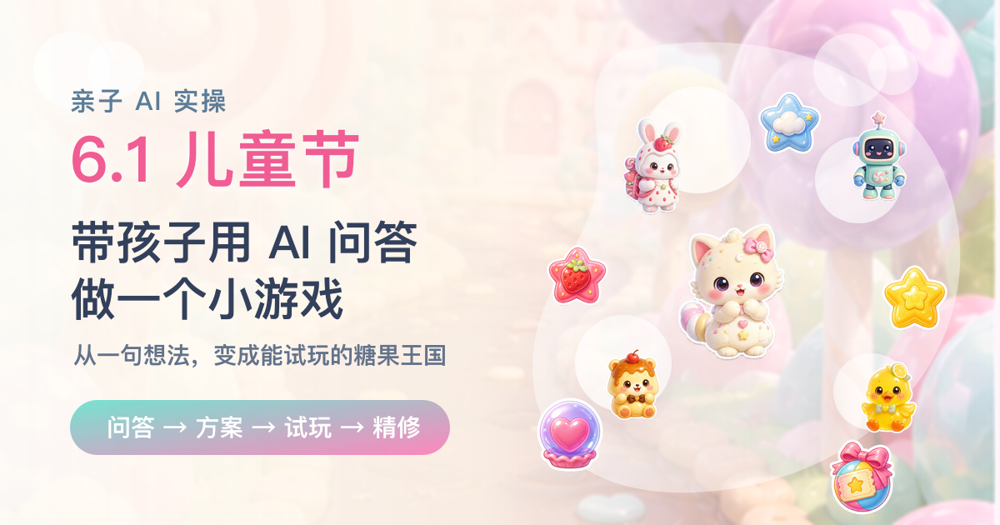
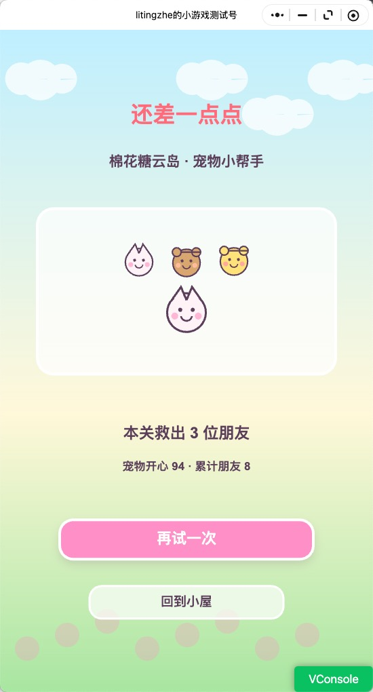
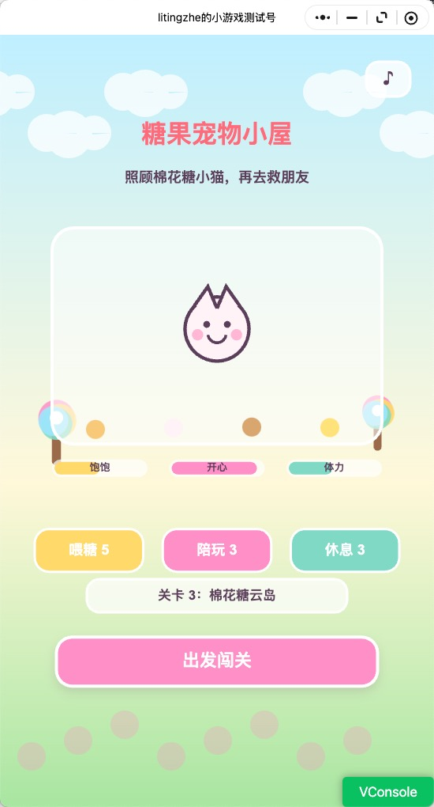
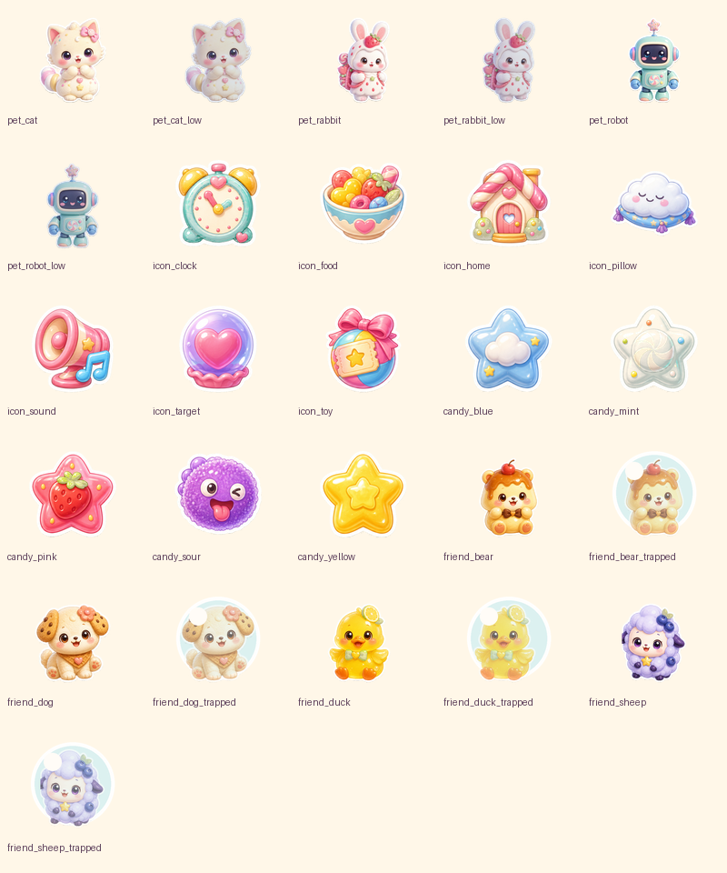
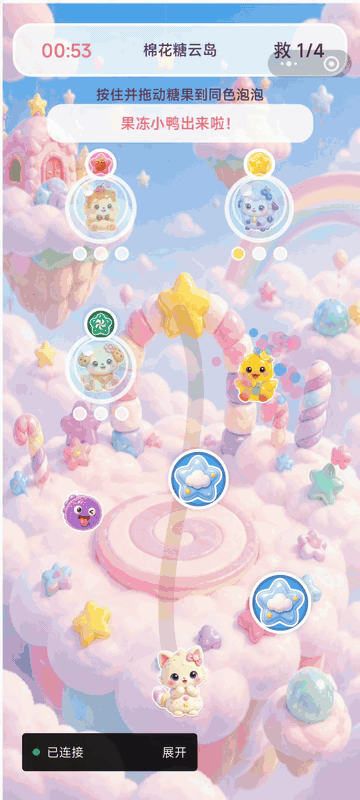

# 6.1 儿童节，带孩子用 AI 问答做一个小游戏



> 亲子 AI 实操 · 从孩子的想法到小游戏方案
>
> 技趣星球 · 用技术创造乐趣。

6.1 儿童节快到了。

很多家长会想着给孩子买个礼物，带孩子出去玩一趟，或者安排一顿好吃的。

这些当然都很好。

但今年你也可以试试另一件事：带孩子一起，用 AI 做一个只属于他的小游戏。

如果你也想照着试，难度大概是 ⭐⭐⭐。

需要一个 AI 聊天工具，加一个能写代码的 AI 工具。第一次可能会折腾一点，但整个过程很适合亲子一起玩。

---

## 我一开始也差点从工具下手

很多人一听“做游戏”，脑子里马上出现一堆词：

代码、引擎、素材、动画、上线、小游戏。

然后就开始头大。

其实带孩子做第一个小游戏，不应该先从工具开始。

它更像搭积木。

你得先问孩子：

> “你想搭城堡，还是小动物的家？”

而不是一上来就问：

> “我们用哪种高级积木拼接结构？”

孩子真正感兴趣的，往往不是技术。

是主角是谁、去哪里冒险、要救谁、会不会赢、好不好玩。

这次我做下来，最有用的不是先打开开发工具。

而是先把孩子脑子里的画面问出来。

---

## 第一步：先让孩子做选择，而不是让孩子“想一个游戏”

如果你直接问孩子：

> “你想做什么游戏？”

很多孩子会愣住。

因为这个问题太大了。

更好的方式是给选项。

就像点餐一样。

你不问：

> “你今天想吃什么宇宙级美食？”

你会问：

> “面条、米饭、披萨，你想吃哪个？”

做游戏也一样。

我当时先让 AI 帮我准备了一组选择题：

```text
我想在 6.1 儿童节带孩子一起做一个小游戏。

请你不要直接给方案，先帮我设计 7 个适合问孩子的问题。

要求：
- 每个问题都给 4 到 6 个选项
- 选项要适合 5 到 10 岁孩子理解
- 问题要覆盖游戏类型、主题、主角、每局时长、游戏目标、难度、是否需要排行榜
- 语气像家长在跟孩子聊天
```

孩子选起来很快。

最后整理出来大概是这样：

| 问题 | 孩子的选择 |
|------|------------|
| 想玩哪种游戏 | 养成/照顾小动物 |
| 主题想选什么 | 糖果王国 |
| 主角是谁 | 小动物 |
| 每局玩多久 | 1 分钟 |
| 游戏目标是什么 | 救朋友 |
| 难度怎么样 | 很简单 |
| 要不要排行榜、广告、分享 | 都不要，简单玩就好 |

孩子当然不会说“我要一个完整游戏设计文档”。

但这些答案已经足够做出一个方向：

> 糖果王国里，小动物用 1 分钟救朋友。游戏要简单，不要排行榜，不要广告。

比起一句“做个儿童节游戏”，这已经清楚很多。

---

## 第二步：让 AI 把孩子的话翻译成游戏方案

孩子的表达通常很可爱，但不会很完整。

比如他说：

> “我要小动物救朋友。”

这里面还有很多空白：

- 怎么救？
- 救谁？
- 成功怎么算？
- 失败会怎样？
- 每一局玩什么？
- 回到首页能干什么？

这些问题，我没有自己硬想。

我把孩子的选择丢给 AI，让它先整理成方案：

```text
下面是孩子选择出来的游戏方向：

1. 游戏类型：养成/照顾小动物
2. 主题：糖果王国
3. 主角：小动物
4. 单局时长：1 分钟
5. 游戏目标：救朋友
6. 难度：很简单
7. 不要排行榜、广告、分享

请帮我整理成一份儿童节小游戏方案。

要求：
- 面向 5 到 10 岁孩子
- 玩法要简单，但不能无聊
- 包含首页、游戏页、结算页
- 写清楚每一页有什么
- 写清楚玩家怎么赢
- 风格要 Q 萌、轻松、有趣
```

整理完之后，方向就变成了：

- 首页：糖果宠物小屋
- 领养：小兔、小猫、小机器人
- 照顾：喂糖、陪玩、休息
- 闯关：把同色糖果拖给同色泡泡
- 目标：救出泡泡里的小动物朋友
- 奖励：获得糖果粮、玩具券、云朵枕

回头看，这有点像把孩子的“梦话”整理成菜单。

孩子只负责说想法。

大人负责判断能不能做。

AI 负责把它写成一份能继续往下走的方案。

---

## 第三步：先做“能玩的一小块”，不要贪大

家长很容易犯一个错：

刚开始想做一个小游戏，聊着聊着就变成：

> “要不要加宠物成长？”
>
> “要不要加 20 个关卡？”
>
> “要不要加商店？”
>
> “要不要加语音？”

最后孩子都困了，游戏还没开始。

第一版只做一小块就够。

比如：

1. 先选一个宠物。
2. 进入糖果王国。
3. 拖动糖果去救一个朋友。
4. 成功后回到小屋。

只要孩子能看到：

> “这是我选的小动物。”
>
> “它真的动起来了。”
>
> “我救出了朋友。”

这件事就已经很有成就感。

我继续让 AI 把范围压小：

```text
请把上面的游戏方案缩小成第一个可玩的版本。

要求：
- 只做 1 个完整关卡
- 只保留 3 个宠物选择
- 只保留 3 种照顾资源
- 不做登录、排行榜、广告、分享
- 用小游戏原生 Canvas 2D 实现
- 给我一份文件清单和开发顺序
```

这里我踩到一个小点：

要不断提醒 AI：

> “先做能玩的第一版。”

不然它很容易一上来就给你一堆宏大的系统。

孩子不会因为你写了 30 页架构设计而开心。

孩子会因为屏幕上的小兔被自己救出来而开心。

---

## 第四步：让孩子继续当“小评委”，问题一下就暴露了

第一版做出来后，千万别急着说：

> “完成了。”

你可以把手机或电脑拿给孩子看，让他当评委。

问三个问题就够：

1. 你觉得哪里好玩？
2. 你觉得哪里不好看？
3. 你还想加什么？

这三个问题，比很多专业评审都管用。

比如这次小游戏做出来后，最初版本只是“点糖果救泡泡”。

我拿给孩子看，很快就发现问题。

第一个问题不是代码。

是画面。

说是小猫，但孩子根本看不出动物特征。

它更像一个临时画出来的小符号。

小动物、图标、按钮都太潦草了。

这时候我才意识到，可能是我一开始给 AI 的上下文有问题。

我一直强调：

> “这是带孩子一起玩的亲子项目。”

AI 很可能把它理解成：

> “随便做个亲子小实验，能看就行。”

结果第一版就很像草稿，而不是一个认真小游戏的视觉效果。

老版本大概长这样：





除了画面，玩法也很快暴露问题：

> 没有什么养成感。
>
> 不像在照顾小动物。
>
> 游戏太简单，没什么可玩性。

于是方案继续改：

- 打开游戏先领养宠物。
- 宠物有饱饱、开心、体力。
- 照顾宠物需要消耗资源。
- 资源来自每天补给和闯关奖励。
- 关卡从点击变成拖拽匹配。
- 错了会扣时间，增加一点点挑战。
- 图片资源也重新生成，明确要求商用品质、统一风格、不要 demo 感。

这一轮之后，我对“带孩子一起做”这件事的感觉变了。

不是大人做好一个东西丢给孩子玩。

而是孩子真的能参与判断。

他的反馈，会改变下一版长什么样。

---

## 第五步：改方案时，也要把素材标准一起改

这次最重要的经验是：

改玩法的时候，别只改代码。

素材标准也要一起改。

因为“可爱”这个词太宽了。

你说可爱，AI 可能给你一张儿童涂鸦。

你说 Q 萌，AI 可能给你一个临时贴纸。

但如果你想让它像一个认真小游戏，就要把标准说清楚。

后来我把素材要求改成了：

```text
请为儿童向小游戏生成一套可商用质感的 Q 萌糖果玩具风视觉资产。

要求：
- 商用品质，不要 demo 感，不要线稿占位图
- 统一风格，适合 5 到 10 岁孩子
- 软糖、玩具、棉花糖质感
- 角色要有圆润轮廓、明亮眼神、柔和高光
- 图标要像真实游戏 UI 资产，而不是简单符号
- 每个素材都要透明背景，方便直接放进游戏
- 包含宠物、低状态宠物、救援朋友、泡泡状态、糖果、资源图标、HUD 图标
```

我后来反复加的关键词是：

> 商用品质、统一风格、不要 demo 感、真实游戏 UI 资产、透明背景。

加上这些要求后，素材效果才明显变好。

新的资源图是这样：



再把这些资源接进游戏里，最终版就比老版本完整很多：



它当然还谈不上完整。

但孩子能看见自己的想法，真的在屏幕里跑起来了。

下次我再写素材提示词，不会只写“可爱”。

我会把这些话一起写进去：

- 是儿童绘本可爱，还是手游图标可爱。
- 是草稿验证，还是准备发布。
- 是随便画一个，还是要统一成一套素材。
- 是白底展示，还是透明背景直接进游戏。

---

## 这次给我的意外收获

做完这个小游戏，我反而觉得它最像一次小型练习。

不是练怎么写一个多厉害的游戏。

而是练怎么把一个模糊想法往前推：

- 先问清楚。
- 再整理成方案。
- 做一个很小的版本。
- 拿到反馈。
- 再改下一版。

后来我发现，这不只是在做游戏时有用。

写文章、做活动、准备课程、整理旅行计划，也能用。

我现在越来越觉得，AI 最实用的地方不是“替我一口气做完”。

而是把一件原本不知道怎么开始的事，拆成几个可以继续往下走的小步骤。

---

如果你也想试试，可以今晚拿 20 分钟做个小实验。

打开 AI，把下面这段话发给它：

```text
我想带孩子一起为 6.1 儿童节创作一个小游戏。

请你像亲子活动主持人一样，先问我 7 个选择题。
每题都要适合孩子回答。
问题要覆盖：游戏类型、主题、主角、单局时长、游戏目标、难度、要不要排行榜或分享。

等我回答后，再帮我整理成一个简单、可爱的小游戏方案。
如果需要生成素材，请提醒我加入：商用品质、统一风格、不要 demo 感、透明背景。
```

我这次最大的感受是，做游戏的第一步真的不是写代码。

是坐下来，认真听孩子说：

> “我想让小动物去糖果王国救朋友。”
