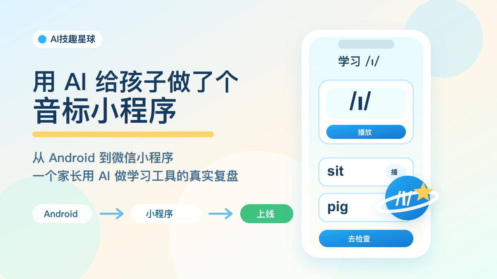
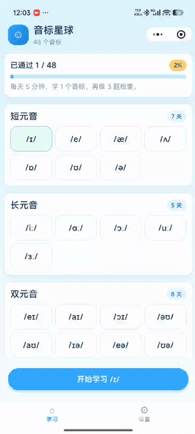
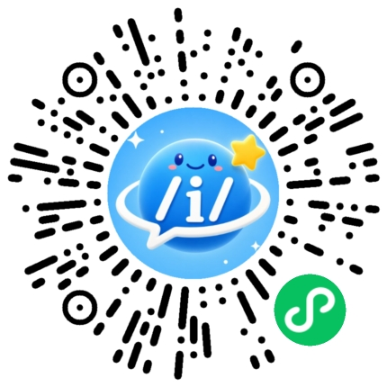

# 用 AI 给孩子做了个音标小程序，现在终于上线了

> 从 Android 到小程序 · 一个家长用 AI 做学习工具的真实复盘
>
> 关注微信公众号 **AI技趣星球**，回复**MF** 一起用技术创造乐趣。





这个小程序其实已经做好快两周了。

真正写出来没有花太久，比较花时间的是后面的备案和上线流程。

我花了 30 块钱做个人小程序备案，又等了 10 天备案结果。

现在终于上线了，也可以拿出来跟大家分享一下。

目前在小程序里已经能搜到。



从最开始的一个想法，到 Android 版本能跑，再到改成小程序，最后提交审核、备案、上线，一路改了很多次。

说实话，刚开始我并没有那么相信 AI。

我有多年的 Android 开发经验，所以一开始心里想的是：

> “先让 AI 试试。做得不行也没事，我还可以自己继续开发。”

结果没想到，0 到 1 的效果非常惊人。

不是“给我一点灵感”的那种惊人。

而是真的能做出一个可以直接用的版本。

这篇就不写成教程了。

我想按完整流程把这次经历重新捋一遍。

不是只讲“我做了什么功能”，而是讲清楚：一个家长怎么从一个想法，走到一个真的能搜到、能打开的小程序。

难度：⭐⭐⭐

如果你也想用 AI 给孩子做一个学习小工具，这篇应该能少踩几个坑。

先把完整流程摆出来：

> 准备做音标学习应用
> → 制作 Android 应用
> → 发现孩子用 iPad，不方便直接用
> → 制作小程序应用
> → 下载小程序开发工具，从 0 开始调
> → 真机调测、提交发布审核
> → 个人小程序备案
> → 正式上架，小程序里可以搜到

后面我就按这个流程，一步一步讲。

---

## 第一步：准备做一个音标学习应用

起因很简单。

孩子学英语，音标总是绕不过去。

偏偏我自己的发音也不算标准，陪他读的时候总觉得心里没底。

市面上的工具不是没有，但很多都太重了。

要么广告多，要么功能一堆，要么不太适合我想要的节奏。

我想要的第一版其实很朴素：

- 48 个音标都能学
- 每个音标能听标准读音
- 有简单的口型提示
- 有几个例词
- 学完能做一个小检查
- 最好能离线，不依赖网络

听起来不复杂。

但真要做，就会冒出一堆细节。

音频从哪来？

界面怎么让孩子愿意点？

过关检查是一页做完，还是一道一道来？

第三关要不要录音？

这些问题，如果全部靠自己想，很容易越想越大。

所以我先让 AI 帮我收范围。

我当时大概是这样问的：

```text
我要做一个给中国小学生用的英语音标学习工具。

第一期不要做太大，只保留：
1. 48 个音标学习
2. 过关检查

要求：
- 移动端优先
- 音频内置，尽量离线使用
- 不能侵权，不能依赖付费素材
- 页面要适合小学生
- 每个音标能播放读音和例词
- 检查题最好一题一题来

请帮我拆成第一版产品范围、页面结构和技术方案。
```

这个输入比“帮我做一个音标 App”好很多。

因为它先告诉 AI：别发散，先做第一版。

---

## 第二步：制作 Android 应用，先在我熟悉的地方试水

准备做应用时，我没有一上来就选最适合孩子的平台。

我先选了 Android。

原因很直接：我有多年的 Android 开发经验。

那时候我对 AI 还保持怀疑。

我心里想的是：

> 先让 AI 做 Android 应用。
>
> 如果做得不行，我还可以自己继续开发。

这有点像让一个新同事先做你熟悉的活。

他做得好，你就放心一点。

他做得不好，你也知道怎么继续处理。

所以第一版，我直接让 AI 先做 Android 应用。

结果让我挺意外。

它不只是生成了几段代码，而是能顺着需求把东西搭起来：

- 首页音标地图
- 音标学习页
- 播放按钮
- 例词练习
- 过关检查
- 主题切换
- 国际化文案
- 本地音频播放

当然，中间也不是一帆风顺。

播放没有声音。

导航栏顶到状态栏。

页面滚动区域不对。

题目里有一题根本没法作答。

这些都出现过。

但神奇的地方在于：你把问题说具体，它真的能继续改。

比如不要只说：

> “页面不对。”

而要说：

> “导航栏自己应该有高度，图标和标题要垂直居中。首页滚动区域应该从导航栏下面开始，到底部按钮上面结束。”

说到这个程度，AI 的修改就会靠谱很多。

做完 Android 版以后，我第一次有了很强的感觉：

> AI 做 0 到 1，已经不是玩具了。

它可能还会犯错。

但它真的能把一个想法推到“能用”的状态。

---

## 第三步：发现平台问题，孩子用的是 iPad

Android 版本能跑之后，我反而冷静下来了。

因为我发现一个很尴尬的问题：

孩子平时学习主要用 iPad。

手机屏幕太小，真让他每天拿着手机学，我也不太放心。

所以我开始重新选平台。

iOS 也不是不能做。

但上架先要交 699 元。

这个工具本来只是想先给孩子内部用一用，可能熟悉几天就够了。

为了这件事走完整套 iOS 上架流程，我觉得有点重。

最后我选了小程序。

原因很简单：

- iPad 能打开
- 手机也能打开
- 家长分享方便
- 不用先装一个 App
- 更适合先验证孩子愿不愿意用

这不是技术上最完美的选择。

但它是当时最适合真实使用的选择。

---

## 第四步：制作小程序应用，从下载开发工具开始

说实话，我之前并不是小程序开发熟手。

所以从 Android 改小程序，一开始我也有点虚。

第一步不是写代码，而是先把小程序开发者工具装起来。

打开项目、看 `app.json`、看页面结构、看控制台报错。

这些东西对小程序老手很普通，但对 0 基础的人来说，刚开始会有点陌生。

但这次 AI 的价值又体现出来了。

它可以帮我快速理解小程序的结构：

- `app.json` 管页面
- `page` 分页面
- `component` 做组件
- `wxss` 写样式
- `InnerAudioContext` 播放音频
- `RecorderManager` 录音

这些东西你要自己从零看文档，也能看懂。

但会慢。

AI 像一个在旁边帮你翻文档的人。

你问它：

```text
我有一个已经能跑的 Android 音标学习 App。
现在要迁移成小程序。

我没有小程序开发经验。

请帮我按小程序结构重新拆：
- 参考现有 Android 功能
- 重新整理成小程序页面和组件
- 保留音标学习、播放、过关检查这些核心能力
```

它给出的东西，不一定一次就完美。

但能让你马上知道下一步该干什么。

小程序真正麻烦的地方，不是“写一个按钮”。

而是很多体验细节要重新适配。

比如导航栏。

Android 上你觉得很自然的顶部栏，到了小程序里就要考虑状态栏、胶囊按钮、安全区。

比如滚动区域。

首页要在顶部导航下面滚动，还不能被底部 Tab 挡住。

比如二级页面。

点进去学习、检查、设置时，就不应该再显示底部 Tab。

这些都不是大功能。


---

## 第五步：调测、发布审核，写完代码还不算完

小程序不是功能写完就结束。
 
还有音频。

音标学习最怕音频不准。

我一开始就要求：音频要内置，不能花钱，不能侵权。

后来音频文件准备好了，又继续一遍遍听。

有些音感觉不准，就重新校对。

这件事 AI 能帮忙整理清单、检查路径、排查播放问题。

但“这个音到底对不对”，最后还得人来听。

这也是我这次最大的感受：

AI 可以把很多活推进去。

但你不能完全撒手。

你得像产品经理、测试、家长三个人合在一起。

一边看功能，一边看孩子怎么用，一边判断输出能不能真的上线。

---

## 第六步：备案和正式上架，最花时间的是等待

代码调完以后，我以为很快就能上线。

结果真正花时间的，是备案。

个人小程序备案花了 30 块钱。

钱倒是不多。

主要是要等。

我等了 10 天，备案结果才下来。

这 10 天里，其实代码已经好了，小程序也能预览。

但它还不能算真正上线。

直到备案通过，审核也走完，才能在小程序里搜到。

所以这次完整走下来，我才更清楚：

> 做小程序不是“写完代码”就结束。
>
> 还要真机调测、提交审核、等备案、正式上架。

现在它终于可以搜到了，我才敢说：这个小工具算是真正跑通了。

---

## 会给 AI 下任务，比会不会写代码更重要

这两周里，我越来越觉得，用 AI 做产品，最重要的不是会多少代码。

而是会不会把需求说清楚。

你不能只说：

> “帮我做一个音标小程序。”

这句话太大了。

AI 不知道你是给谁用，也不知道第一版要做到什么程度。

更好的说法是：

> “给中国小学生用，先做 48 个音标学习和过关检查。移动端优先，音频内置，不依赖网络。每个音标要能播放读音和例词，检查题一题一题来，第三关需要录音对比。”

说到这个程度，AI 才知道怎么拆页面、怎么排功能、怎么给你技术方案。

所以我现在更愿意把它理解成“给 AI 写任务说明书”。

任务越清楚，它越像一个能干活的同事。

任务越模糊，它就越容易做出一个看起来很完整、但不一定能用的东西。

## 后面我想把“音标星球”改成“学习星球”

现在小程序已经上线了，我反而开始想下一步。

如果只做音标，它就是一个单点工具。

但孩子的学习，不止音标这一件事。

所以我想慢慢把“音标星球”改成“学习星球”。

这些想法都来自我自己孩子的学习场景。

一方面希望他学得轻松一点。

另一方面，也想稍微解放一下我每天陪学的时间，让我能多留一点精力继续学习 AI 和做产品。

1. **多孩子管理**

   家里不止一个孩子时，进度、错题、积分都要分开。不能混在一起。

2. **拼音过关**

   这个是给马上上一年级的孩子准备的。

   把拼音也做成一关一关的练习。声母、韵母、整体认读音节，都可以拆开学。

3. **电子宠物**

   学习完以后，小宠物可以成长、换装、获得食物。让孩子多一点期待。

4. **生字和错字积累**

   孩子写错的字，可以存下来。系统自动生成拼音，再变成后面的默写练习。

   如果只是自己家里用，听写功能可以先加。

   但如果用的人多了，就要认真算成本。

   语音合成不是完全免费的，不能一开始就把服务器和音频成本扛上来。

5. **英语拼读练习**

   这个功能我反而不一定会做。

   一是市面上已经有不少现成免费的工具。

   二是音频资源会带来体积和成本问题。

   个人小程序包体也有上限，如果只是自己家和身边亲戚朋友用，就没必要一开始就搞服务器放音频资源。

   音标之后，继续做自然拼读。让孩子看到单词时，能慢慢把声音拼出来。

6. **作息时间记录**

   学习不能只看做了多少题。

   如果睡太晚，或者一天学得太猛，也要提醒。

   对孩子来说，长期稳定比短时间猛冲更重要。

7. **错题原因和频次记录**

   错题不只记“错了”。

   还要记为什么错：听错、看错、不会拼、粗心、没理解。

   同一个原因出现多了，就该换练法。

8. **积分卡系统**

   家长可以自己设计加分、减分项。

   比如准时睡觉加分，主动学习加分，拖延太久扣分。

   一周坚持给小奖励。

   一学期达成长期目标，给一个大一点的奖励。

   重点不是用奖励“收买”孩子。

   而是让孩子慢慢明白：目标可以拆小，努力可以积累，长期坚持会有结果。

这些都不会一下子做完。

我现在更愿意一版只解决一个小问题。

先让孩子愿意打开。

再让孩子愿意坚持。

最后才谈更完整的学习系统。

---

## 这次给我的最大提醒

如果只看结果，这件事好像很简单：

> “做了一个音标小程序。”

但真正经历一遍，会发现它其实包含了很多判断：

- 准备做音标学习应用，先把第一版范围砍小
- 先做 Android 应用，因为我有经验，可以兜底
- 发现孩子用 iPad 后，改成小程序
- 下载小程序开发工具，从 0 开始迁移
- 真机调测、提交发布审核
- 备案通过后，正式上架

这次让我对 AI 的看法变了不少。

我还是不觉得 AI 可以完全替代人。

但我会承认一件事：

> 对一个清楚自己想做什么的人来说，AI 已经能把起步速度拉得非常快。

以前一个想法，可能停在脑子里。

现在它真的可以变成一个已经上线、能被搜到的小程序。

这就是最让我惊讶的地方。

---

## 今天的小结

这次最让我震惊的，其实是做 Android 应用的时候。

Codex 不只是写代码。

它可以自己运行 Android 应用，操作模拟器，调试页面，还能根据桌面截图判断当前页面显示得对不对。

这已经很像一个能配合你干活的开发助手了。

今天只记住 3 件事：

- AI 做 0 到 1，已经很能打，但你要把需求说清楚。 
- 平台选择要看孩子怎么用，不要只看自己会什么。
- 小程序上线不是写完代码就行，真机、权限、音频、审核备案都要一步步过。

如果你也想给孩子做一个学习工具，可以先别急着写代码。

先问自己一个问题：

> 孩子会在什么设备上，什么时间，用几分钟完成一次学习？

然后把答案交给 AI：

```text
我想给孩子做一个学习小工具。

真实使用场景是：
- 设备：
- 每次使用时长：
- 学习内容：
- 家长是否陪同：
- 是否需要离线：

请帮我设计第一个可上线的小版本。
要求：
- 只保留最核心功能
- 不要账号、排行榜、复杂成长系统
- 输出页面结构、核心流程、最小技术方案
- 列出第一版明确不做的功能
```

先别追求大而全。

能让孩子真的打开，并完成一次学习，就已经是很好的第一步。

---

*有问题？评论区告诉我。*
