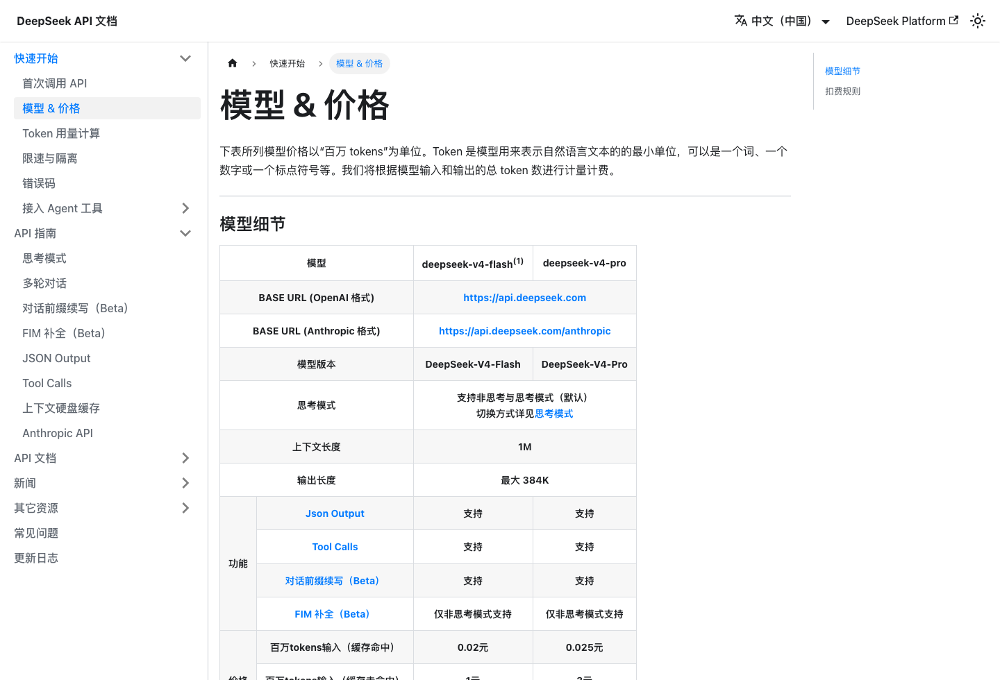
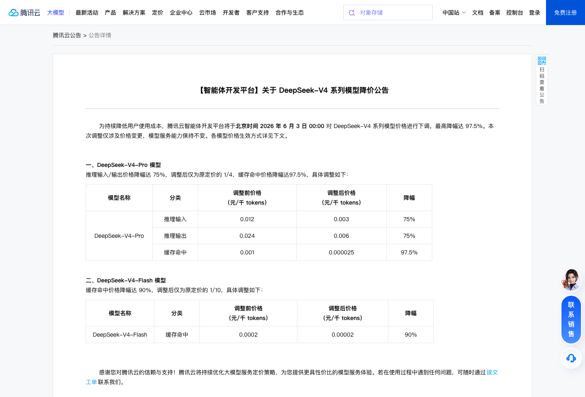
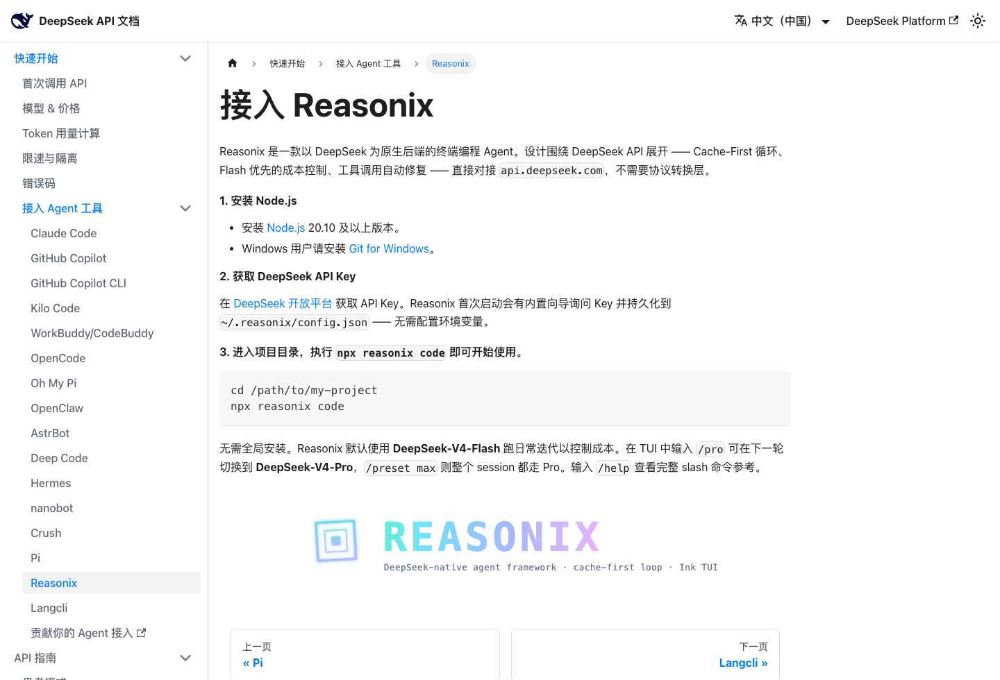

# DeepSeek 又降价了：普通人怎么把它接进 Reasonix 和 CodeWhale？

> DeepSeek 工具上手指南
>
> 关注微信公众号 **AI技趣星球**，回复MF 一起用技术创造乐趣。
>
> 本文写作时间：2026 年 6 月 3 日。模型价格和工具名称可能会变，动手前以官网为准。

最近 DeepSeek 又被刷屏了。

一边是 DeepSeek 官方模型继续按很低的价格开放 API。

另一边，腾讯云也在 2026 年 6 月 3 日下调了 DeepSeek-V4 系列模型调用价。

很多人的第一反应是：

> “便宜是便宜，可我到底能拿它干什么？”

这篇就不讲大模型论文，也不讲算力故事。

我们只做一件事：把 DeepSeek 接进两个能真正干活的工具里。

一个是 **Reasonix**。

一个是 **CodeWhale**，也就是很多人说的 DeepSeek TUI / whalecode 这类终端工具。

这篇的重点很简单：DeepSeek 便宜之后，最适合普通人的用法不是拿来闲聊，而是接进编程 Agent，让它读项目、改文件、跑命令。Reasonix 更适合新手稳稳上手，CodeWhale 更适合喜欢终端、想要轻量操作的人。

难度：⭐⭐⭐

需要会打开终端、复制命令、配置一次 API Key。第一次可能会卡在环境变量，但照着做能跑通。

---

## API 降价，等于“请助理的时薪变低了”

你可以把 AI API 想成“按字数收费的外包助理”。

以前你让它读一个项目、改一段代码、总结一堆文件，心里会有点虚：

> “这一问会不会烧很多钱？”

现在 DeepSeek 这类模型价格打下来后，试错成本低了很多。

DeepSeek 官方在价格页里列出的写作时价格是：



| 模型 | 缓存命中输入 | 缓存未命中输入 | 输出 | 适合什么 |
|------|----------------|------------------|------|----------|
| DeepSeek-V4-Flash | 每百万 token 0.02 元 | 每百万 token 1 元 | 每百万 token 2 元 | 日常问答、轻量改代码 |
| DeepSeek-V4-Pro | 每百万 token 0.025 元 | 每百万 token 3 元 | 每百万 token 6 元 | 更复杂的分析和编程任务 |

腾讯云在 2026 年 6 月 3 日也宣布下调 DeepSeek-V4 模型价格：



| 腾讯云模型 | 调整后重点 |
|------------|------------|
| DeepSeek-V4-Flash | 缓存命中价降幅达 90%，调整后与官方价持平 |
| DeepSeek-V4-Pro | 推理输入和输出降幅达 75%，缓存命中价降幅达 97.5%，调整后与官方价持平 |

这里有个小词要解释一下：缓存命中。

你可以先粗略理解成“AI 发现你前面问过类似内容，重复部分可以便宜算”。

编程 Agent 经常反复读同一个项目，所以缓存价格很重要。

这里的重点不是“又便宜了几分钱”。

重点是：你终于可以把它当成日常工具来试。

就像网约车价格降下来之后，你不会只研究发动机，你会开始想：

> “那我今天去哪儿？”

DeepSeek 降价之后，我们也该问：

> “那我今天让它帮我做什么？”

最值得普通人试的，就是接进编程 Agent。

---

## 编程 Agent 是什么？它不是聊天窗口

普通 AI 聊天工具像一个顾问。

你问：

```text
这个网页怎么改好看？
```

它给你一段建议。

但你还要自己打开文件、复制代码、找报错。

编程 Agent 更像一个坐在旁边的助理。

你说：

```text
帮我看一下这个项目，
把首页按钮颜色改成蓝色，
然后运行测试确认没有报错。
```

它可以自己去读文件、改文件、跑命令。

今天说的 Reasonix 和 CodeWhale，都属于这个方向。

它们的差别不在“谁更神”。

差别在于：你更喜欢哪种工作方式。

---

## 准备工作：先拿到 DeepSeek API Key

不管你用 Reasonix 还是 CodeWhale，第一步都是准备模型。

你有两条路：

| 方式 | 适合谁 | 说明 |
|------|--------|------|
| DeepSeek 官方 API | 想直接用官方模型的人 | 地址是 `https://api.deepseek.com` |
| 腾讯云 DeepSeek | 已经在用腾讯云的人 | 方便和云账号、账单、企业额度放一起 |

如果你是第一次试，建议先用官方 API。

步骤大概是：

1. 打开 DeepSeek 开放平台
2. 注册或登录账号
3. 进入 API Keys 页面
4. 新建一个 Key
5. 复制保存好

拿到之后，不要发给别人。

API Key 就像你家的门禁卡。

别人拿到后，就能用你的额度。

### 在终端里配置 Key

macOS 或 Linux 可以这样写：

```bash
export DEEPSEEK_API_KEY="你的 DeepSeek API Key"
export DEEPSEEK_BASE_URL="https://api.deepseek.com"
```

如果你想长期生效，可以写进 `~/.zshrc`：

```bash
echo 'export DEEPSEEK_API_KEY="你的 DeepSeek API Key"' >> ~/.zshrc
echo 'export DEEPSEEK_BASE_URL="https://api.deepseek.com"' >> ~/.zshrc
source ~/.zshrc
```

Windows PowerShell 可以这样写：

```powershell
setx DEEPSEEK_API_KEY "你的 DeepSeek API Key"
setx DEEPSEEK_BASE_URL "https://api.deepseek.com"
```

写完后，重新打开一个终端窗口。

---

## 方法一：接入 Reasonix，适合先稳稳跑起来



Reasonix 是 DeepSeek 官方文档里列出的 AI 编程 Agent。

你可以把它理解成：

> 一个围绕 DeepSeek 模型设计的终端编程助手。

它适合什么人？

适合第一次试 DeepSeek 编程 Agent 的人。

因为它的目标很明确：让你直接把 DeepSeek 用在项目里。

### 第一步：安装 Node.js

先检查电脑有没有 Node.js：

```bash
node --version
```

如果能看到 `v20.10.x`、`v22.x.x` 或更高版本，通常就够了。

如果提示找不到命令，先去 Node.js 官网下载 LTS 版本。

### 第二步：进入项目目录

不要一上来就拿公司项目试。

先找一个练手项目：

```bash
mkdir deepseek-agent-demo
cd deepseek-agent-demo
```

或者进入你已有的小项目：

```bash
cd ~/my-project
```

### 第三步：启动 Reasonix

Reasonix 官方推荐的入门方式，不需要全局安装。

进入项目后直接运行：

```bash
npx reasonix code
```

第一次运行时，它会用内置向导询问你的 DeepSeek API Key。

填完后，配置会保存到 `~/.reasonix/config.json`。

所以你不一定非要提前配置环境变量。

### 第四步：开始使用

Reasonix 默认使用 DeepSeek-V4-Flash。

这适合日常迭代，成本低。

如果下一轮想用 Pro，可以在 TUI 里输入：

```text
/pro
```

如果整个会话都想用 Pro，可以输入：

```text
/preset max
```

不确定命令时，输入：

```text
/help
```

### 你可以先这样问

第一次不要让它大改项目。

先从“读懂项目”开始：

```text
请先阅读当前项目。
不要修改任何文件。
用普通人能看懂的话告诉我：
1. 这个项目是做什么的
2. 主要文件分别有什么用
3. 如果我要改首页，应该先看哪些文件
```

确认它能正常读项目后，再让它做小改动：

```text
请帮我把首页的主按钮文案改成“开始体验”。
只改必要文件。
改完后告诉我你改了哪些文件，以及我应该运行什么命令检查效果。
```

这一步的重点是：先让 AI 小步干活。

不要一上来就说“帮我重构整个项目”。

---

## 方法二：接入 CodeWhale，适合喜欢终端的人

CodeWhale 是一个面向 DeepSeek V4 的开源终端编程工具。

很多人会把它叫 DeepSeek TUI，或者按英文顺序口误成 whalecode。

你可以简单理解成：

> 一个在终端里运行的 DeepSeek 编程界面。

它适合什么人？

适合已经习惯终端、经常在项目目录里敲命令的人。

### 第一步：确认安装方式

CodeWhale 这类 TUI 工具更新会比较快。

所以安装命令最好以官网为准。

官网首页给出的 npm 安装命令是：

```bash
npm install -g codewhale
```

它也提供 Cargo、Homebrew、预构建二进制和 Docker 等方式。

你不用死记命令。

记住判断方法就行：

| 情况 | 你该怎么做 |
|------|------------|
| 官网给 npm 命令 | 复制 npm 命令安装 |
| 官网给 Homebrew 命令 | 复制 brew 命令安装 |
| 官网给压缩包 | 下载后按说明放进 PATH |
| 安装后命令找不到 | 检查 PATH，不要反复重装 |

### 第二步：配置 DeepSeek

如果它支持环境变量，沿用前面的配置：

```bash
export DEEPSEEK_API_KEY="你的 DeepSeek API Key"
```

你也可以用它自己的认证命令保存：

```bash
codewhale auth set --provider deepseek --api-key sk-...
```

这里建议先选便宜模型。

比如日常改文案、看项目、写小脚本，先用 Flash。

真遇到复杂问题，再切 Pro。

### 第三步：在项目里启动

进入项目目录：

```bash
cd ~/my-project
```

启动 CodeWhale：

```bash
codewhale
```

如果你的命令叫别的名字，以官网实际提示为准。

启动后，先问一个只读问题：

```text
请扫描当前项目。
不要修改文件。
告诉我项目使用了什么框架、启动命令是什么、最适合新手看的入口文件是哪一个。
```

再做一个低风险任务：

```text
请帮我新增一个 README 的“本地运行”小节。
先给我修改计划。
我确认后再改文件。
```

这个提示词很适合新手。

因为它要求 AI 先给计划，不会直接乱改。

---

## Reasonix 和 CodeWhale 怎么选？

不用纠结。

你可以按下面这张表选。

| 对比项 | Reasonix | CodeWhale |
|--------|----------|-----------|
| 上手感觉 | 更像完整 Agent | 更像终端工作台 |
| 适合人群 | 第一次接 DeepSeek 编程助手 | 已经习惯命令行的人 |
| 学习成本 | 中等 | 中等偏高 |
| 推荐第一步 | `npx reasonix code` 读项目 | `codewhale` 进入项目工作台 |
| 适合任务 | 项目理解、改代码、排错 | 终端内计划、编辑、运行 |
| 对新手友好度 | 更友好 | 更看个人终端基础 |

我的建议很简单：

如果你只是想体验“DeepSeek 能不能帮我改项目”，先试 Reasonix。

如果你本来就喜欢命令行，平时经常用 Git、npm、pnpm，那可以直接试 CodeWhale。

如果你两个都想试，也可以这样分工：

| 场景 | 推荐 |
|------|------|
| 第一次读懂陌生项目 | Reasonix |
| 小范围改 README、配置、脚本 | CodeWhale |
| 需要边聊边跑命令 | CodeWhale |
| 需要更像助理一样拆任务 | Reasonix |

工具不用信仰化。

能帮你把事情做完，就是好工具。

---

## 新手最容易踩的 5 个坑

### 1. API Key 配错

如果工具一直提示认证失败，先检查 Key。

不要截图发群里问。

重新生成一个 Key，旧的删掉，更稳。

### 2. Base URL 写错

DeepSeek 官方一般是：

```text
https://api.deepseek.com
```

多一个空格、少一个 `https`，都可能失败。

### 3. 一上来就让 AI 改太多

新手最容易这样问：

```text
帮我把这个项目全部优化一下。
```

这句话太大。

AI 不知道你到底要什么。

换成这样更好：

```text
请先只检查首页相关文件。
列出 3 个最容易改、风险最低的地方。
不要直接修改文件。
```

### 4. 不看改了哪些文件

Agent 能改文件，也可能改错文件。

每次改完，都让它说明：

```text
请列出你刚才修改的文件。
每个文件用一句话说明为什么改。
如果有需要我手动检查的地方，也列出来。
```

### 5. 不会停下来

AI 有时候会一路往下做。

你可以明确告诉它：

```text
每次只改一个小点。
改之前先给计划。
我确认后再执行。
```

这句话对新手很有用。

---

## 一个最适合今天照做的小练习

如果你想今天就试一次，不要拿复杂项目。

就做这个练习：

1. 新建一个空文件夹
2. 放一个简单的 `README.md`
3. 启动 Reasonix 或 CodeWhale
4. 让它帮你生成一个待办清单小网页

你可以直接复制这段：

```text
请在当前文件夹里做一个最简单的待办清单网页。
要求：
1. 只使用 HTML、CSS、JavaScript
2. 页面可以新增待办、勾选完成、删除待办
3. 文件结构保持简单
4. 改文件前先告诉我计划
5. 我确认后再创建文件
```

等它生成后，再问：

```text
请告诉我怎么在浏览器里打开这个网页。
如果代码有明显问题，请先自己检查一遍。
```

这就是 DeepSeek 降价后最适合普通人的玩法。

不是研究模型参数。

而是让它帮你做一个能打开、能点击、能修改的小东西。

---

## 最后收一下

这篇先带走 3 件事：

- DeepSeek 和腾讯云降价后，普通人更适合把它接进工具里用，而不是只聊天。
- Reasonix 更适合第一次体验 DeepSeek 编程 Agent。
- CodeWhale 更适合喜欢终端、想快速在项目里操作的人。

如果你不知道先选哪个，就从 Reasonix 开始。

先让它读项目，不要让它乱改。

最后给你一个通用提示词，两个工具都能用：

```text
请先阅读当前项目。
不要修改任何文件。
用普通人能看懂的话告诉我：
1. 这个项目是做什么的
2. 我应该从哪个文件开始看
3. 如果我要做一个最小改动，建议改哪里
4. 改之前需要我确认哪些风险
```

---

参考信息：

- DeepSeek 官方价格页：https://api-docs.deepseek.com/zh-cn/quick_start/pricing
- DeepSeek Reasonix 文档：https://api-docs.deepseek.com/zh-cn/quick_start/agent_integrations/reasonix
- CodeWhale 官网：https://www.codewhale.ai/
- 腾讯云 DeepSeek-V4 系列模型降价公告：https://cloud.tencent.com/announce/detail/2308

*阅读更多：Claude Code 怎么用？普通人也能上手的 AI 编程助手*
*有问题？评论区告诉我*
