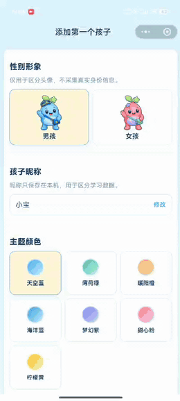
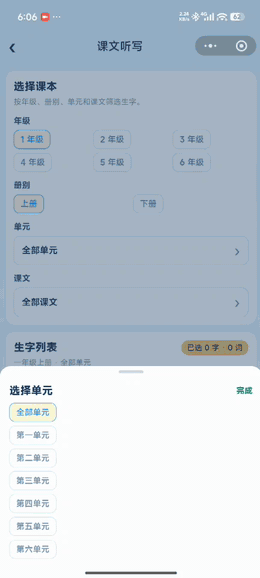
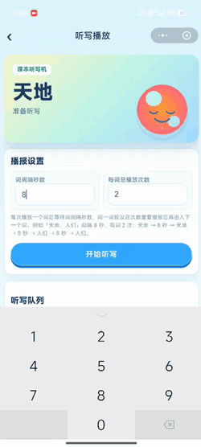
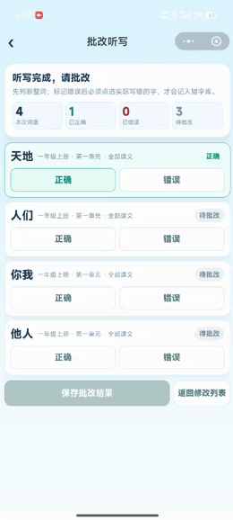

自己写的：

之前的文章基本上是全部 AI 输出，使用固定的 SKILL、固定的风格。但是有时候读下来确实生硬。

不过我确实也没时间，就在文章最上面简单写一些主要的。

错字功能上线了。录入文字的语音转文字和拍照转文字，我都砍掉了。服务提供商试用次数有点少，可能我自己使用都会需要付费；万一用的人多一点，非常不划算，还是自己手动输入吧。

字词转播报的，三个月内有免费额度，可以正常用。三个月以后要换其他平台了。

还有个课文导入的，可能课本内容和当前的不一定一致。先让 AI 实现了功能，细节 bug 后续再说吧。

凑合用用，本身就写着玩。

结论：没有任何小程序的开发经验，通过打字跟 AI 沟通，是可以写出来不错的小程序应用的。这也是我第一次写小程序。如何清楚知道自己想做啥的话，可以尝试。

---

下面是AI 写的

# 字词星球使用说明：从选词到听写批改，一篇讲清楚


上一篇聊了怎么用 AI 把字词星球的原型理顺。

这一篇不讲代码。你拿着手机，跟着点一遍，就能把听写流程走通。

> 关注微信公众号 **AI技趣星球**，回复 MF 一起用技术创造乐趣。

一句话结论：字词星球 = 错字积累 + 听写播报 + 批改记账。听写词只管这一次，批改出来的错字才会长期留着。

难度：⭐

下面按实际操作录了分段动图，卡在哪一步就对着看。

## 使用前，知道这几件事

字词星球是家长做着玩的本地工具，不是商业成品。上手前心里有数，后面少踩坑：

- **听写播报**靠语音合成，需要联网；目前有免费额度，用完后可能要换方案，或者你亲自念给孩子听
- **词语录入**目前只支持手动输入；语音转文字、拍照识字这类功能还没做
- **课文生字**按人教版整理，和你手边教材可能对不上，发现差异欢迎评论区反馈
- **学习数据**存在本机，换手机或清缓存会丢，记得定期去设置里导出备份

## 怎么找到字词星球

打开小程序，先进 **学习星球** 首页。

中间那块「字词听写」就是入口，点进去就到字词星球了。首页会显示这个孩子还有几个错字待练，一眼能判断今晚要不要加练。

右上角头像旁可以 **切换孩子**。家里俩娃各记各的，不会把哥哥的错字算到妹妹头上。

第一次用的话，先去 **孩子列表** 添加档案：填昵称、选头像、勾选要开的模块（音标、拼音、字词至少勾上字词）。建好档案再开始听写，数据才有地方放。



## 先搞懂两件事：听写词 vs 错字

很多家长第一次用会懵：明明昨天加了词，今天怎么没了？

因为字词星球把数据分成两层：

| 类型 | 存多久 | 从哪来 |
|------|--------|--------|
| **听写词**（听写列表） | 只管本次听写，清空就没了 | 课本选词、手动录入、错字复习 |
| **错字**（错字库） | 长期积累，跟着孩子走 | 听写批改时标记不会的字、手动录入错字 |

打个比方：

- 听写列表 = 今晚要考的卷子，考完可以扔
- 错字库 = 孩子的错题本，得一直留着复习

所以你在听写列表里删词、清空，都不会动到错字库。反过来，错字库里的字也不会自动出现在今晚的听写里——你得自己选进去。

## 字词星球首页：先看一眼再动手

进到字词星球，顶部有三块数字，帮你判断孩子最近状态：

- **在练错字**：还没掌握的，今晚可以优先练
- **累计错字**：历史上记过的总数，看积累量
- **最高错次**：单个字最多错过几次，一眼找「老大难」

下面三个入口，日常最常用：

1. **开始听写** — 看本次要听哪些词，确认好了再播
2. **课文听写** — 按年级课本挑生字，省得自己翻书抄
3. **手动录入错字** — 作业本上刚写错的字，先记进错题本

再往下是错字卡片，可以左右滑筛选：

- **全部**：还在练的全部错字
- **高频错字**：错 3 次及以上，建议本周重点听
- **本周新增**：这周刚加入的，看看新坑在哪
- **最近错字**：近 7 天又写错过的，说明还没稳住
- **已掌握**：连续写对 3 次后暂时移到这里

每张卡片会写：这个字错几次、关联哪些听写词。比如「候」下面写着「时候、等候」——下次复习会念完整词，但统计的仍是「候」这个字。

底部 **全部错字** 点进去，能搜索、按时间或错次排序、批量勾选删除。字多的时候比首页卡片好找。

## 一次完整听写：跟着走就行

整条链路就 5 步，第一次建议完整走一遍，后面就会很快：

```text
选词 → 听写列表确认 → 播放听写 → 批改 → 看结果
```

### 第 1 步：把词加进听写列表

不管从哪个入口选词，最后都会进 **同一个听写列表**。你可以混着加：先加课本词，再补几个错字复习词，列表会按加入顺序排好。

**方式 A：课文听写（最省事）**

1. 点「课文听写」，先选年级和上下册
2. 再点「选择单元」「选择课文」——拿不准就选「全部单元」「全部课文」，范围大一点
3. 勾选要练的生字，可以多选
4. 下方会实时显示将生成多少个词，确认数量合理再点「加入听写列表」
5. 跳回听写列表后，检查每个词的来源标签对不对（比如「一年级上册 · 第二单元 · 第三课」）

小提示：切换单元或课文后，之前勾的生字会清空，这是正常的，避免串课内容。



**方式 B：从错字复习（周末加练常用）**

1. 首页点「全部错字」，或在听写列表底部点「错字」
2. 勾选要复习的字——可以点「选择本周」一次选一整周
3. 系统按关联词生成听写词：选了「候」，通常会播报「时候」
4. 点「开始听写」进入列表，还能继续加词，不必立刻播

**方式 C：手动录入听写词（老师布置了额外词语）**

1. 听写列表底部点「手动录入」
2. 点输入框，批量粘贴或输入词语，逗号、顿号、空格都能分隔，一次最多 30 个
3. 上方出现字块后，**按你想听的顺序** 逐个点字——比如「时候」先点「时」再点「候」
4. 下方出现已选序列，确认词语完整后点保存，词就进列表了

> 这里的「手动录入」只加听写词，**不会**写进错字库。作业本上已经写错的字，请走首页「手动录入错字」。

列表里你还能：

- 看拼音和来源，确认没加错
- 单个词点「删除」
- 底部「清空」一键清列表（会弹窗确认，错字库不动）
- 重复加同一个词，系统自动去重，不会出现两遍

### 第 2 步：调播报，让孩子准备好纸笔

列表确认无误，点「开始听写 N 词」进入播放页。

建议先让孩子坐好、笔拿好，再点播放——第一个词出来得很快。

两个参数按需调：

| 设置 | 默认 | 你可以这样调 |
|------|------|--------------|
| 词间隔秒数 | 8 秒 | 一年级写慢了就调到 10～12 秒；高年级熟练可缩到 5～6 秒 |
| 每词总播放次数 | 2 次 | 新词用 2～3 次；复习词 1 次就够 |

播报顺序是这样的（以「时候、游泳」为例，间隔 8 秒、每词 2 次）：

```text
时候 → 等 8 秒 → 时候 → 等 8 秒 → 游泳 → 等 8 秒 → 游泳
```

注意：是 **一个词连播几遍，再换下一个词**，不是每个字之间等 8 秒。

播放过程中：

- 点 **暂停** 可以中途停一下，给孩子揉揉手
- 某个词老听不清，点那一行的 **试听** 单独重听
- 全部播完，按钮会变成「开始批改」

没声音？听写靠语音合成，需要联网。先试听一个词排查；实在不行你亲自念，照样可以进批改。



### 第 3 步：批改——这一步最关键

孩子写完了，进入批改页。每个词做两件事：

1. 先点 **正确** 或 **错误**
2. 标了错误的，必须再点 **具体哪个字写错了**（可多选）

比如「时候」写错了，只点「错误」不够——得点出是「候」写错了。这样错题本才知道问题在哪。

全部词都判完后，点「保存批改结果」。这时候系统才会记账：

- 点选的字进入错字库
- 老错字：次数 +1
- 新错字：首次加入，并挂上本次听写词
- 同一轮只结算一次，手快点两次也不会重复加



### 第 4 步：看结果，决定今晚收工还是加练

结果页会给你一张「成绩单」：

- 几个词对了、几个错字被记下来
- 每个字是「新加入」还是「错误 +1」，变化一目了然

两个常用按钮：

- **只重听本次错词** — 把写错的词塞回听写列表，趁热再练一轮
- **返回字词星球** — 今晚收工，改天再从高频错字里挑

顺便一提：完成听写会给 **电子宠物** 加积分和经验。想晒一下成果可以点分享，每个任务分享奖励限领 1 次，每天最多 3 次。

批改保存后，回字词星球首页就能看到错字更新了——「他」「们」这类字会带着关联词出现在卡片里。


## 手动录入错字：作业本上的错，当场记

不用等听写，作业刚改完就能记：

1. 首页点「手动录入错字」
2. 点输入区，输入「时候、游泳、慢慢」这类词语
3. 按顺序点字块——每点一个字，下方多一行「会 / 不会」
4. **整词每个字都判断完**，保存按钮才会亮
5. 标了「不会」的字进错字库，并和完整词语关联

举个例子：「时候」里「时会写、候不会写」，保存后错字库多一个「候」，关联词写着「时候」。下次复习会念「时候」，但统计的是「候」。

别和听写列表里的「手动录入」搞混：

| 入口 | 记到哪 | 什么时候用 |
|------|--------|------------|
| 首页 · 手动录入错字 | 错字库，长期保留 | 作业本上已经写错的字 |
| 听写列表 · 手动录入 | 本次听写列表 | 今晚要听、还没写错的词 |

## 错字什么时候算「已掌握」

不会永远挂在待练列表里。

同一个字在听写批改里连续标 **正确 3 次**，就会移到「已掌握」。首页「在练错字」数量会降下来，说明孩子稳住了。

以后还能在「已掌握」分类里找到它。要是又写错了，会自动回到在练列表。

## 数据备份：换手机前一定先做

字词星球的数据存在 **你这台手机本地**，没有云端自动同步。

这意味着：换手机、删小程序、清缓存，错字库都可能没了。所以养成习惯——**重要数据先导出**。

### 怎么导出

1. 底部切到 **设置** 页（小齿轮图标）
2. 点 **数据备份与恢复**
3. 先看一眼「当前本地数据」：几个孩子、多少个错字
4. 点 **导出并复制到剪贴板**
5. 弹出提示后，打开备忘录或微信「文件传输助手」，**粘贴保存**

导出的是一段 JSON 文本，看着像乱码没关系，整段复制、整段保存就好。建议备份标题写上日期，比如「字词星球备份-2026-06-07」。

这份备份里有什么？

- 孩子档案和模块设置
- 音标、拼音、字词学习进度
- 错字库和关联词语
- 当前听写队列、宠物积分等会话状态

### 怎么导入（恢复数据）

1. 同样进入 **设置 → 数据备份与恢复**
2. 在「导入备份」输入框 **整段粘贴** 之前的 JSON
3. 点 **确认导入**
4. 会弹窗告诉你：将覆盖本地几个孩子、几个错字——仔细看清再点确定
5. 导入成功后，回字词星球看一眼错字还在不在

几个实际场景：

- **换手机**：旧手机导出 → 发到微信 → 新手机安装小程序 → 导入
- **夫妻两台手机**：一个人带娃听写、另一个人查错字，可以定期导出同步（导入会覆盖本机数据，导入前先导出当前版本留底）
- **误删错字想找回**：只有导入更早的备份才行，平时建议每月备一次

注意：导入会 **覆盖本机全部学习数据**，不是合并。两台设备各有一份不同的错字记录时，先想清楚要以哪份为准。

## 常见问题

**Q：听写列表清空后，错字还在吗？**

在。清空只动本次听写词。

**Q：「时候」只错了「候」，听写时念什么？**

念完整词「时候」。统计的是「候」。

**Q：换了孩子，数据会混吗？**

不会。切换孩子后，错字、进度各自独立。备份里包含所有孩子的数据，导入后也会一起恢复。

**Q：课文生字和教材对不上？**

目前按人教版整理。某一课缺字或多字，评论区说一声，我们逐课核对。

**Q：备份文本太长，粘贴失败？**

尽量用备忘录或文件传输助手，避免在聊天窗口里截断。输入框支持较长文本，但要保证 JSON 首尾完整。

**Q：能不能语音输入或拍照录入词语？**

目前不行，只支持手动输入。作业本上错的字，走「手动录入错字」逐字标记。

**Q：听写播报以后还能用吗？**

目前语音合成有免费额度，正常使用没问题。额度政策可能调整，真遇到播不出来，你可以自己念，批改流程不受影响。

## 功能速查表

| 我想… | 去哪里 | 怎么点 |
|--------|--------|--------|
| 按课本听写 | 课文听写 | 年级册别 → 单元课文 → 勾生字 → 加入列表 |
| 复习旧错字 | 全部错字 | 勾选错字 → 开始听写 |
| 记作业错字 | 手动录入错字 | 输入词语 → 逐字标会/不会 → 保存 |
| 临时加几个词 | 听写列表 → 手动录入 | 输入词语 → 按顺序点字 → 保存 |
| 调播报速度 | 听写播放页 | 改词间隔、每词播放次数 |
| 只重练错词 | 听写结果页 | 只重听本次错词 |
| 删不要的错字 | 全部错字 | 勾选 → 删除 |
| 备份/恢复数据 | 设置 → 数据备份与恢复 | 导出复制 / 粘贴导入 |
| 换手机迁数据 | 旧手机导出 → 新手机导入 | 先导出再装小程序 |

## 今天的小结

今晚就能试一遍完整流程：

1. 课文听写加 5 个词
2. 间隔调到孩子写得舒服的速度
3. 播完批改，故意标错一个字看错题本有没有记下
4. 去设置里导出一份备份，存进备忘录

记住 4 件事：

- 听写列表管这一次，错字库管长期复习
- 批改标错时，一定要点出具体哪个字
- 连续写对 3 次，错字会自动「已掌握」
- 换手机前先导出，别等数据丢了再后悔

产品设计那篇想了解「字和词为什么分开记」，可以看上一篇《我用 AI 设计字词星球》。

> 关注微信公众号 **AI技趣星球**，回复 MF 一起用技术创造乐趣。

---
*阅读更多：上一篇《我用 AI 设计字词星球》*
*有问题？评论区告诉我*
