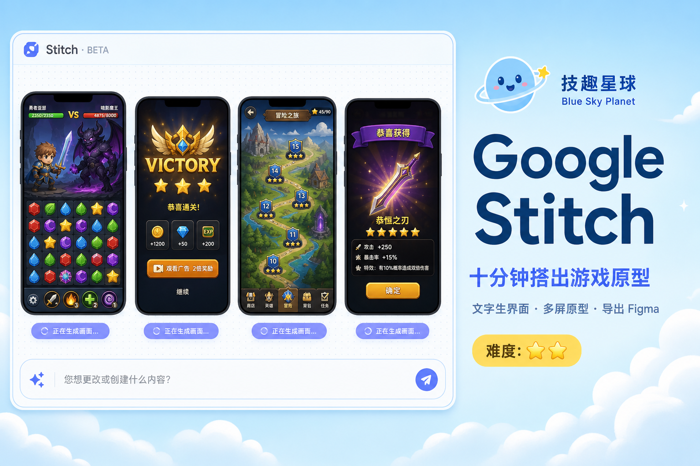
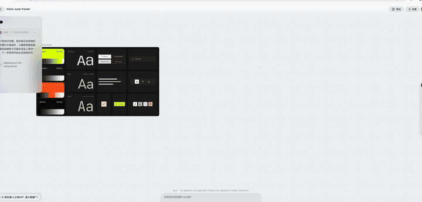
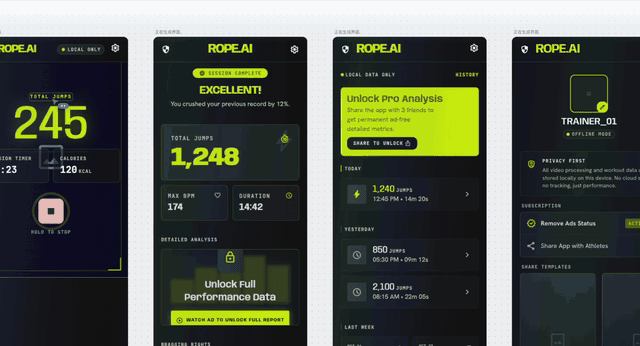
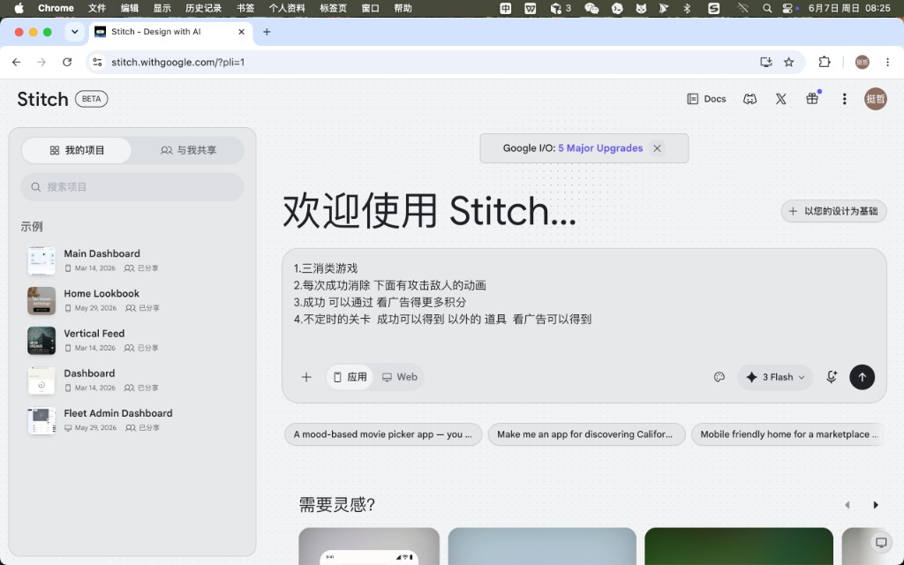
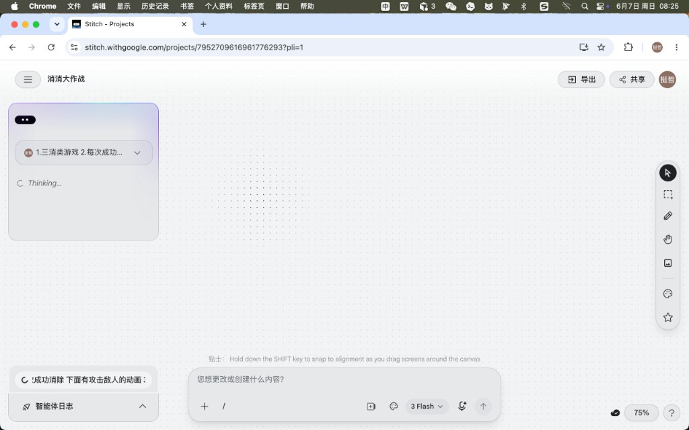
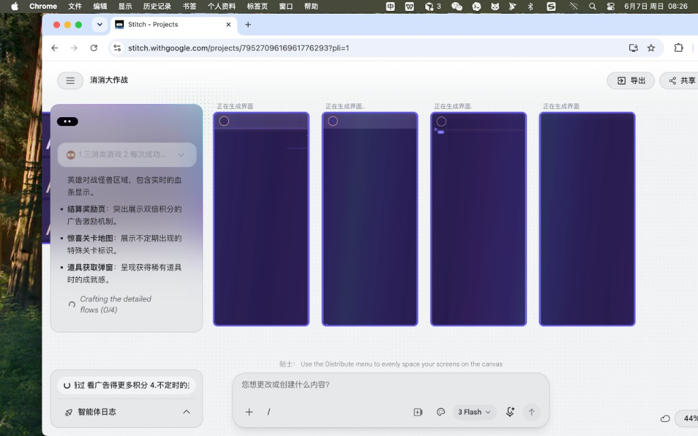
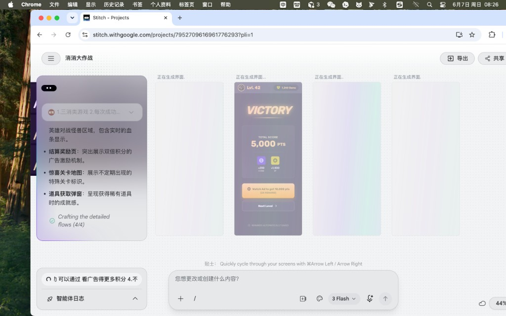
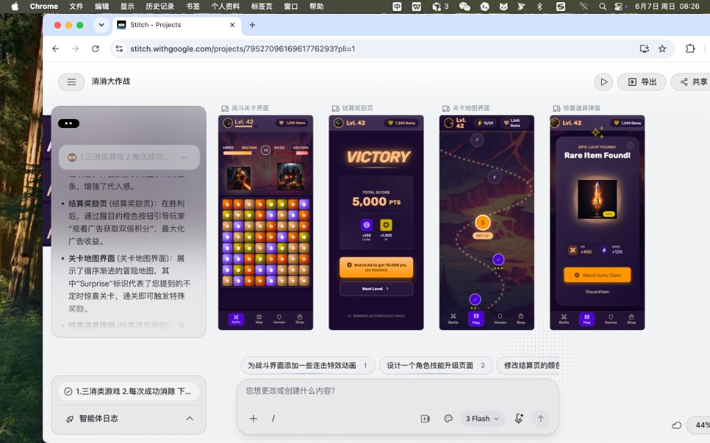

自己写的：

不是广告，自己用过了

工具免费，想花钱都不行 每个月都有免费额度。因为是 beta 版本不算是正式发布，额度用完也只有等下个月刷新

有时候我们有很好的想法，也有明确的思路。但是做出来的东西 很粗糙，没有设计感。

没有美术的专业美感，只是完成了功能，并没有让产品 更好用。让更多人喜欢用。做出来的东西就很像草台班子。

或者连草台班子都算不上 毕竟就是一个人。

然后我发现了 谷歌的这个工具。感觉不错

比很多 AGENT 出的草图好太多了

---

下面是AI 写的

# 不会画原型？我用 Google Stitch 十分钟搭出「消消大作战」四屏界面



> Google Stitch 上手指南 · 从一句话到可点原型
>
> 技趣星球 · 用技术创造乐趣

下面两段录屏节选，是我用 Stitch 做「跳绳记录 App」的真实操作（项目名 Vision Jump Tracker）。从四屏开始生成到成品，全程在浏览器里完成。





你想做一个 App，脑子里有画面，但不会 Figma，也不会画线框图。

以前只能写一大段需求文档，扔给 AI 写代码——结果经常跑偏，改来改去。

Google 在 2025 年 I/O 上推出的 **Stitch**（[stitch.withgoogle.com](https://stitch.withgoogle.com/)），走另一条路：**先出高保真界面，再导出 Figma 或 HTML 代码**。

我按网上教程和官方能力，用中文界面跑了一遍「三消 + 打怪 + 看广告得积分」的小游戏原型。从打开网页到四张手机屏并排出来，大约十分钟。

**一句话结论：Stitch 适合「想法还不成熟、但想先看见长什么样」的阶段；免费、浏览器里就能用，不用装软件。**

难度：⭐ 到 ⭐⭐

---

## Stitch 像「会画图的 AI 产品经理」

传统流程是：你口述 → 设计师画稿 → 开发照着做。Stitch 把前两步压缩成一次对话。

它底层是 Google 的 Gemini 多模态模型（界面里可选 **3 Flash** 等档位）。你输入文字、上传草图或截图，甚至对着画布说话，它就在无限画布上生成可编辑的手机/网页界面。

和 Midjourney 不一样：Stitch 产出的是**有层级、可导出、能连屏成原型**的 UI，不是一张 flat 配图。

| 你能得到什么 | 说明 |
|-------------|------|
| 高保真界面 | 布局、配色、字体、间距一次生成 |
| 多屏原型 | 多张屏连起来，点 Play 可预览流程 |
| 导出 Figma | 标准模式可导出可编辑图层（需 Figma 插件） |
| 导出代码 | HTML + Tailwind，部分模式支持 React/JSX |
| DESIGN.md | 记录配色、字体规则，后续生成保持一致 |

**当前费用（2026 年初）：** Labs 阶段免费。标准模式约 350 次/月，实验模式约 50～200 次/月，无需绑卡。具体额度以官网为准。

**使用条件：** 18 岁以上 Google 账号，且所在地区能使用 Gemini。

---

## 第一步：打开 Stitch，选「应用」还是「Web」

**难度：⭐**

1. 浏览器访问 [stitch.withgoogle.com](https://stitch.withgoogle.com/)
2. 用 Google 账号登录
3. 首页大输入框下方，选 **应用**（手机图标）或 **Web**（显示器图标）

做手游界面就选「应用」。做落地页选「Web」。

左侧是「我的项目」列表，可以搜历史项目；下方有示例项目可参考。



---

## 第二步：写需求——越具体，界面越像你要的

**难度：⭐**

官方和社区教程都强调：**一条线程里只做一个平台**（手机或网页），别混着来。

我这次用的是「消消大作战」示例，首条提示词可以写成：

```text
做一个三消类手游，中文界面，暗色游戏风。

核心玩法：
1. 上方是英雄打 BOSS，有血条
2. 下方是三消棋盘，消除后触发攻击动画
3. 过关结算页：突出「看广告双倍积分」按钮
4. 关卡地图：有不定时出现的惊喜关卡
5. 获得稀有道具时弹窗，可看广告领取

请一次生成：战斗关、结算页、关卡地图、道具弹窗，共 4 个手机屏。
```

要点（综合 [Google 开发者论坛提示指南](https://discuss.ai.google.dev/) 与多篇英文教程）：

- **说清平台**：「手机 App」「iOS 风格」比只说「做个游戏」强很多
- **说清用户场景**：给谁用、什么情绪（紧张、成就、放松）
- **一次点名要几张屏**：比生成一张再补三张更省额度
- **给视觉参考**：「像 Candy Crush 的棋盘 + RPG 血条」比抽象描述好

发出去之后，画布左侧会出现需求卡片，状态先是 **Thinking...**，再进入 **Crafting the detailed flows**。



---

## 第三步：等 AI 拆流程、逐屏生成

**难度：⭐**

2026 年 3 月大更新后，Stitch 从「单屏聊天」变成 **无限画布 + 设计智能体**：

- 左侧卡片会列出它理解的子功能（血条、广告按钮、惊喜关卡等）
- 中间并排出现手机框，先显示「正在生成界面...」
- 进度如 **Crafting the detailed flows (0/4)** → **(4/4)** 打勾

这一步不用你操作，等即可。复杂项目可能 1～3 分钟出齐四屏。



生成过程中会先出完某一屏（例如 **VICTORY** 结算页），其余仍在加载——属于正常现象。



---

## 第四步：看成品——四屏已经能当原型讲需求

**难度：⭐**

我这次跑出来的四屏（见头图）：

| 屏幕 | 内容 |
|------|------|
| 战斗关卡 | 上方 HERO/BOSS 血条，下方三消棋盘，底栏 Battle / Map / Heroes / Shop |
| 结算奖励 | VICTORY、总分、金币经验，橙色 **Watch Ad to get 10,000 pts (2X REWARD)** |
| 关卡地图 | 纵向路径、关卡节点、惊喜关标识 |
| 道具弹窗 | EPIC LOOT、属性加成、**Watch Ad to Claim** |

左侧卡片还会用中文解释设计理由，比如「结算页用醒目橙色引导看广告」。这对跟团队或客户对齐很有帮助。

生成完成后，底部会出现**建议下一步**，例如：

- 为战斗界面加连击特效
- 设计角色技能升级页
- 修改结算页配色

点一条或自己在输入框里改都行。



---

## 第五步：迭代、连原型、导出

**难度：⭐⭐**

### 用对话改细节

底部输入框占位符是「您想更改或创建什么内容?」。常用改法：

```text
把结算页主按钮改成绿色，文案改成中文「看广告领双倍」
```

```text
战斗界面棋盘加大，血条移到最顶部
```

小改优先用**对话**；大改可以选中某一屏重新描述。2026 更新也支持在画布上**直接改文字、换图、调间距**，不必每次都重新生成。

### 连屏成可点原型

多屏都满意后：

1. 选中多张屏
2. 使用 **Stitch**（连屏）功能，让 AI 推断跳转关系
3. 点 **Play** 预览完整流程

适合演示「过关 → 看广告 → 回地图」这类路径。

### 导出给设计师或开发

| 导出方式 | 适用 | 注意 |
|---------|------|------|
| **Figma** | 交给设计师精修 | 仅**标准模式**；图层偏多，需整理 |
| **HTML / Tailwind** | 快速落地页 | 交互要自己做 |
| **React / JSX** | 前端起步 | 需二次工程化 |
| **MCP 服务器** | 接 Cursor、Claude Code 等 | 设计直驱编码 |

社区常见链路：**Stitch 出稿 → Figma 修 → v0 / Bolt / 人工写 React**。

### DESIGN.md：多屏风格不跑偏

做超过 2 屏时，建议让 Stitch 维护一份 **DESIGN.md**，写清主色、字体、圆角、间距。之后新生成的屏会尽量遵守同一套规范。

示例片段：

```markdown
## 颜色
- 主色：#6366F1
- 强调（广告按钮）：#F97316
- 背景：#0F172A

## 规则
- 广告 CTA 必须用橙色、全宽按钮
- 手机屏宽 390px，暗色游戏风
```

---

## 标准模式 vs 实验模式：怎么选

| | 标准模式 | 实验模式 |
|---|---------|---------|
| 模型 | Gemini 2.5 Flash 等 | Gemini Pro / 更新后端 |
| 速度 | 快 | 较慢 |
| 上传图片/草图 | 一般不支持 | 支持 |
| 导出 Figma | ✅ | ❌ |
| 月额度 | 约 350 次 | 约 50～200 次 |

**经验：** 纯文字做多屏手游 → 标准模式够用。要把白纸草图或竞品截图喂进去 → 开实验模式，但 Figma 导出要另想办法（例如截图或 HTML）。

---

## 和其他工具比一比（帮你决定要不要试）

| 工具 | 擅长 | 和 Stitch 的差别 |
|------|------|-----------------|
| **Figma** | 协作、组件库、精细设计 | Stitch 更快出第一版，不能替代团队设计系统 |
| **v0 / Bolt** | 文字直接出可运行网页 | Stitch 画布多屏、原型感更强，游戏/App 视觉更完整 |
| **Galileo AI** | 已被 Google 收购，并入 Stitch | 老 Galileo 用户需迁移到 Stitch |

Stitch **不是** Figma 替代品，而是把「从 0 到能看」的时间从几天压到几分钟。

---

## 我踩过的坑 & 网上教程共识

1. **一条提示词塞 10 个屏** → 质量明显下降。先核心 3～4 屏，再扩展。
2. **不说明手机还是网页** → 布局经常不对。开头就写死平台。
3. **只看图不看代码** → 开发仍从零量尺寸。至少导出 Figma 或 HTML 当参考。
4. **实验模式出稿却想进 Figma** → 当前无法直接导出，要提前选模式。
5. **把第一版当终稿** → 好结果往往来自 3～5 轮小改，而不是重 roll。

Voice Canvas（语音改稿）和粘贴 URL 提取竞品风格，是进阶玩法；本文流程跑通后再试即可。

---

## 今天的小结

今天只需要记住 3 件事：

- **Stitch = 浏览器里的 AI 原型机**，地址 [stitch.withgoogle.com](https://stitch.withgoogle.com/)，免费额度够试水
- **写好「平台 + 用户 + 多屏清单」**，比泛泛说「做个 App」重要十倍
- **出稿后**用对话微调、Play 连屏、再导出 Figma 或代码——别停在第一张图

如果你也有一个「字词星球」「音标星球」式的产品想法，不妨先用 Stitch 把主流程四屏画出来，再决定要不要写代码。比直接让 AI 开写，省很多返工。

---

## 附录：可直接复制的英文/中文提示词模板

**模板 A · 工具类 App（中文）**

```text
设计一个手机 App，iOS 风格，浅色简洁。
用户：25～40 岁上班族。
需要 4 屏：登录、首页仪表盘、设置、个人资料。
首页要有今日任务卡片、进度环、底部 Tab 导航。
请保持统一圆角和蓝色主色。
```

**模板 B · 游戏（本次案例精简版）**

```text
Mobile match-3 game, dark fantasy UI, English labels OK.
Screens: battle with hero/boss HP bars, victory rewards with rewarded ad button,
level map with bonus nodes, loot popup with watch-ad claim.
Generate all 4 screens in one flow, consistent art style.
```

**模板 C · 迭代单屏**

```text
Keep the battle screen layout. Change gem colors to red/blue/green/yellow only.
Add a combo counter top-center. Localize all text to Simplified Chinese.
```

---

## 参考与延伸阅读

- 官网：[Stitch - Design with AI](https://stitch.withgoogle.com/)
- 背景：Stitch 源自 Google 收购的 Galileo AI（2025 I/O 发布）
- 英文实操：[LogRocket · Google Stitch tutorial](https://blog.logrocket.com/google-stitch-tutorial/)
- 功能综述：[Google Stitch Complete Guide (2026)](https://www.fysalyaqoob.com/guides/google-stitch-complete-guide)
- 生态对比：[o-mega · Google Stitch & AI Design Tools](https://o-mega.ai/articles/google-stitch-and-ai-design-tools-complete-guide)
