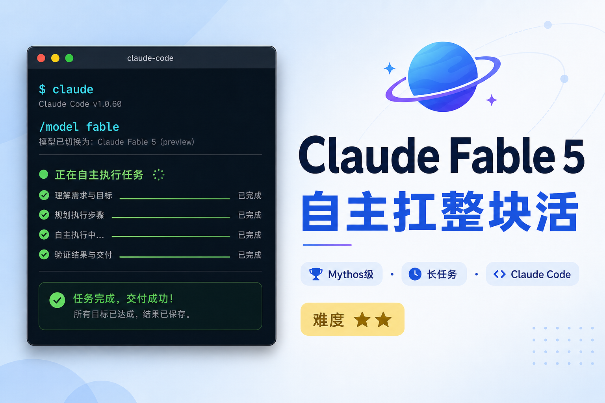

# Claude Fable 5 来了：AI 从「帮你干活」升级成「替你扛事」



> 写作时间：2026 年 6 月 10 日。模型名称、价格和开放策略可能调整，动手前以 [Anthropic 官方公告](https://www.anthropic.com/news/claude-fable-5-mythos-5) 为准。

昨天，你的朋友圈可能被一条消息刷屏：

> 「Claude 又发新模型了。」

但名字有点绕——不是 Claude Code 5，也不是简单的 Opus 4.9。

官方叫 **Claude Fable 5**，属于全新的 **Mythos 级**模型。

如果你只把它理解成「又强了一点」，可能会错过这次更新的真正变化：

**Claude Fable 5 让 AI 从「回答问题」，变成「独自扛住整块工作」。**

难度：⭐⭐ 
有 Claude 付费账号就能试；没账号也能读懂这波变化，判断要不要跟进。

---

## 名字先捋清：Fable 5、Mythos 5、Claude Code，各是什么？

很多人搜「Claude Code 5」，其实官方并没有这个产品名。

6 月 9 日 Anthropic 同时发了两个模型，底层是同一套「大脑」，安全策略不同：

| 对比项 | Claude Fable 5 | Claude Mythos 5 |
|--------|----------------|-----------------|
| 谁能用 | 普通人，公开可用 | 政府合作方等受限用户 |
| 安全策略 | 加了安全护栏 | 部分护栏解除 |

两者底层是同一模型，差别在「门禁等级」——普通人接触 Fable 5 就够了。

**Claude Code** 是终端里的 AI 编程助手，不是新模型本身。

但它第一时间接入了 Fable 5——你在命令行里输入 `/model fable`，就能切换到这颗新大脑。

你可以这样记：

| 你听到的词 | 实际是什么 |
|-----------|-----------|
| Claude Fable 5 | 新模型，Mythos 级，公开可用 |
| Claude Mythos 5 | 同模型，高权限版，普通人碰不到 |
| Claude Code | 装在你电脑上的 AI 干活工具 |
| Dynamic Workflows | Claude Code 的「百级 Agent 编排」功能 |

---

## 像雇了个能加班的资深同事，不是更聪明的聊天机器人

以前用 AI，像在上问朋友：

> 「这段代码怎么改？」

朋友回你建议，复制、粘贴、调试，还是你的事。

Fable 5 更像公司刚招来的资深同事。

Stripe 在官方测试里说：Fable 5 把**原本团队两个月才能做完的代码库迁移**，在**一天内**跑完了——面对的是 **5000 万行** Ruby 代码。

这不是「回得快」，是「能自己干完」。

头部博主 Dan Shipper（Every 创始人，也参与 Claude Code 桌面端）说得更直白：

> 我们正在从「给 AI 派任务」，走向「给 AI 派责任」。

他团队内部的 Senior Engineer 基准测试里，Fable 5 拿了 **91 分**，Opus 4.8 是 63，GPT-5.5 是 62。

前 Tesla AI 总监 Andrej Karpathy 的评价更狠：

> 这是一次「值得升大版本号」的跃迁。 
> 用法变了——给它任务，然后走开，让它跑 3～4 小时，甚至通宵。

他把 Fable 5 比作星际穿越里的**曲速引擎**：你输入坐标，它自己算路线、自己飞，你不用全程盯着。


对普通人意味着什么？

你不写代码，也可能受益——整理年报、做调研、把一堆表格变成可视化报告，这类「又臭又长」的活，正是 Fable 5 的强项。

---

## 数字背后：这次强在哪？

权威来源主要是 [Anthropic 官方公告](https://www.anthropic.com/news/claude-fable-5-mythos-5) 和 [Claude API 发布说明](https://platform.claude.com/docs/en/release-notes/overview)。

几个普通人也看得懂的亮点：

| 能力 | 通俗理解 |
|------|----------|
| 上下文 100 万 token | 能「读完」整本书再回答 |
| 最长输出 12.8 万 token | 一次能写出完整方案 |
| 自适应思考始终开启 | 难题会多想几步，不用你手动开 |
| 编程基准大幅领先 | 复杂项目更不容易半途而废 |

外媒 The Decoder 引用的 Cognition FrontierCode 测试：

| 模型 | 高难度编程任务通过率 |
|------|---------------------|
| Claude Fable 5 | **29.3%** |
| Claude Opus 4.8 | 13.4% |
| GPT-5.5 | 5.7% |

还有一个好玩的数据点：Fable 5 用**纯看游戏画面**的方式，独自打通了《宝可梦 火红》。

以前的模型需要额外「外挂」才能玩，这次只靠截图就通关了。

说明它的「看图理解 + 长期规划」确实上了一个台阶。

---

## Claude Code 用户：现在就能试的三件事

如果你已经在用 Claude Code（装法见《Claude Code 怎么用？普通人也能上手的 AI 编程助手》），Fable 5 不是远在天边的新闻。

**第一件：切换模型**

确保 Claude Code 版本 ≥ 2.1.170，在终端里输入：

```text
/model fable
```

**第二件：把任务描述写「长」一点**

Fable 5 擅长长任务。别只说「修这个 bug」，试试：

```text
请阅读整个项目的 README 和 src 目录结构，
找出所有硬编码的中文字符串，
统一抽到 i18n 配置文件里，
改完后跑测试，把失败项列成表格给我。
```

**第三件：配合 Dynamic Workflows 处理大工程**

5 月底 Claude Code 还上线了 **Dynamic Workflows**（动态工作流）：

- Claude 自己写编排脚本
- 后台最多 **16 个并发 Agent**，单次上限 **1000 个**
- 中间结果存在脚本变量里，不占你的对话窗口
- 中断后可在同一会话续跑

博主 yeekal 的评价很实在：

> 目标用户是企业级大规模重构。普通开发者，子 Agent 已经够用了。 
> 但如果你要审计整个代码库、批量改几千个文件，值得一试。

触发方式：提示词里带上 `workflow` 或 `ultracode`，或设置 `/effort ultracode`。

---

## 普通人最关心的：要钱吗？有什么坑？

### 限时免费窗口

Anthropic 官方时间表：

| 时间段 | Pro / Max / Team 用户 |
|--------|----------------------|
| 6 月 9 日～6 月 22 日 | Fable 5 **包含在订阅里，不加价** |
| 6 月 23 日起 | 需额外购买 **usage credits** 才能继续用 |
| 之后（容量够时） | 计划重新纳入常规订阅 |

所以：**现在试，成本最低。**

### 价格档位

API 定价：输入 **$10/百万 token**，输出 **$50/百万 token**。

比上一版 Mythos Preview 便宜一半以上，但仍是 Opus 4.8 的 **2 倍**。

Dan Shipper 也提醒过：强模型 + 长任务 = 账单可能让你意外。

建议从小任务开始，别一上来就「重构整个项目」。

### 安全护栏：偶尔会「降档」

Fable 5 带了新的安全分类器。

碰到网络安全、生物化学等敏感话题，会自动改用 Opus 4.8 回答。

官方说这类情况平均不到 **5%** 的会话，但偶尔会误伤正常提问。

你会收到通知，知道当前不是 Fable 5 在答。

---

## 三个场景：不写代码也能用

**场景一：职场人做季度复盘**

把销售表、会议纪要、客户反馈丢给 Claude，让它交叉分析，输出一页纸结论。

Fable 5 在 Hebbia 金融基准和 IMC 交易分析测试里都拿了高分——读表、找根因是它的强项。

**场景二：自媒体创作者做选题调研**

> 提示：若模型不能实时联网，请自行粘贴近期热门帖文或截图，再让 AI 归纳。

```text
我是做亲子教育内容的博主，目标读者是 3-8 岁孩子的家长。
请根据我粘贴的近期热门帖文/截图，归纳热度最高的 10 个亲子话题，
每个话题给出：痛点、已有内容缺口、我可以做的差异化角度。
输出成 Markdown 表格。
```

**场景三：小老板做竞品速览**

```text
我公司做儿童拼音学习 App。请根据我上传的三份竞品截图，
对比它们的：首页信息架构、激励机制、家长端功能。
最后给出我们产品下周可以优先改的 3 个点，按投入产出排序。
```

---

## 读完后带走这 3 点

- **Claude Fable 5** 是 Mythos 级新模型，不是「Claude Code 5」；Claude Code 只是接入它的工具之一
- 核心变化是 AI 能**长时间自主干活**，从「问答」变成「扛责任」
- **6 月 22 日前**，付费用户可免费体验；之后注意用量和账单

如果你已经有 Claude Code，今晚就可以试这一条：

```text
/model fable

请用 30 分钟阅读我当前项目，
列出 3 个最影响用户体验的问题，
并给出每个问题的修复步骤（先易后难）。
不要直接改代码，先给我方案让我确认。
```

把 AI 当实习生用，它只会回答。

把 AI 当能加班的同事用，它才会真正帮你省时间。

---

## 信息来源

| 来源 | 内容 |
|------|------|
| [Anthropic 官方公告](https://www.anthropic.com/news/claude-fable-5-mythos-5) | Fable 5 / Mythos 5 发布、基准、定价、开放策略 |
| [Claude API Release Notes](https://platform.claude.com/docs/en/release-notes/overview) | API 与 Claude Code 版本更新 |
| Dan Shipper（Every / X） | Senior Engineer 基准 91 分、「任务→责任」观点 |
| Andrej Karpathy（X） | 「大版本号级跃迁」、长任务自主执行 |
| yeekal.com | Dynamic Workflows 实测与适用场景 |
| The Decoder | FrontierCode 等第三方基准数据 |
