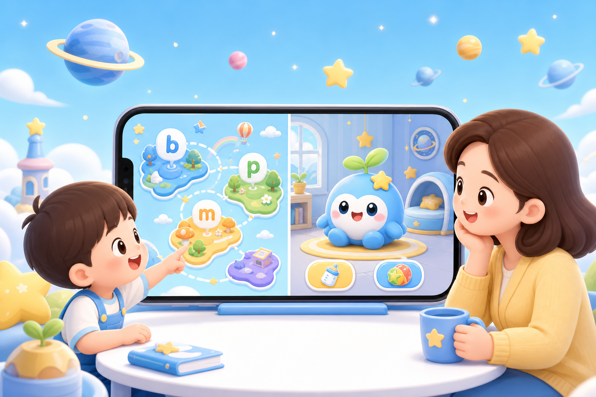

# 拼音星球 + 电子宠物使用说明：学完一关，回去喂芽芽




> 关注微信公众号 **AI技趣星球**，回复MF 一起用技术创造乐趣。

一句话结论：**拼音过关赚积分 → 宠物小屋喂养玩耍 → 商店买装扮**。下面按实际操作顺序写，分段动图在 `./images/demo-*.gif`。

难度：⭐

## 怎么进入

1. 打开小程序，到 **学习星球** 首页（地图页）
2. 右上角 **切换孩子**（宠物、拼音进度、积分都跟着当前孩子走）
3. 第一次用：进 **孩子列表** 建档案，勾选要用的模块（拼音、音标、字词、宠物）

中间模块区两个入口：

| 入口 | 点进去 |
|------|--------|
| **拼音拼读** | 拼音地图 |
| **电子宠物** | 未领养 → 领养页；已领养 → 宠物小屋 |


## 拼音星球（5 步）

```text
地图选一项 → 单项学习 → 自由拼读 → 三题过关 → 回地图
```

1. 点 **拼音拼读**，在地图选一个未完成项（黄色 = 待学）
2. **单项学习**：听示范音，看口型提示和易混对比，点 **去过关**
3. **自由拼读**：选声母、韵母、声调；不能拼的组合会变灰
4. **三题过关**：听音选字母 → 选拼读示例 → 录音回放（录完即算完成）
5. 过关后该项变绿；弹出 **学习奖励** 卡片，积分和经验自动入账

分类入口（声母 / 韵母 / 整体认读）在地图页，想直接找某个字母可以从那里进。


## 电子宠物

### 领养

1. 首页点 **电子宠物**
2. 输入名字（1～8 字，默认「芽芽」）
3. 点 **确认领养 · 获得 30 星星积分** → 进入宠物小屋

每个孩子单独一只；换孩子后，已领养的会直接进小屋，未领养的重新走领养。


### 宠物小屋

**看状态**

| 数值 | 作用 |
|------|------|
| 饱腹 | 低了要喂 |
| 心情 | 玩耍、喂养会涨 |
| 活力 | 玩耍会消耗，不够要先睡 |

**三个按钮**

- **喂养** — 饱腹低于 90 才能点；每天第一次星星饼干免费
- **玩耍** — 需要足够活力（默认有弹弹球）
- **睡觉** — 活力低时可用，睡完活力回升

点宠物本身：随机小动作，不加积分。

右上角：**装扮**、**商店**。下方：**今日任务**、**学习奖励**、**成长手册**。


### 积分和经验从哪来

完成学习后**自动入账**，不用手动领：

| 操作 | 大约得到 |
|------|----------|
| 音标过关 1 项 | +8 ★ · +12 XP |
| 拼音过关 1 项 | +8 ★ · +12 XP |
| 字词听写批改保存 | +6～20 ★ · +10～30 XP（看词数） |
| 升级 | 额外 ★（见成长手册） |
| 分享某次学习成果 | +5 ★（同一任务限 1 次，每天最多 3 次） |

过关页 / 听写结果页的奖励卡片：

- **去看看宠物** → 宠物小屋
- **继续学习** → 回到刚才模块

**学习奖励** 页（小屋下方入口）：

- 看当前 ★ 余额
- 对「待分享」项点 **分享** 领 +5 ★
- 看最近入账记录


### 今日任务

小屋 → **今日任务**，每天 3 条：

1. 完成 1 个音标或拼音关卡
2. 完成 1 组字词听写（批改保存后算完成）
3. 今天学满 2 个不同模块（如拼音 + 听写）

进度显示「完成 X / 3」。点**未完成**的行会跳到对应模块；已完成的不能再点。


### 星星商店

小屋右上角 → **商店** → 选分类（全部 / 食物 / 玩具 / 配饰）→ 点购买。

| 类型 | 买了之后 |
|------|----------|
| 食物 | 进库存，喂养时优先消耗 |
| 玩具 | 永久拥有，玩耍时用 |
| 配饰 | 永久拥有，到装扮间穿戴；部分需达到指定等级才能买 |

积分不够会提示还差多少；够了直接买。


### 装扮间

小屋右上角 → **装扮** → 选部位（头 / 颈 / 背 / 手）→ 点 **穿戴**。

- **卸下**：摘掉当前部位
- 未拥有的：点 **去购买** 跳商店


### 成长手册

小屋 → **成长手册**：看等级、称号、累计 XP、距下一级还差多少，以及各级里程碑。


## 一次走通（示例）

```text
选孩子 → 拼音过关 1 项 → 奖励卡片点「去看看宠物」→ 喂养 → 玩耍 → 今日任务看进度
```

有字词模块的话，再加一步听写批改，任务更容易凑满 3/3。

## 常见问题

**换了孩子，宠物不见了？**  
切回那个孩子；每个孩子独立，未领养的重新领养。

**积分不够买吃的？**  
继续学拼音 / 音标 / 听写；每天还有一次免费星星饼干可喂。

**玩耍点不了？**  
活力不够 → 先 **睡觉** 再玩。

**喂养提示「已经吃得很饱啦」？**  
饱腹 ≥ 90，等第二天或先去玩耍。

**分享没加积分？**  
该任务可能已领过，或今天 3 次分享用完了 → 去 **学习奖励** 页查记录。

> 关注微信公众号 **AI技趣星球**，回复MF 一起用技术创造乐趣。

---
*有问题？评论区告诉我*
