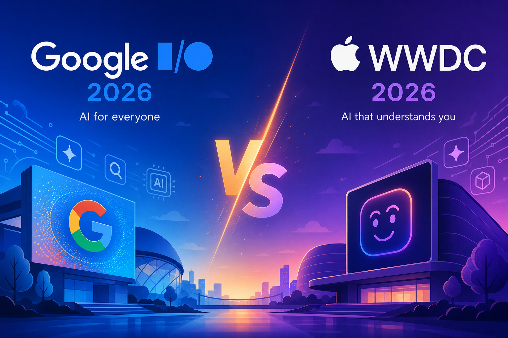
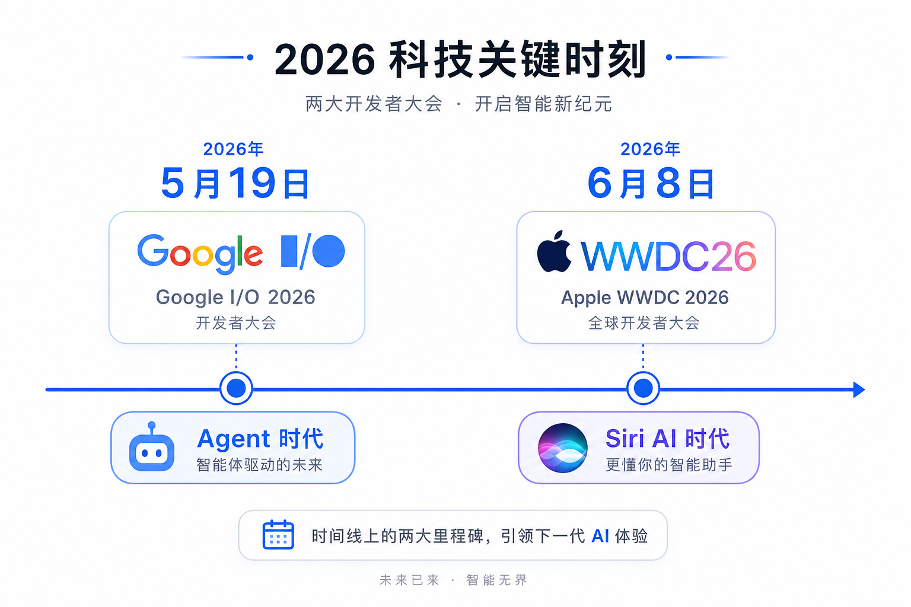
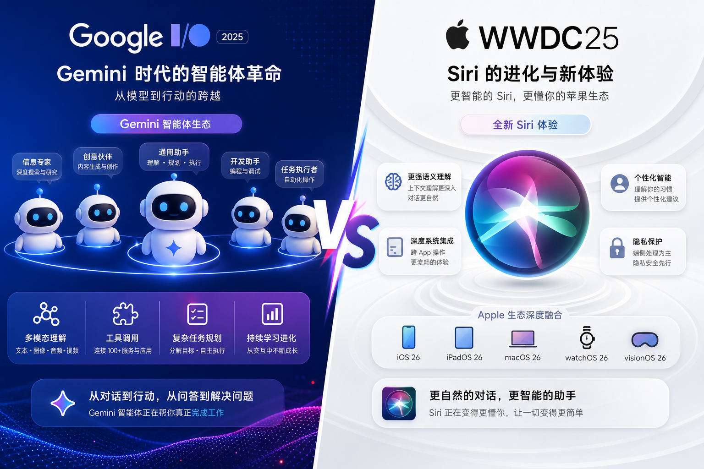
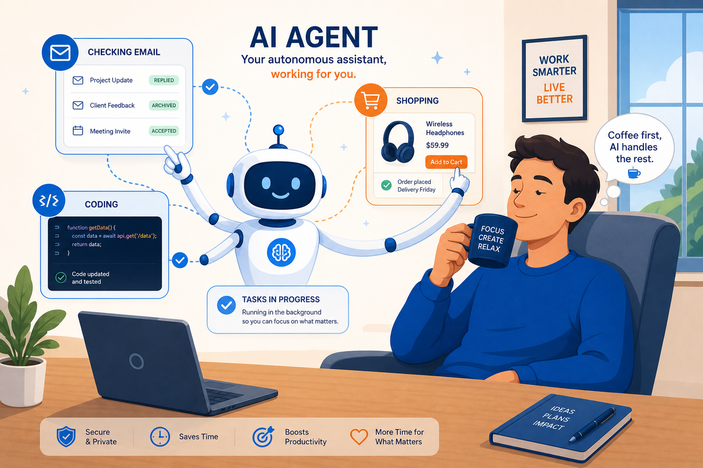
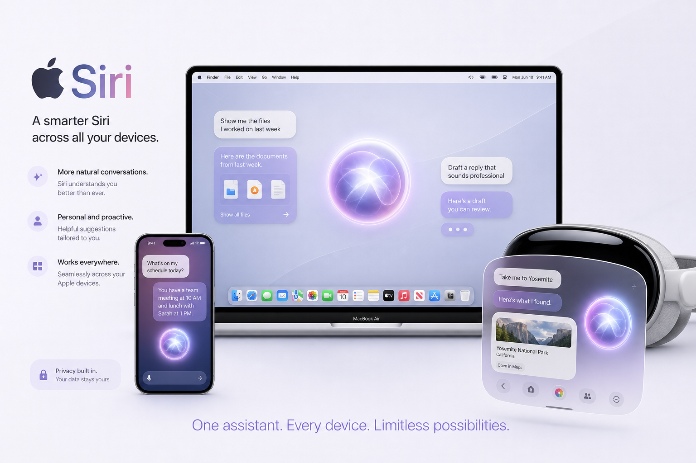
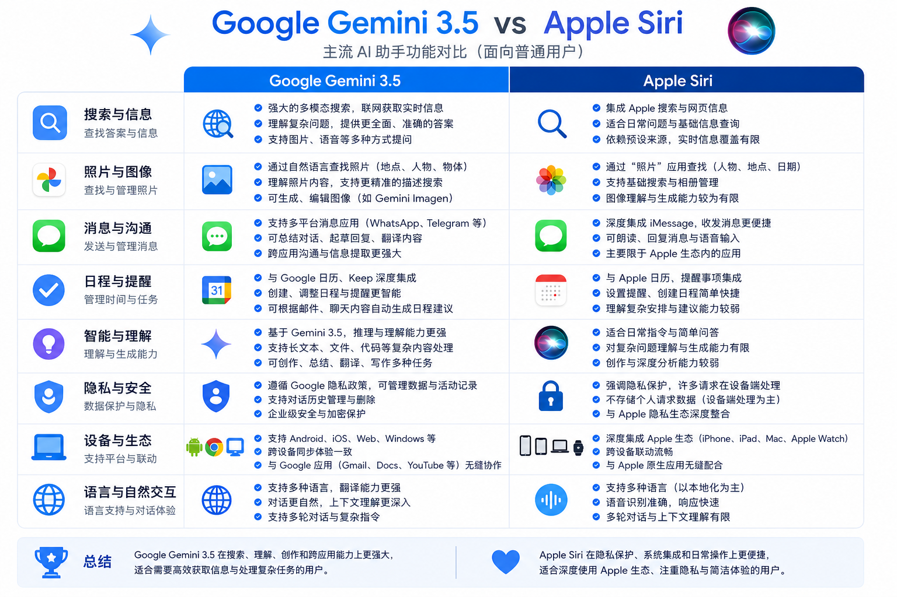

# 5月谷歌、6月苹果又更新了：AI 能自己跑腿，Siri 也大改版，跟我们有什么关系？



5 月谷歌开了 I/O，6 月苹果办了 WWDC。两场大会，核心都是 AI，但路线不一样。

| | Google I/O · 5月19日 | Apple WWDC · 6月8日 |
|---|---------------------|---------------------|
| 关键词 | Gemini 3.5 智能体 | Siri AI 大改版 |
| 一句话 | AI 在云端帮你跑腿 | AI 在设备里读你的数据 |

你可能没看直播，但一定刷到过片段。问题是：这些发布跟你有什么关系？

**一句话结论：两家都在把 AI 从「问答机」升级成「办事助手」——Google 走云端智能体，Apple 走设备内隐私。不用换手机，用法会变。**

---

## 两集连续剧，一张时间线



| 时间 | 事件 | 官方来源 |
|------|------|----------|
| 2026-05-19 | Google I/O 2026 主题演讲 | [Google 官方博客](https://blog.google/innovation-and-ai/technology/ai/io-2026-keynote-moment-videos/) |
| 2026-05-19~20 | Google I/O 开发者主题演讲 | [Google Developers Blog](https://developers.googleblog.com/en/all-the-news-from-the-google-io-2026-developer-keynote/) |
| 2026-06-08 | Apple WWDC 2026 主题演讲 | [Apple Newsroom](https://www.apple.com/newsroom/2026/06/apple-unveils-next-generation-of-apple-intelligence-siri-ai-and-more/) |

---

## 像两个风格迥异的管家：Google 派跑腿，Apple 派贴身秘书



你可以把这两场发布想象成**两家高端酒店换了新管家**。

Google 的新管家叫 **Gemini 3.5**，性格是「我先去跑，跑完再汇报」。它能在后台帮你盯新闻、比价、写代码、甚至自己搭一个小工具——官方叫 **Information Agent**（信息智能体）和 **Gemini Spark**（个人 AI 助手）。你下达任务，它 24 小时在云端转。

Apple 的新管家叫 **Siri AI**，性格是「我住在你手机里，知道你昨天跟谁聊了天」。它读你的短信、邮件、照片，跨 App 帮你办事，还能盯着屏幕内容回答问题。对话记录通过 iCloud 私密同步——官方强调隐私架构。

┌──────────────────────────────────────┐
│ 💡 核心区别，一句话 │
│ │
│ Google：云端智能体，能干更多活 │
│ Apple：设备内助手，更懂你的私人数据 │
└──────────────────────────────────────┘

最有意思的反转：据 [TechCrunch](https://techcrunch.com/2026/06/08/wwdc-2026-everything-announced-on-siri-ai-os-27-apple-intelligence-and-more/) 报道，新版 Siri 的部分能力底层用了 **Google Gemini**。苹果用户嘴里的「嘿 Siri」，背后可能是谷歌在撑腰——科技圈的联姻，比电视剧还精彩。

---

## Google I/O 2026：智能体时代，具体发布了什么？



Google 在 I/O 上说的核心转变，用官方原话讲就是：从「AI 帮你」变成「AI 替你跑流程」。

### 普通人能感知到的 6 个变化

| # | 功能 | 你能干什么 | 难度 |
|---|------|-----------|------|
| 1 | **Gemini 3.5 Flash** | Gemini App 和搜索 AI 模式默认模型，更快更聪明 | ⭐ |
| 2 | **Information Agent** | 搜索时说「keep me updated」，AI 后台帮你盯话题更新 | ⭐ |
| 3 | **Daily Brief** | 早晨打开 Gemini，自动汇总邮件、日历、待办 | ⭐ |
| 4 | **Universal Cart** | 跨搜索、YouTube、Gmail 的统一购物车，自动比价 | ⭐ |
| 5 | **Gemini Omni Flash** | 用文字+图片+音频生成视频，YouTube Shorts 免费用 | ⭐⭐ |
| 6 | **Neural Expressive** | Gemini App 全新界面，回答带图、带时间线、带动画 | ⭐ |

> 📊 **难度说明**
>
> ⭐ = 打开 App 就能用
>
> ⭐⭐ = 需要订阅 Google AI Plus/Pro，部分功能限美国

### 开发者向的重磅（跟你间接相关）

Google 还发布了 **Antigravity 2.0**——一个「智能体优先」的开发平台。简单说：以后程序员可以让 AI 子智能体分别写前端、测 Bug、迁移代码，自己在旁边喝咖啡验收。

另外有个叫 **WebMCP** 的开放标准正在推进——网站可以把自己的按钮、表单「暴露」给浏览器里的 AI，让 AI 帮你填表、下单更靠谱。Chrome 149 已开始实验。

数据来源：[Google Developers Blog](https://developers.googleblog.com/en/all-the-news-from-the-google-io-2026-developer-keynote/) · [Google Keyword](https://blog.google/innovation-and-ai/technology/ai/io-2026-keynote-moment-videos/)

---

## WWDC 2026：Siri 终于「毕业」了



苹果等这场发布会，等了不止一年。

2024 年 WWDC 就预告了「更聪明的 Siri」，结果一拖再拖。Craig Federighi 在台上正式推出 **Siri AI**——苹果说这是「完全新版本的 Siri」，不是小修小补。

### Siri AI 能做什么？

根据 [Apple Newsroom 官方发布](https://www.apple.com/newsroom/2026/06/apple-unveils-next-generation-of-apple-intelligence-siri-ai-and-more/)：

▶ **看屏幕回答问题**——你正在看网页或照片，问 Siri「这地方怎么去」，它能读屏幕内容再回答

▶ **跨 App 搜个人数据**——「帮我找上周小明发的那张发票」，它会翻短信、邮件、照片

▶ **独立 Siri App**——像常见 AI 聊天 App 一样有对话历史，iCloud 私密同步

▶ **Vision Pro 新交互**——不用喊「嘿 Siri」，盯着悬浮光球就能开聊

▶ **Messages 一键回复建议**——根据聊天上下文，帮你拟回复

▶ **Safari 网页监控**——「这个商品补货了通知我」，Notify Me 功能

### 系统全家桶也升级了

| 系统 | 代号/亮点 | 普通人感知 |
|------|----------|-----------|
| iOS 27 | 性能大提升 | App 启动快 30%，照片加载快 70% |
| macOS 27 | Golden Gate | Liquid Glass 可调透明度，侧边栏图标回归彩色 |
| iPadOS 27 | 外接硬盘加速 | 文件传输速度最高 5 倍 |
| watchOS 27 | 动态 App 网格 | 表盘推荐 5 个常用 App |
| visionOS 27 | 全景变空间场景 | Wi-Fi 连接快 3 倍 |

### 家长党狂喜：Screen Time 大改版

苹果还花了大量篇幅讲**儿童数字安全**——Setup Assistant 帮家长选 App、Ask to Browse 管网页、Communication Safety 拦截暴力内容。如果你家有娃，这可能是 WWDC 里对你最实用的部分。

---

## 一张表看懂：你该站哪边？



| 维度 | Google（Gemini 生态） | Apple（Siri AI 生态） |
|------|----------------------|---------------------|
| **核心思路** | 云端智能体，24 小时后台跑 | 设备内助手，读你的私人数据 |
| **最强场景** | 搜索、购物、内容创作、编程 | 跨 App 办事、隐私敏感任务 |
| **新模型** | Gemini 3.5 Flash（已上线） | 下一代 Apple Intelligence |
| **视频生成** | Gemini Omni Flash | Image Playground 图片生成 |
| **购物** | Universal Cart 跨平台购物车 | — |
| **系统性能** | — | iOS 27 全面提速 |
| **上线时间** | 部分已可用，夏季更多功能 | 今年秋季正式版，现在开发者测试 |
| **国内可用性** | Gemini App 需特殊网络 | Siri AI 暂不在中国大陆提供 |

┌──────────────────────────────────────┐
│ ⚠️ 注意：别急着换设备 │
│ │
│ 大部分功能今年秋天才正式推送 │
│ 现在只是开发者测试版 │
│ 且 Siri AI 初期仅支持英语 │
└──────────────────────────────────────┘

---

## 最有意思的 3 个细节（吃瓜版）

**1. 库克最后一届 WWDC**

Tim Cook 已宣布 9 月 1 日把 CEO 交给硬件负责人 John Ternus。这届 WWDC 是 Cook 任内最后一届——Siri AI 成了他的「AI legacy」。

**2. 苹果用谷歌的脑**

Siri AI 底层部分能力来自 Google Gemini。两家表面竞争，底下合作——跟当年 Google 地图嵌入 iPhone 有异曲同工之妙。

**3. 欧盟用户又「特殊待遇」了**

Siri AI 在欧盟的 iPhone 和 iPad 上暂时不可用（数字市场法合规问题），Mac 和 Vision Pro 反而能用。Google 的 Gemini 在欧洲倒是正常推进。

---

## 你现在就能做的 3 件事

不用等秋天，今天就能试：

### ① 用 AI 快速搞懂两场发布（⭐）

打开 **豆包、Kimi 或 DeepSeek**，直接粘贴问：

```text
帮我对比 2026 年 5 月 Google I/O 和 6 月 Apple WWDC 的 AI 发布，
用表格列出：核心产品、目标用户、已上线功能、还没上线的功能。
要求：中文、简洁、每项不超过 20 字。
```

有网络加速工具的话，也可以打开 Gemini App 问同样的问题。

### ② 让 AI 帮你写「发布会速览」（⭐）

```text
你是一位科技博主，请用 800 字、口语化中文，
写一篇「Google I/O vs WWDC 2026」对比文章。
读者是不写代码的普通白领。
重点讲：对他们日常生活有什么变化。
不要堆砌术语，每段不超过 4 行。
```

### ③ 关注秋季更新清单（⭐）

把下面清单存进备忘录，9 月前后对照着看：

- iOS 27 正式版 → Siri AI 好不好用
- Gemini Information Agent 是否开放
- Gemini 3.5 Pro 是否上线
- Universal Cart 是否扩到更多国家
- Android XR 智能眼镜实物怎么样

---

## 收个尾

记住 3 件事就够：

- **Google 押注「智能体」**：AI 从聊天伙伴变成能后台跑任务的助手，Gemini 3.5 Flash 已经能用
- **Apple 押注「Siri AI」**：拖了两年的大改版终于来了，跨 App 读数据是它的杀手锏
- **你不必站队**：用 Google 服务的盯 Gemini，用 iPhone 的等 iOS 27，两家都在往「AI 帮你办事」走

AI 大战的下一章，不在发布会上，在你每天开手机的那几秒钟里。

---

## 参考来源

| 来源 | 链接 |
|------|------|
| Apple 官方新闻稿 | https://www.apple.com/newsroom/2026/06/apple-unveils-next-generation-of-apple-intelligence-siri-ai-and-more/ |
| Google I/O 12 大发布 | https://blog.google/innovation-and-ai/technology/ai/io-2026-keynote-moment-videos/ |
| Google 开发者主题演讲 | https://developers.googleblog.com/en/all-the-news-from-the-google-io-2026-developer-keynote/ |
| The Verge · WWDC 2026 汇总 | https://www.theverge.com/tech/944110/wwdc-2026-news-announcements |
| The Verge · Google I/O 2026 汇总 | https://www.theverge.com/tech/933415/google-io-2026-biggest-announcements-ai-gemini |
| TechCrunch · WWDC 2026 解读 | https://techcrunch.com/2026/06/08/wwdc-2026-everything-announced-on-siri-ai-os-27-apple-intelligence-and-more/ |
