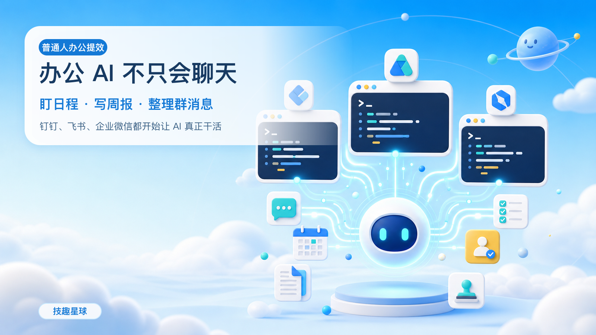

# 办公 AI 不只会聊天：盯日程、写周报都能自动做



> 写作时间：2026 年 6 月 12 日。新闻进展与工具能力可能继续变化，请以官方公告和 GitHub 仓库为准。
>
> 难度：⭐⭐ 
> 看懂不用写代码；真正上手，需要安装 Node.js、CLI，并完成企业授权。

最近几天，钉钉站在了舆论中心。

一篇约 7.5 万字的长文《置身钉内》从阿里内网流出。作者复盘了钉钉 AI 项目 ONE 从立项、冲高到收缩的过程，也写到了高压管理、频繁汇报和无意义加班等问题。

6 月 10 日，阿里巴巴合伙人委员会回应称，文中提到的管理方式“不是阿里文化该有的样子”。

6 月 11 日，阿里宣布钉钉管理层调整：陈航卸任钉钉 CEO，1992 年出生的陈宇森接任。

这件事首先是一次组织管理和企业文化事件。员工是否被尊重，不能被任何“AI 创新”口号遮住。

但从产品角度看，《置身钉内》还留下了另一个问题：

**办公软件到底应该怎样做 AI？**

是继续在首页塞一个聊天框，还是让 AI 真正进入消息、日程、文档、待办和审批，把事情做完？

最近，钉钉、飞书、企业办公工具几乎同时给出了一个相似答案：

**把办公能力做成开源 CLI，让 AI Agent 可以直接调用。**

技趣星球 · 用技术创造乐趣。

---

## CLI 是什么？它像 AI 的遥控器

CLI 的全称是 Command Line Interface，中文叫“命令行界面”。

名字听着有点专业，其实就是：

**你输入一行文字，电脑照着执行。**

我们平时打开 App，靠鼠标和手指点按钮。CLI 则把这些按钮变成文字命令。

打个比方：

- App 界面像看菜单点菜
- CLI 像直接告诉服务员：“一份炒饭，不要葱”

为什么 AI 特别喜欢 CLI？

因为 AI 最擅长处理文字。你让它操作几十个按钮，它容易点错；你给它一条明确命令，它更容易稳定执行。

例如，你对 AI 说：

> 帮我查一下明天下午的空闲时间，再创建一个 30 分钟的项目会。

AI 可以先查询日历，再调用 CLI 创建会议。你不需要自己来回切换页面。

所以，CLI 不只是程序员用的黑窗口。

在 AI Agent 时代，它更像是给 AI 准备的一套办公遥控器。

---

## 三家办公软件，都把“遥控器”开源了

目前三家的官方项目分别是：

| 平台 | 开源 CLI | 主要技术 | 开源协议 | 重点能力 |
|------|----------|----------|----------|----------|
| 钉钉 | `dws` | Go | Apache 2.0 | 审批、考勤、待办、日历、通讯录、智能表格 |
| 飞书 | `lark-cli` | Go | MIT | 文档、消息、多维表格、邮箱、日历、会议 |
| 企业办公工具 | `wecom-cli` | Rust | MIT | 消息、文档、智能表格、会议、待办、日程、通讯录 |

项目地址：

- [钉钉 dws](https://github.com/DingTalk-Real-AI/dingtalk-workspace-cli)
- [飞书 lark-cli](https://github.com/larksuite/cli)
- [企业办公工具 wecom-cli](https://github.com/WecomTeam/wecom-cli)

它们不是三个普通的开发工具。

三个项目都明确提到了 **AI Agent**，并提供了 Agent Skill、结构化输出或面向 AI 的命令设计。

这说明办公软件正在发生一个变化：

> 以前，软件只给人设计按钮。 
> 现在，软件还要给 AI 准备可以调用的工具。

---

## 钉钉 dws：更像一套企业办事工具箱

钉钉的项目叫 **DingTalk Workspace CLI**，命令是 `dws`。

它覆盖 18 个产品方向，包括：

- 通讯录
- 日历
- 待办
- 审批
- 考勤
- 群聊
- 智能表格
- 日报

钉钉的优势很明确：**企业管理流程比较全。**

例如，AI 可以帮你：

1. 搜索某位同事
2. 查询两个人的空闲时间
3. 创建会议和待办
4. 查询待处理审批
5. 汇总今天的考勤或日报

它还有几个适合 AI 的设计：

- `--dry-run`：先预览，不立即执行
- `-f json`：把结果整理成 AI 容易读取的格式
- 内置 Agent Skill：告诉 AI 各类命令应该怎么用
- OAuth、权限范围和审计：所有操作都必须经过授权

> 注意：
>
> dws 的多 Skill 模式目前仍标注为实验预览，而且读取企业数据需要管理员授权。不要把它理解成安装后就能随便查看公司信息。

**适合谁：**

已经在钉钉里使用审批、考勤、日报和项目协作的团队。

---

## 飞书 lark-cli：文档和知识工作更强

飞书的项目叫 **lark-cli**。

官方仓库目前写明，它覆盖 18 个业务领域、200 多条精选命令，并提供 20 多个 Agent Skill。

它擅长的方向包括：

- 消息和群聊
- 云文档
- 多维表格
- 日历和会议室
- 邮箱
- 任务和 OKR
- 妙记和会议内容

飞书 CLI 有三层入口：

1. 快捷命令：写法短，人和 AI 都容易记
2. API 命令：对应常用开放平台能力
3. 原始 API：遇到少见需求时兜底

例如，开完产品会后，你可以让 AI：

```text
读取今天“产品评审会”的会议内容，
整理出结论、风险和待办，
创建一篇飞书文档，
再给每位负责人创建任务。
```

原来要复制逐字稿、整理文档、分配任务。

现在可以先让 AI 跑完整个流程，你只负责检查结果。

**适合谁：**

重度使用飞书文档、多维表格、日历和会议纪要的知识型团队。

---

## 企业办公工具 wecom-cli：聊天、客户和办公入口更近

企业办公工具的开源项目叫 **wecom-cli**。

它覆盖七类核心能力：

- 消息
- 通讯录
- 文档
- 智能表格
- 日程
- 会议
- 待办

安装方式也比较直接：

```bash
npm install -g @wecom/cli
npx skills add WeComTeam/wecom-cli -y -g
wecom-cli init
```

配置完成后，AI 可以查询消息、搜索同事、创建待办、安排会议、读写文档。

它很适合这样的场景：

> 汇总今天项目群里的重要消息，找出需要我处理的事项，生成待办草稿。先不要发送，也不要修改任何数据。

企业办公工具官方仓库对使用范围有明确说明：

- 10 人及以下的小团队，可使用消息、文档、日程、会议、待办等能力
- 10 人以上的企业，API 模式智能机器人目前重点提供文档相关 CLI 能力

所以，它不是“所有企业装完都能用全部功能”。实际能力取决于企业规模、机器人模式和管理员授权。

**适合谁：**

日常沟通主要在企业办公工具，希望从群聊、会议和待办开始尝试 AI 自动化的小团队。

---

## 三家都能做什么？先看这 6 个实际场景

CLI 本身不是目的。

真正有价值的是：它能不能替你少点几次、少抄几遍、少漏一件事。

### 场景一：自动整理群消息

```text
读取我今天有权限查看的项目群消息，
只整理和我有关的任务、截止时间和风险。
不要发送消息，不要创建任务。
```

适合：钉钉、飞书、企业办公工具。

### 场景二：找时间并创建会议

```text
查看我和张三明天下午的空闲时间，
推荐两个 30 分钟时段。
等我确认后再创建会议。
```

适合：三家都可以，前提是日历权限已开。

### 场景三：会议纪要变待办

```text
读取今天的会议记录，
提取负责人、任务和截止时间，
先生成待办表格，不要直接创建。
```

飞书的妙记和文档链路更顺；其他平台也可以结合已有会议记录完成。

### 场景四：周报自动收集

```text
汇总我本周完成的待办、参加的项目会议和相关文档，
按“本周完成、下周计划、风险”生成周报草稿。
```

适合：三家都可以。

### 场景五：审批先分类，不自动通过

```text
读取我待处理的审批，
按报销、请假、采购分类，
列出提交人、金额和时间。
只做摘要，不执行通过或拒绝。
```

钉钉在审批和企业管理流程上更有优势。

### 场景六：把重复流程交给 Agent

如果只安装 CLI，你每次还要主动打开 Codex、Claude Code 或 Cursor，再告诉 AI 做什么。

接上 OpenClaw 或 Hermes 后，变化在于：

**Agent 可以常驻后台，在固定时间或收到消息时，自动调用 CLI 干活。**

CLI 是“手”，Agent 是“大脑和闹钟”。

前者负责操作办公软件，后者负责理解任务、拆步骤、记住习惯，并在合适的时间启动。

---

## 有了 OpenClaw 和 Hermes，到底能自动到什么程度？

先别把它想成一个可以独立上班的“数字员工”。

更准确的理解是：

> 它像一个住在电脑或服务器里的助理。 
> 能定时醒来、收消息、查资料、调用办公 CLI、整理结果，再把报告发回来。

自动化大致可以分成四级：

| 程度 | Agent 能做什么 | 建议 |
|------|----------------|------|
| 1. 自动读取 | 查日历、待办、群消息、文档 | 可以先放开 |
| 2. 自动整理 | 生成摘要、周报、会议纪要、提醒文案 | 适合全自动 |
| 3. 自动创建 | 建待办、写文档、预约会议 | 执行前确认 |
| 4. 自动决定 | 发消息、删除数据、处理审批 | 默认不要放开 |

对普通人来说，最有价值的不是第四级。

而是让 AI 自动完成那些**每天都要看、每周都要抄、很容易遗漏**的工作。

### OpenClaw：更像一个常驻的 AI 值班台

OpenClaw 可以安装成后台服务，通过 Gateway 长期运行。

它可以：

- 接收聊天消息，把聊天窗口变成 AI 助理入口
- 用定时任务每天、每周自动工作
- 调用 Skill、CLI、网页和本地文件
- 把执行结果送回指定聊天渠道或 Webhook
- 保存工作区记忆，记住固定规则和长期信息

如果把 `dws`、`lark-cli` 或 `wecom-cli` 配成它的工具，OpenClaw 就能把“聊天入口”和“办公操作”连起来。

#### 示例一：每天早上自动发工作简报

每天 8:30，OpenClaw 自动执行：

```text
1. 查询我今天的日历
2. 查询今天到期和已经逾期的待办
3. 汇总昨晚项目群中 @ 我的消息
4. 生成一份不超过 300 字的工作简报
5. 发给我本人，不要发到任何群
```

你上班前就能看到：

- 今天有几场会
- 哪些任务快到期
- 昨晚错过了什么
- 上午最应该先做哪件事

**带来的提升：**每天少翻几个页面，也不容易漏会、漏任务。

#### 示例二：会议结束后自动收尾

你在群里对 OpenClaw 说：

```text
整理刚结束的“产品评审会”：
读取会议记录和相关文档，
生成结论、风险和待办草稿。
待办先不要创建，发给我确认。
```

你回复“确认”后，它再调用办公 CLI：

- 创建会议纪要文档
- 给负责人建立待办
- 设置截止时间
- 把文档链接发回当前聊天

**带来的提升：**开完会不用再花半小时复制整理，责任人和截止时间也更清楚。

#### 示例三：每周五自动生成周报

```text
每周五 16:30：
汇总我本周完成的待办、参加的项目会议和修改过的文档，
按“本周完成、下周计划、风险”生成周报。
只保存为草稿并发给我，不要代替我提交。
```

**带来的提升：**不用靠记忆回想这一周做了什么，周报从“重新写一遍”变成“检查和修改”。

### Hermes：更像一个会总结你做事方法的长期助理

Hermes 也可以通过 Gateway 接收消息，并用内置定时器自动执行任务。

它和普通定时脚本最大的区别，是更强调：

- 跨会话记忆你的偏好和历史决定
- 从复杂任务中整理出新的 Skill
- 在重复使用中改进已有 Skill
- 搜索过去的对话，找回之前的上下文
- 把大任务拆给多个子 Agent 并行处理

OpenClaw 更适合先把通道、定时任务和工具稳定接起来。

Hermes 更适合需要长期积累个人习惯的工作流。

#### 示例四：周报越写越像你

第一次，你告诉 Hermes：

```text
我的周报不要写空话。
每条工作要包含结果，风险单独列出。
如果没有数据支持，就不要写“显著提升”。
```

它会按这个要求生成周报。

重复几次后，Hermes 可以把这些要求沉淀成周报 Skill。下次再写时，不需要你每次重复格式和禁用词。

**带来的提升：**减少反复解释，让 AI 输出更接近你的工作习惯。

#### 示例五：把固定办事流程沉淀下来

假设你每次准备项目例会都要：

1. 查上周待办
2. 找出延期事项
3. 汇总相关群消息
4. 更新会议文档
5. 准备本周议程

Hermes 跑过几次后，可以把这套流程整理成“项目例会准备”Skill。

以后你只需要说：

> 帮我准备明天的项目例会。

它就知道该查哪些数据、用什么格式、哪些操作必须等你确认。

**带来的提升：**把只存在脑子里的办事经验，变成可重复执行的流程。

#### 示例六：同时准备多份材料

你可以让 Hermes 把任务拆开：

```text
准备明天的客户会议：
一个子任务整理最近三次会议记录；
一个子任务汇总未完成待办；
一个子任务检查相关文档的最新版本；
最后合并成一页会前简报。
```

**带来的提升：**原本需要来回查找的准备工作，可以并行完成，你只看最后的简报。

### 普通人能得到哪些实际提升？

| 日常痛点 | Agent 可以帮什么 | 你仍然负责什么 |
|----------|------------------|----------------|
| 消息太多看不过来 | 定时摘要、提取与你有关的事项 | 判断优先级 |
| 总是漏会议和截止时间 | 每日简报、提前提醒、检查冲突 | 确认安排 |
| 会后整理很耗时间 | 纪要、待办和文档草稿 | 校对结论和负责人 |
| 周报全靠回忆 | 自动收集本周工作痕迹 | 修改表达并提交 |
| 重复流程每次重新教 | 记住偏好、沉淀 Skill | 定义规则和边界 |
| 资料散落在多个地方 | 跨消息、日历、文档汇总 | 判断信息是否可信 |

一句话区分：

- **OpenClaw**：先解决“AI 在哪里接单、什么时候自动干活”
- **Hermes**：进一步解决“AI 能不能记住我的习惯，并把流程越做越顺”
- **办公 CLI**：解决“AI 用什么方式进入钉钉、飞书或企业办公工具执行操作”

它们组合起来，才能形成一条完整链路：

```text
收到消息或到达时间
→ Agent 理解任务
→ 调用办公 CLI 查询数据
→ 整理和判断
→ 需要写入时向你确认
→ 创建待办、文档或会议
→ 把结果发回来
```

> 注意：
>
> OpenClaw 和 Hermes 不会因为安装了办公 CLI，就自动拥有企业数据权限。仍然需要管理员授权、正确配置账号和最小权限。涉及发消息、修改文档、创建会议、审批和删除数据时，建议始终保留人工确认。

---

## 普通人应该选哪一个？

不用为了 AI 更换整套办公软件。

先看你所在的团队平时用什么：

| 你的情况 | 建议先试 |
|----------|----------|
| 公司审批、考勤、日报都在钉钉 | `dws` |
| 文档、知识库、多维表格用得最多 | `lark-cli` |
| 沟通主要在企业办公工具，团队规模较小 | `wecom-cli` |
| 只想体验，不想影响真实数据 | 从查询日历、通讯录等只读操作开始 |
| 想从聊天窗口接单、定时自动执行 | CLI + OpenClaw |
| 想长期记住个人习惯、沉淀办事流程 | CLI + Hermes |

三家的方向并没有本质区别：

**都在把办公软件从“人点按钮”，变成“人说目标，AI 调工具”。**

差别主要在各自原本擅长的业务，以及企业管理员愿意开放哪些权限。

---

## 上手前，先守住 4 条安全线

办公 CLI 能读到的不是测试数据，而可能是真实的通讯录、聊天、文档和审批。

建议先做到这四点：

1. **先只读，后写入**：先查询，不要一开始就让 AI 发消息、删文档、批审批
2. **先预览，后执行**：支持 `--dry-run` 的命令先看预览
3. **最小权限**：只开完成当前任务必需的权限
4. **人工确认**：发消息、建会议、改任务、处理审批前必须确认

不要把 Token、App Secret、客户名单和敏感文件直接贴进公开聊天窗口。

AI 能帮你省时间，但权限责任仍然在人。

---

## 今天就试一个只读任务

如果你已经装好其中一个 CLI，可以把下面这段话交给 Codex、Claude Code 或 Cursor：

```text
我已经安装并登录办公平台 CLI。

请先查看该 CLI 的官方帮助和已安装 Skill。
只执行只读操作，不创建、修改、删除或发送任何内容。

任务：
1. 查询我今天的日历
2. 整理时间、标题和参会人
3. 找出冲突时段
4. 推荐一个 30 分钟的空闲时间

执行前先列出准备调用的命令和需要的权限，等我确认后再运行。
```

先让 AI 帮你看清今天的安排。

等这个小流程稳定了，再尝试创建待办、整理周报和发送提醒。

---

## 最后说两句

《置身钉内》提醒我们：AI 产品做得再快，也不能靠透支人来换。

而三家办公软件开源 CLI，则展示了另一条更实际的路线：

**不是再造一个会聊天的入口，而是让 AI 有权限、有边界地完成具体工作。**

今天记住一句话：

**CLI 是 AI 的手，但权限开不开、让它做到哪一步，决定权应该一直在人手里。**

技趣星球 · 用技术创造乐趣。

---

## 参考资料

- [阿里回应《置身钉内》：不是阿里文化该有的样子](https://wap.eastmoney.com/a/202606103766475437.html)
- [钉钉换帅：陈宇森接任 CEO](https://www.stcn.com/article/detail/3955254.html)
- [钉钉 dws 官方仓库](https://github.com/DingTalk-Real-AI/dingtalk-workspace-cli)
- [飞书 lark-cli 官方仓库](https://github.com/larksuite/cli)
- [企业办公工具 wecom-cli 官方仓库](https://github.com/WecomTeam/wecom-cli)
- [OpenClaw 官方文档](https://docs.openclaw.ai/)
- [Hermes Agent 官方仓库](https://github.com/nousresearch/hermes-agent)
