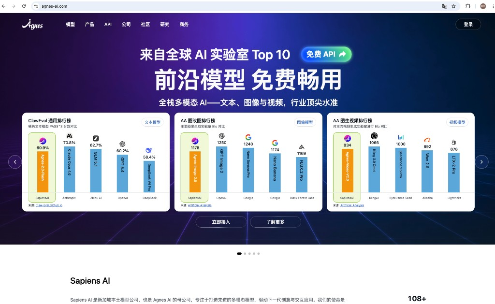
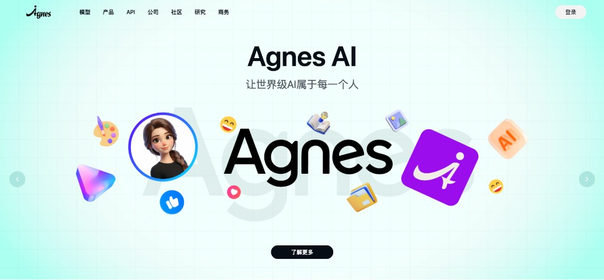
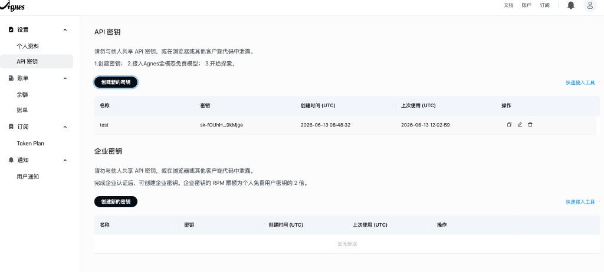
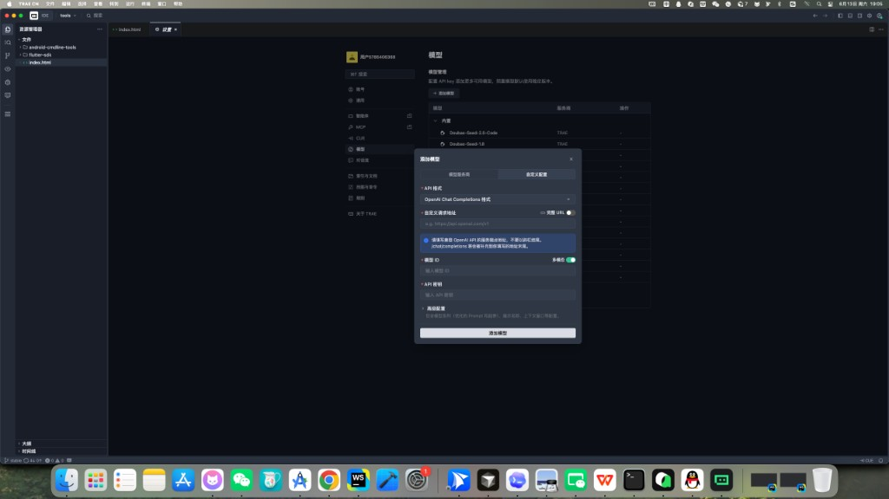
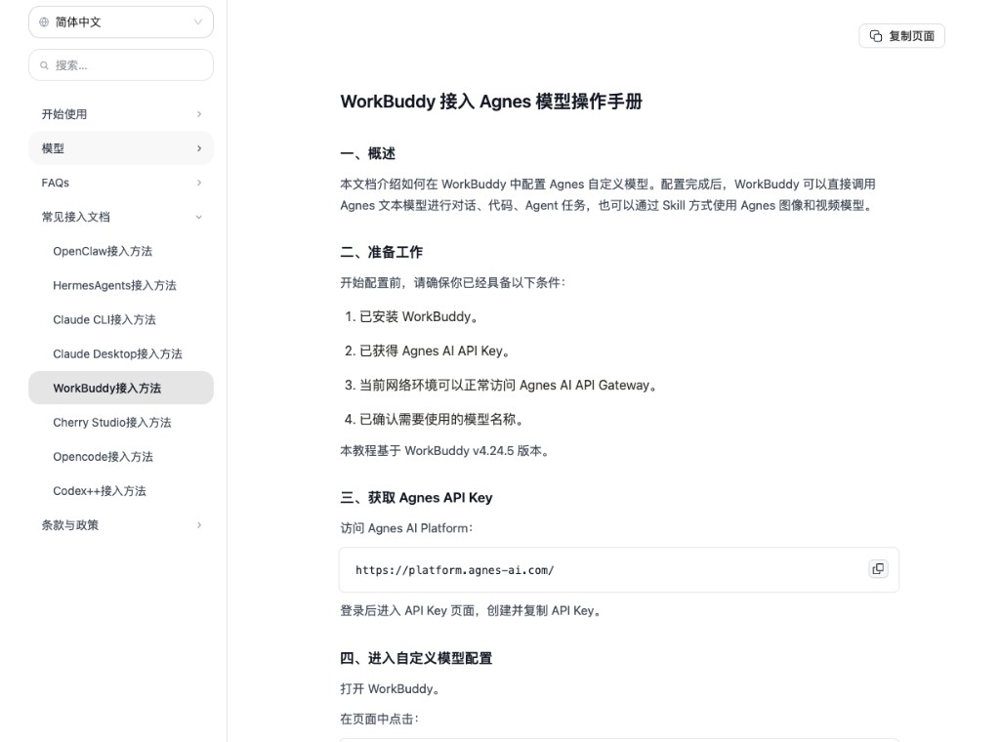
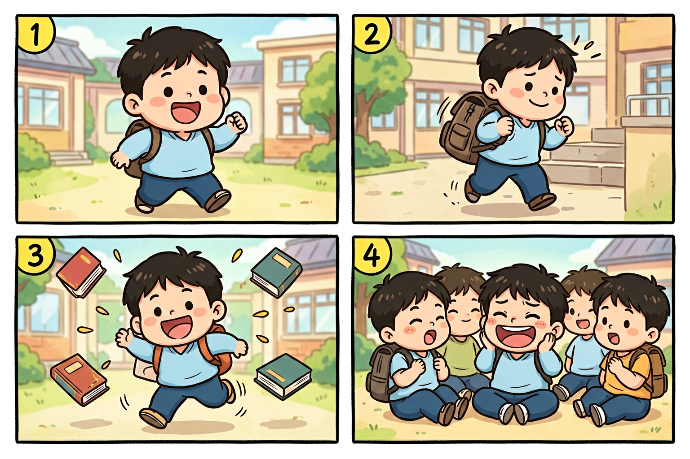
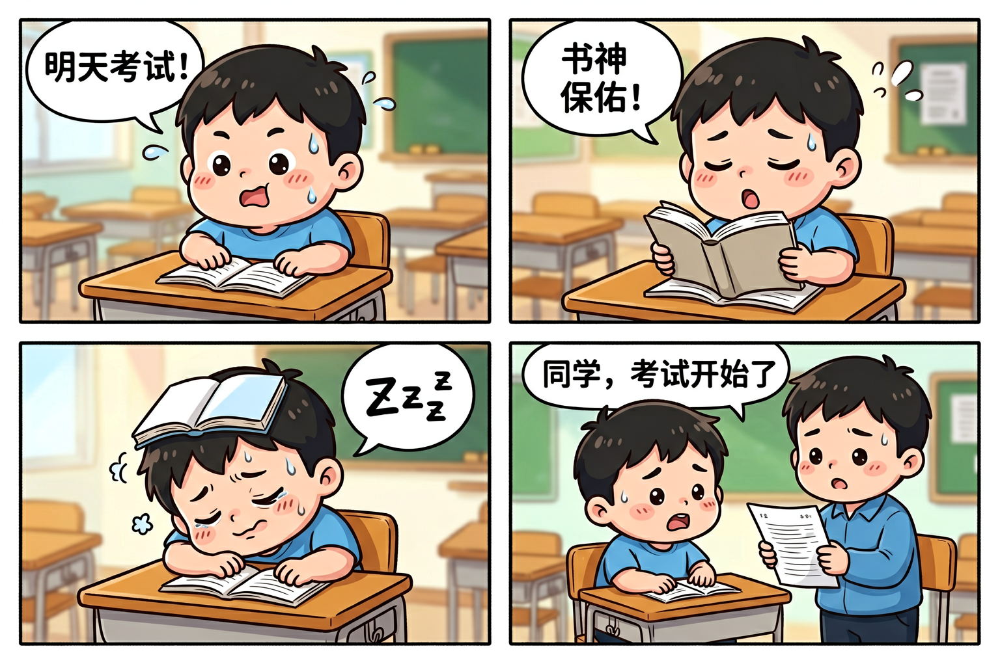
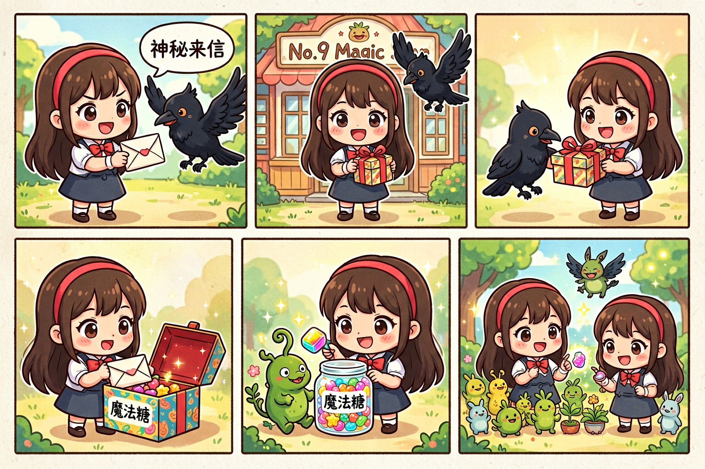

# Agnes 无限期免费：普通人接入实测



> 零成本接入 · 跟着步骤就能用
>
> 技趣星球 · 用技术创造乐趣

打开 [agnes-ai.com](https://agnes-ai.com/)，首页写着「前沿模型，免费畅用」。

底下三张对比图更直白：文本模型在 ClawEval 榜单里能跟 Claude、GPT 同台；生图、视频模型在 Artificial Analysis 盲评里也有名次。

对普通人来说，这句话的意思很简单——不用每月掏订阅，也能接一套还不错的多模态模型：能聊天问答、能生图、也能生成视频。

我按官网指引接进 Agent 工具，实测了一圈。问答和生图都顺利；视频提交了任务，一直在排队，最后没出片。

下面是我的接入过程和真实结果，你可以照着做。

难度：⭐⭐ 
注册拿 Key + Agent 配一次模型，大概 10 分钟。

---

## Agnes 是什么？普通人用得上的地方

[Agnes AI](https://agnes-ai.com/) 背后公司是新加坡的 Sapiens AI，主打「让世界级 AI 属于每一个人」。

目前对个人免费开放三条能力线：

| 能力 | 模型 | 我实测感受 |
|------|------|------------|
| 文本问答 | agnes-2.0-flash | 接好后能正常聊天、写提示词、改文案 |
| 图片生成 | agnes-image-2.1-flash | 15～20 秒出图，四格漫画效果不错 |
| 视频生成 | agnes-video-v2.0 | 提交后一直 queued，5 分钟没出片 |

官网 slogan 是「全栈多模态 AI——文本、图像与视频，行业顶尖水准」。我体验下来，前两样对普通人已经够用；视频先放低预期。



价格和开放政策可能调整，使用前以 [platform.agnes-ai.com](https://platform.agnes-ai.com) 页面为准。

---

## 哪些 Agent 工具能接？

Agnes 走 OpenAI 兼容接口，理论上支持自定义模型的 Agent 都能接。我试过的结果：

| 工具 | 能否接入 | 说明 |
|------|----------|------|
| Trae CN | ✅ 可以 | 设置里加自定义模型，再让 Agent 打包生图/视频 Skill |
| WorkBuddy | ✅ 可以 | 对话区「Auto」→「配置自定义模型」，填 Key 和接口地址即可 |
| Qoder | ❌ 不行 | 目前不支持自定义 OpenAI 兼容接口，接不了 |

你手头有 Trae 或 WorkBuddy，直接往下走。只有 Qoder 的话，可以先用文末的 curl 命令测，或换上面两个工具之一。

---

## 接入教程

核心就三步：拿 Key → 配文本模型 → 打包生图/视频 Skill。下面以 Trae 为例演示，WorkBuddy 配置项一样，只是入口位置不同。

### 第一步：拿 API Key

难度：⭐

1. 打开 [platform.agnes-ai.com](https://platform.agnes-ai.com)，注册登录
2. 左侧进入「设置 → API 密钥」，点「创建新的密钥」，复制保存

不花钱，不用绑信用卡。页面上写着三步：创建密钥 → 接入 Agnes 多模态免费模型 → 开始探索。



### 第二步：配文本问答模型

难度：⭐⭐

三个配置项各家工具都一样：

| 配置项 | 填什么 |
|--------|--------|
| 接口地址 | `https://apihub.agnes-ai.com/v1` |
| API Key | 刚才复制的 Key |
| 模型名称 | `agnes-2.0-flash` |

**Trae CN**：进入「设置 → 模型」，点「添加模型」，选「自定义配置」标签，API 格式选 OpenAI Chat Completions，填入上表三项：



**WorkBuddy**：对话区点「Auto」→「配置自定义模型」，同样填入上表，保存后选中 `agnes-2.0-flash`。官方有详细图文教程，见文档「WorkBuddy 接入方法」：



接好后，日常问答、写提示词、整理需求都可以走 Agnes，不占用工具自带额度。

### 第三步：生图 Skill

难度：⭐⭐

生图不走普通对话接口，需要打包成 Skill。在 Agent 对话框里发：

```text
我想使用 Agnes Image 2.1 Flash 模型生图。
请阅读 API 文档 https://agnes-ai.com/doc/agnes-image-21-flash，
帮我打包成一份 Skill，命名为 agnes-image-gen。
我的 API Key 是：（粘贴你的 Key）
```

完成后在 Skills 面板能看到 `agnes-image-gen`。


安全提醒：Key 写进本地配置或环境变量，别发到公开群。Skill 建好后可改成 `$AGNES_API_KEY` 占位。

### 第四步：视频 Skill（可选）

```text
我想使用 Agnes Video v2.0 模型生成视频。
请阅读 API 文档 https://agnes-ai.com/doc/agnes-video-v2-0，
帮我打包成一份 Skill，命名为 agnes-video-gen。
我的 API Key 是：（粘贴你的 Key）
```

视频是异步任务：提交 → 排队 → 生成 → 完成才有下载链接。我卡在排队阶段，下文单独说。

---

## 文本问答：接进去就能聊

难度：⭐

文本模型配好后，在 Agent 对话区直接问就行。

我试了让它帮忙改四格漫画剧情、把中文需求翻成英文提示词，回答速度正常，长上下文也扛得住。官网提到支持 1M 超长上下文，对整理长文档、总结资料这类活比较友好。

不想用 Agent 工具，curl 也能测：

```bash
curl -s https://apihub.agnes-ai.com/v1/chat/completions \
 -H "Content-Type: application/json" \
 -H "Authorization: Bearer 你的API_Key" \
 -d '{
 "model": "agnes-2.0-flash",
 "messages": [{"role": "user", "content": "你好，帮我写一段四格漫画剧情"}]
 }'
```

---

## 生图实测：多风格出图 + 三张四格漫画

生图是我测得最顺的一块。写实、动漫、3D、四格漫画都试过，横版 1536x1024 大约 15～20 秒出一张，0 元。

不想走 Skill，终端一条 curl 也能出图：

```bash
curl -s https://apihub.agnes-ai.com/v1/images/generations \
 -H "Content-Type: application/json" \
 -H "Authorization: Bearer 你的API_Key" \
 -d '{
 "model": "agnes-image-2.1-flash",
 "prompt": "你的图片描述",
 "n": 1,
 "size": "1536x1024"
 }'
```

### 多风格试画：写实、动漫、3D 都行

难度：⭐

不只做漫画，换几种风格也试了，效果都不错。

**写实摄影——橘猫窗台**


光影自然，毛发质感在线，没有明显 AI 塑料感。

**日系动漫——樱花少女**


色调柔和，线条干净，适合做头像或插画草图。

**3D 渲染——低多边形星球**


等距视角、低多边形风格，拿来做 PPT 配图或 App 占位图都够用。

### 实测一：无字四格，先锁画风

难度：⭐

```text
四格漫画，Q萌桂宝风格（圆脸蛋、粗线条、搞笑夸张，类似《桂宝》漫画），校园搞笑小故事：
第1格，圆脸小胖男孩背着书包兴奋出门；
第2格，他背着沉重书包在楼梯上挣扎；
第3格，绊了一跤，书本满天飞；
第4格，坐在地上哈哈大笑，朋友围过来。
粗线条、明亮色彩、夸张表情，幽默温馨。
```



四格边界清楚，人物前后一致。建议先无字跑通画风，再加气泡。

### 实测二：带中文气泡，考试前夜

难度：⭐⭐

```text
四格漫画，Q萌桂宝风格，带中文对话气泡，教室背景：
第1格，小胖男孩坐课桌前满头大汗，气泡写「明天考试！」；
第2格，闭眼对着课本祈祷，气泡写「书神保佑！」；
第3格，趴在桌上睡着，课本盖头上，气泡写「Zzz」；
第4格，老师拿试卷站旁边，气泡写「同学，考试开始了」。
粗线条、明亮色彩、夸张表情。
```



中文气泡大部分能对上，台词越短越稳。

### 实测三：五格奇幻，魔法糖故事

难度：⭐⭐

```text
五格漫画，Q萌奇幻风格：
第1格，长发戴发箍女孩收到黑乌鸦送来的信，气泡「神秘来信」；
第2格，她站在「第九号魔法商店」门前，乌鸦在旁飞翔；
第3格，乌鸦递给她礼物盒；
第4格，她打开盒子，彩色糖罐标签写「魔法糖」；
第5格，她用魔法糖把植物变成小怪物，和同桌斗智斗勇。
鲜艳配色，可爱角色，奇幻校园感。
```



五格塞进一张图，后面几格会略小，但故事能读懂。验证脑洞够用，出版级建议一格一图再拼版。

---

## 视频实测：进了排队，没出片

生图很顺，我顺手测了 agnes-video-v2.0。官网宣传原生音画同出，不用单独配音，听起来很香。

提示词：

```text
一杯热咖啡缓缓倒入白色陶瓷杯，液面泛起细腻泡沫，升起袅袅热气，
柔和晨光背景，慢镜头，ASMR 风格轻柔配乐。
```

通过 agnes-video-gen Skill 提交，接口返回：

```json
{
 "status": "queued",
 "seconds": "5.0",
 "size": "1280x704"
}
```

状态一直是 queued。每隔 30 秒轮询，等了约 5 分钟，没变成 processing 或 completed。

可能原因（个人推测）：免费视频调用量大、高峰排队久、或需要更长等待时间。

结论：问答和生图可以放心免费试；视频目前别急着等——提交了先放着，晚点再查。非高峰时段或把轮询延长到 15～20 分钟，也许有机会。

手动查任务状态：

```bash
curl -s "https://apihub.agnes-ai.com/v1/video/generations/你的task_id" \
 -H "Authorization: Bearer 你的API_Key"
```

---

## 适合谁、不适合谁

适合：

- 想零成本试一套多模态 API 的普通人
- 用 Trae、WorkBuddy 做 Agent 工作流，想省 Token 账单
- 需要配图、漫画草图、课件插画的老师或自媒体

暂时别指望：

- 视频即提交即出片（我这次排队失败）
- 生图气泡文字 100% 正确
- Qoder 等不支持自定义接口的工具直接接入
- 完全替代付费顶级模型的所有场景

---

## 今天的小结

实测下来，普通人免费接入 Agnes，目前最稳的是这两样：

- 文本问答：配好 agnes-2.0-flash，日常聊天和写提示词够用
- 图片生成：四格漫画按「画风 → 无字分镜 → 加气泡」三步走，出图快、质量不差

视频能力在官网和文档里都有，但我这次没跑通，建议低预期。

官网：[agnes-ai.com](https://agnes-ai.com/) 
文档：[agnes-ai.com/doc](https://agnes-ai.com/doc) 
控制台：[platform.agnes-ai.com](https://platform.agnes-ai.com)
