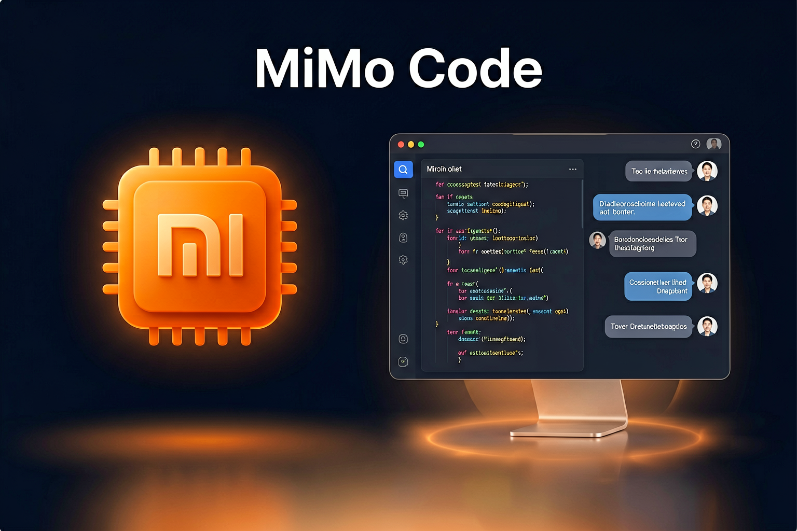
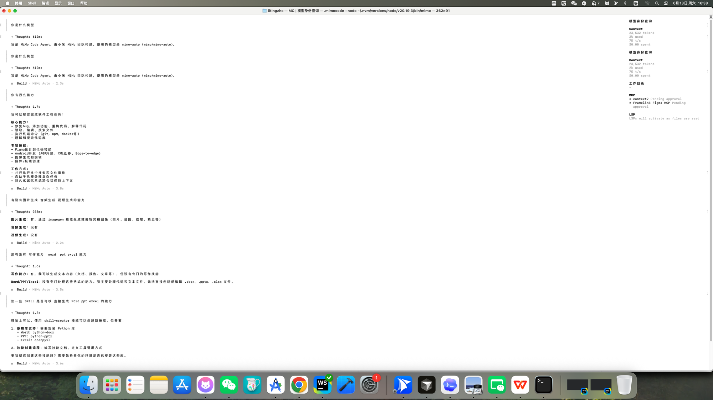

# MiMo V2.5 Pro 限时免费：小米的 AI 编程助手，我帮你试了一圈



> 写作时间：2026 年 6 月 13 日。工具版本与免费政策可能随时变化，请以官网为准。
>
> 难度：⭐⭐ 
> 只需安装终端工具，无需注册账号，开启就能用。

最近 AI 编程工具扎堆出新品，小米也悄悄上线了自己的终端编程助手——MiMo Code。搭配刚发布的 MiMo V2.5 Pro 模型，限时免费用。这篇文章帮你捋清楚：它是什么、怎么装、怎么用、和 Claude Code 比差多少。

---

## 先说结论：值得试一下

MiMo V2.5 Pro 是小米最新发布的旗舰大模型，专门为 AI 编程和 Agent 场景优化：

- **参数规模超过 1 万亿**，实际激活 42B，效率很高
- **支持 100 万 Token 上下文**，读大项目不怕溢出
- **编程能力超过 Claude Sonnet 4.6**（官方数据）
- **全球智能排名第八，中文模型排名第二**（Artificial Analysis 权威榜单）

最关键的是——**现在限时免费，安装好直接用，无需注册、无需 API Key**。

> ⚠️ 注意：小米 V2 系列模型将于 **2026 年 6 月 30 日正式下线**，届时全面切换至 V2.5 系列。现在是体验的好时机，尽早装上试试。

---

## MiMo Code 是什么？

用大白话说，**MiMo Code 就是小米版的 Claude Code**。

它运行在你的终端里（不是浏览器，也不是 App），是一个能读懂你整个代码库、自动规划修改、实际执行代码操作的 AI 编程代理。

你可以把它理解成一个**坐在终端里的 AI 程序员**：你告诉它要做什么，它帮你分析、规划、写代码、跑测试，整个过程你都能看到。

> **你（提需求）**
> ↓
> **MiMo Code**（理解代码 → 规划方案 → 执行）
> ↓
> **你的项目文件**（被修改、测试、运行）

和 Claude Code、Cursor、Windsurf 是同一个赛道的产品，但 **MiMo Code 本身完全免费开源**，而且支持接入 **75+ 个 LLM 提供商**——不限于小米自己的模型。

---

## 安装：一条命令搞定 ⭐⭐

### Mac / Linux

打开终端（推荐 iTerm、VS Code Terminal 或 Ghostty），粘贴这条命令：

```bash
curl -fsSL https://mimo.xiaomi.com/install | bash
```

等几十秒，装完就能用。

### Windows

需要 Node.js 环境（没有的话先装 [Node.js](https://nodejs.org/)），然后在 PowerShell 里运行：

```bash
npm install -g @mimo-ai/cli
```

> **小贴士**：Mac 用户强烈推荐在 iTerm 或 VS Code 内置终端里用，系统自带的 Terminal.app 体验稍差一些。

---

## 启动：安装好直接用

**现在限时免费期间，安装好后直接运行 `mimo` 即可使用，无需注册账号、无需配置 API Key。**

在项目目录里运行：

```bash
mimo
```

等它加载完毕，直接输入需求就能用了，就这么简单。



> 截图里展示的就是真实使用场景——直接问它「你有什么能力」，它会告诉你支持的功能列表：修 Bug、加功能、重构代码、Android 开发、Figma 设计转代码等。右侧面板实时显示上下文用量和工具状态。

> 如果未来免费期结束需要配置自己的 API Key，参考：[platform.xiaomimimo.com](https://platform.xiaomimimo.com)

**想切换到其他模型？**（比如 DeepSeek、Claude）用 `/connect` 添加对应提供商的 API Key 即可。MiMo Code 支持 75+ 家提供商。

**查看当前可用模型：**

```
/models
```

---

## 三种工作模式，搞懂就不迷路

MiMo Code 有三个内置模式，用 **Tab 键** 随时切换：

| 模式 | 适合做什么 | 能改文件吗 |
|------|-----------|-----------|
| **Build** | 日常写代码、跑命令（默认） | ✅ 能读写 |
| **Plan** | 先分析再动手，规划大改动 | ❌ 只读分析 |
| **Compose** | 复杂任务工作流编排 | ✅ 技能驱动 |

### 什么时候用哪个？

- **小任务、明确需求** → 直接用 Build，告诉它"加个登录功能"，它直接动手
- **大型重构、心里没底** → 先切 Plan 让它出方案，看完觉得 OK 再切 Build 执行
 **多步骤复杂流程**（写测试 → 调试 → 代码审查 → 合并）→ 用 Compose，它会自动调用 13 个内置技能来编排整个流程

---

## 亲身测试：一句话做出 H5 小游戏

光看跡分不够直观，我直接用 MiMo Code 测了一下它的实际编码能力。

**我输入的内容就七个字：**

> 做个 H5 小游戏测试一下编码能力

**MiMo Code 给出的：**

它直接进入 Build 模式，**32.7 秒**内生成了一个完整的打地鼠游戏：

- **3×3 九宫格地鼠洞**，30 秒倒计时
- **连击加分机制**：3 连击 ×3分、5 连击 ×5分
- **动态难度**：分数越高地鼠消失越快，全程自动调整
- **粒子效果、连击展示和结局评语**
- **纯单文件实现**，一个 `whack-a-mole.html`，浏览器直接开

没有让它指定做什么游戏类型、没有给任何设计稿、也没有说要做连击机制——这些它全部自己加的。


---

## 日常使用速查

启动之后，直接在输入框里打字就行，像和 AI 聊天一样。下面是几个最常用的场景：

### 读代码、理解项目

```
帮我分析一下这个项目的整体结构
```

```
@src/auth/index.ts 这个文件的认证逻辑是怎么工作的？
```

> 用 `@` 符号 + 文件名，可以把某个文件直接喂给 AI，不用手动复制粘贴。

### 写代码、改功能

```
给用户注册页面加一个邮箱验证功能
```

```
把这个函数从 callback 风格改成 async/await
```

### 跑命令

```
!npm test
```

> 前面加 `!` 就是直接执行 Shell 命令，运行结果会自动传给 AI，方便它分析报错。

### 让 AI 先规划再动手

按 **Tab** 切到 Plan 模式，输入：

```
我想把数据库从 MySQL 迁移到 PostgreSQL，帮我分析一下需要改哪些地方
```

它只分析不动手，给你一份清晰的迁移方案，你确认之后再切回 Build 执行。

---

## 权限管理：防止 AI 乱来

AI 帮你写代码，最怕的是它乱删文件、乱跑危险命令。MiMo Code 有细粒度权限控制。

在项目根目录创建 `mimocode.json`：

```json
{
 "permission": {
 "bash": {
 "*": "ask",
 "git *": "allow",
 "npm *": "allow",
 "rm *": "deny"
 }
 }
}
```

这段配置的意思是：

- `git` 和 `npm` 命令 → 直接放行
- `rm` 删除命令 → 直接禁止（防止 AI 误删）
- 其他所有命令 → 每次执行前问你一遍

> 建议新手一开始把 `rm` 设成 `deny`，等用熟了再按需调整。

---

## 和其他 AI 编程工具比一比

| 工具 | 价格 | 终端/GUI | 模型自由度 | 亮点 |
|------|------|---------|-----------|------|
| **MiMo Code** | 工具免费，模型限时免费 | 终端 | 75+ 提供商 | 开源、不锁定模型 |
| **Claude Code** | $20/月起 | 终端 | 仅 Claude | 生态成熟，能力强 |
| **Cursor** | 免费额度 + $20/月 | GUI（编辑器） | 多模型 | 有图形界面，上手快 |
| **Windsurf** | 免费额度较多 | GUI（编辑器） | 多模型 | 免费额度大 |

**MiMo Code 最大的优势**：工具本身完全免费开源，不强制绑定某个模型。哪天你觉得某个模型不好用，直接换，不用换工具。

---

## MiMo V2.5 Pro 模型能力到底怎么样？

先看官方跑分（仅供参考）：

### 编程基准测试（SWE-Bench Verified）

| 模型 | 得分 |
|------|------|
| Claude Opus 4.6 | 最高档 |
| **MiMo V2 Pro** | **超过 Claude Sonnet 4.6** |
| Claude Sonnet 4.6 | 次之 |
| GPT-5.2 | 再次 |

### Agent 能力（ClawEval，接近 Opus 水平）

| 模型 | 得分 |
|------|------|
| Claude Opus 4.6 | 66.3 |
| Claude Sonnet 4.6 | 66.3 |
| **MiMo V2 Pro** | **61.5** |
| Gemini 3 Pro | 51.9 |
| GPT-5.2 | 50.0 |

> 实际体验下来，**写日常业务代码、做小工具、改 Bug 完全够用**，响应速度也不错。复杂架构设计方面还是 Claude Opus 更强，但对于大多数开发场景，MiMo V2.5 Pro 的性价比已经非常突出了。

### API 定价对比（正式收费后）

| 模型 | 输入（/百万 Token） | 输出（/百万 Token） | 缓存读取 |
|------|---------------------|---------------------|---------|
| **MiMo V2.5 Pro（≤256K）** | **$1** | **$3** | **$0.20** |
| Claude Sonnet 4.6 | $3 | $15 | $0.30 |
| Claude Opus 4.6 | $5 | $25 | $0.50 |

比 Claude Sonnet 便宜 **3~5 倍**，缓存写入暂时还免费。

---

## 几个实用小技巧

1. **`@` 引用文件**：写 `@文件名` 直接把文件内容喂给 AI，不用复制粘贴
2. **拖截图进去**：把截图拖进终端窗口，让 MiMo Code 看图（需要所接入的模型支持多模态， MiMo V2.5 Pro 本身暂不支持，可切换其他多模态模型）
3. **`!` 执行命令**：`!git status` 直接跑命令，输出结果自动传给 AI 分析
4. **Tab 切模式**：写代码用 Build，规划方案用 Plan，复杂流程用 Compose
5. **`/help` 看所有命令**：不记得某个功能怎么用的时候，输入 `/help` 查速查表

---

## 相关链接

| 资源 | 链接 |
|------|------|
| MiMo Code 官方文档 | [mimo.xiaomi.com/zh/mimocode](https://mimo.xiaomi.com/zh/mimocode/start) |
| 限时免费体验（无需注册） | 安装后直接 `mimo` 启动即用 |
| MiMo V2 Pro 模型介绍 | [mimo.xiaomi.com/mimo-v2-pro](https://mimo.xiaomi.com/mimo-v2-pro) |

---

## 最后说一句

小米这次的 MiMo Code + V2.5 Pro 组合，算是国产 AI 编程工具里比较认真做的一款：**工具开源、模型免费、不锁定供应商**。

如果你平时在终端里干活比较多，又一直想用 AI 编程助手但舍不得 Claude Code 的月费，现在是个不错的入坑时机。

趁着限时免费，装好 MiMo Code，进一个项目目录打开终端敲 `mimo`，就能开工了。
