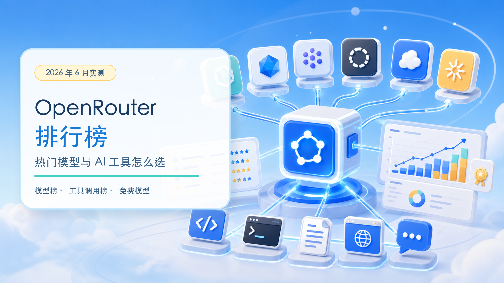
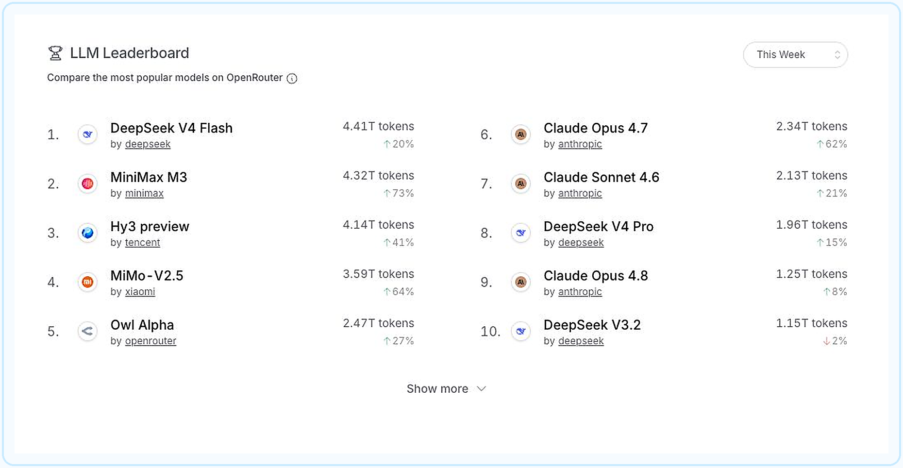
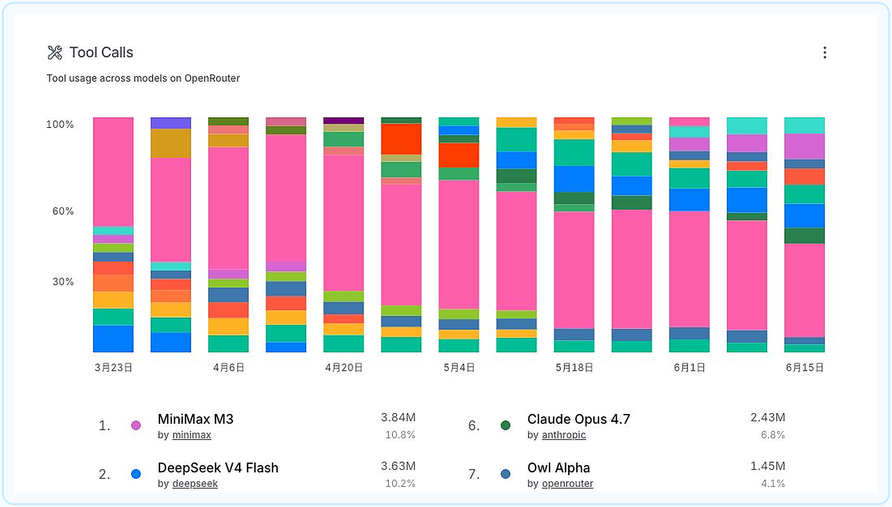
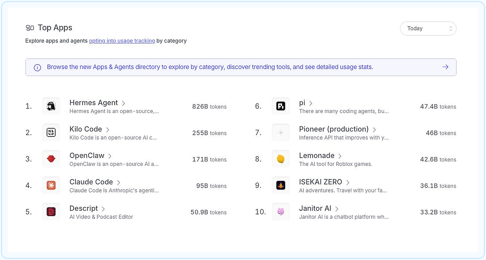
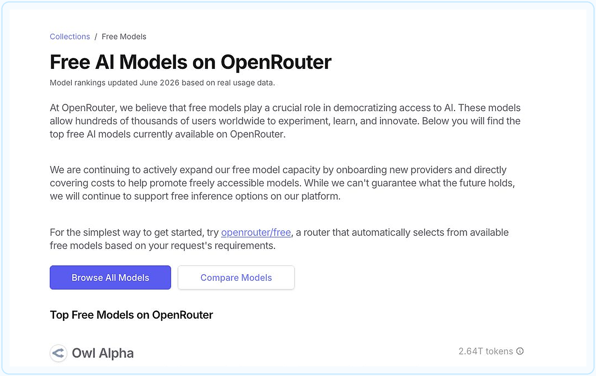

# OpenRouter 排行榜：热门模型和工具怎么选



> 不知道该用哪个 AI？先看真实使用量，再按任务挑模型
>
> 技趣星球 · 用技术创造乐趣。

现在的 AI 模型实在太多了。

DeepSeek、Claude、MiniMax、MiMo、Gemini……名字越看越熟，真到选择时，还是容易犯难。

OpenRouter 的排行榜提供了另一个观察角度：**不只看厂商怎么宣传，还看大量真实请求最后流向了哪些模型和工具。**

我在 2026 年 6 月 15 日打开了 [OpenRouter 排行榜](https://openrouter.ai/rankings)，把当前模型榜、工具调用榜和应用榜截了下来。

先提醒一句：榜单变化很快。本文记录的是截图当天的数据，后续请以官网实时页面为准。

---

## OpenRouter 像一个「AI 模型总插座」

平时使用 AI，往往要分别注册不同平台。

换模型时，又要重新处理账号、余额和接口配置。

OpenRouter 做的事情，可以理解成一个「AI 模型总插座」：

- 一个网站里查看和试用不同厂商的模型
- 用一套接口切换多个模型
- 比较模型价格、上下文长度和能力
- 把同一个模型请求交给不同服务商处理
- 为聊天工具、编程工具和 AI 助手提供模型通道

它本身不是一个新的大模型，更像模型与工具之间的中转站。

普通人可以直接使用它的 Chat 页面。开发者则可以把 OpenRouter 接到编程工具、聊天前端或自己的 App 中。

**难度：⭐⭐**

---

## 排行榜到底在排什么

OpenRouter 页面最上方的彩色柱状图，展示各模型每周处理的 Token 数量。

你可以把 Token 理解成 AI 读写的「文字小颗粒」。数量越大，说明这个模型通过 OpenRouter 处理的内容越多。

但要注意：

> **使用量高，不等于模型质量绝对第一。**

排名还会受到价格、免费活动、响应速度、工具接入量和新模型热度影响。

所以这份榜单更像「真实使用热度榜」，不是考试分数榜。

---

## 本周热门模型：国产模型占了四个前排



截至 2026 年 6 月 15 日，页面选择的是 `This Week`。模型使用量前十如下：

| 排名 | 模型 | 本周用量 | 环比变化 |
|------|------|----------|----------|
| 1 | DeepSeek V4 Flash | 4.41T Tokens | +20% |
| 2 | MiniMax M3 | 4.32T Tokens | +73% |
| 3 | 腾讯 Hy3 preview | 4.14T Tokens | +41% |
| 4 | 小米 MiMo-V2.5 | 3.59T Tokens | +64% |
| 5 | OpenRouter Owl Alpha | 2.47T Tokens | +27% |
| 6 | Claude Opus 4.7 | 2.34T Tokens | +62% |
| 7 | Claude Sonnet 4.6 | 2.13T Tokens | +21% |
| 8 | DeepSeek V4 Pro | 1.96T Tokens | +15% |
| 9 | Claude Opus 4.8 | 1.25T Tokens | +8% |
| 10 | DeepSeek V3.2 | 1.15T Tokens | -2% |

这份排名里有三个明显信号。

### 1. 价格和速度正在影响真实选择

DeepSeek V4 Flash 排在第一。

MiniMax M3、Hy3 preview 和 MiMo-V2.5 紧随其后，而且周增长都很快。

这说明大量调用并没有只流向最贵的模型。对批量写作、编程代理和自动化任务来说，**够用、便宜、速度快**往往比单次测试分数更重要。

### 2. Claude 仍是工具和复杂任务的重要选择

Claude Opus 4.7、Claude Sonnet 4.6 和 Claude Opus 4.8 都进入前十。

它们的总量不是最高，但同时出现在模型榜、工具调用榜和 Claude Code 等应用里。

这类模型更适合复杂代码修改、长文档处理和多步骤任务。是否值得用，要看任务难度，而不是只看总排名。

### 3. 新模型的短期涨幅值得观察

MiniMax M3 一周增长 73%，MiMo-V2.5 增长 64%，Claude Opus 4.7 增长 62%。

涨幅高说明它们正在被更多工具接入，或者正处于发布推广期。

但短期上涨不代表长期稳定。选择长期使用的模型，还要看价格是否变化、服务是否稳定，以及自己的任务结果。

---

## 工具调用榜，更接近 AI 助手的真实表现



普通聊天只需要模型回答文字。

AI 助手要真正做事，还需要调用搜索、文件、终端、浏览器或其他工具。

这就是排行榜里的 **Tool Calls**。

当前截图中，MiniMax M3 以 384 万次工具调用排在第一，DeepSeek V4 Flash 以 363 万次排在第二，腾讯 Hy3 preview 以 290 万次排在第三。

Claude Opus 4.7、Owl Alpha 和 Gemini 3 Flash Preview 也进入前列。

这份榜比总使用量更适合下面这些场景：

- 给 Cursor、Claude Code 等编程工具选模型
- 让 AI 搜索网页、读取文件或执行命令
- 搭建可以连续完成多步任务的 AI 助手
- 判断模型是否经常被用于自动化工作

不过，调用次数多仍不代表每次调用都成功。

真要给工具选模型，建议至少测试三件事：

1. 会不会正确选择工具
2. 工具执行失败后会不会调整
3. 会不会在没确认时执行危险操作

你可以用这段任务测试不同模型：

```text
请先阅读当前项目结构，不要修改文件。

然后告诉我：
1. 项目使用了什么技术
2. 启动命令是什么
3. 最可能出现问题的三个位置
4. 你准备调用哪些工具，以及每个工具的用途

在我确认前，不要执行修改和删除操作。
```

---

## 热门 AI 工具：Agent 和编程工具最活跃



OpenRouter 还统计了主动开启用量追踪的 Apps 和 Agents。

这里比较的是工具消耗的 Token 数量，不是安装人数或活跃用户数。

截图当天选择的是 `Today`。前十名是：

| 排名 | 工具 | 主要用途 |
|------|------|----------|
| 1 | Hermes Agent | 带记忆、搜索、浏览器和定时任务的开源 AI 助手 |
| 2 | Kilo Code | 支持 VS Code、JetBrains 和命令行的编程助手 |
| 3 | OpenClaw | 可连接消息应用并操作文件、浏览器和命令的开源助手 |
| 4 | Claude Code | 能读取代码库、改文件、运行测试的编程工具 |
| 5 | Descript | 视频和播客编辑 |
| 6 | pi | 可定制的编程 Agent |
| 7 | Pioneer | 根据流量改进效果的推理接口 |
| 8 | Lemonade | Roblox 游戏制作工具 |
| 9 | ISEKAI ZERO | AI 互动冒险 |
| 10 | Janitor AI | 角色聊天和故事创作 |

### 前四名，代表了三种热门工具路线

**Hermes Agent：长期运行的通用助手**

Hermes Agent 以 826B Tokens 排在第一，领先幅度很大。

它不只是回答一次问题。它会保留记忆、搜索网页、操作浏览器、调用子任务，还能定时执行工作。一次任务可能连续运行很多步，因此 Token 消耗会明显高于普通聊天。

**Kilo Code 和 Claude Code：让 AI 直接进入代码库**

Kilo Code 排在第二，Claude Code 排在第四。

这类工具会阅读多个文件、分析依赖、修改代码、运行测试，再根据报错继续调整。你只发了一句话，工具背后可能已经和模型往返了几十次。

Kilo Code 更偏多编辑器和多模型选择。Claude Code 则和 Claude 模型、命令行开发流程结合得更紧。

**OpenClaw：从聊天窗口走向实际操作**

OpenClaw 排在第三。它可以连接消息应用，让 AI 操作文件、浏览网页、执行命令或处理日常任务。

这代表另一种趋势：AI 不再只待在独立聊天网页里，而是进入我们平时使用的消息入口和电脑工具。

### 为什么 Agent 特别消耗 Token

一个普通聊天问题，通常是「你问一次，AI 回一次」。

Agent 的工作方式更像一个不断汇报进度的实习生：

> 读任务 → 查资料 → 选择工具 → 执行 → 查看结果 → 调整方案 → 再执行

每一步都可能产生新的模型请求。任务越长、读取的文件越多、失败重试越多，Token 消耗就越高。

所以 Top Apps 排名靠前，可能意味着工具使用频繁，也可能意味着单次任务很重。**不能只凭 Token 数判断哪个工具更好。**

### 普通人可以从这个榜单看什么

| 你想做的事 | 可以重点了解 |
|------------|--------------|
| 找一个长期运行、会用多种工具的助手 | Hermes Agent |
| 在 VS Code、JetBrains 或命令行里写代码 | Kilo Code |
| 从消息应用安排 AI 做事 | OpenClaw |
| 让 AI 深度阅读和修改代码库 | Claude Code |
| 用说话和文字方式剪视频、播客 | Descript |

榜单可以帮你发现工具，但不能替你做最终选择。

安装前还要查看权限范围、数据会发给谁、使用什么模型，以及费用如何计算。涉及文件、终端、邮件或账号操作时，先用测试项目和非重要账号验证。

也要注意，这只是**主动向 OpenRouter 提交用量信息的应用排名**，不能代表全球所有 AI 工具的完整市场份额。

---

## OpenRouter 确实有不少免费模型



OpenRouter 单独提供了一个 [免费模型集合](https://openrouter.ai/collections/free-models)。

截图当天可以看到这些模型：

- Owl Alpha
- NVIDIA Nemotron 3 Ultra
- Poolside Laguna M.1
- Nex AGI Nex-N2-Pro
- NVIDIA Nemotron 3 Super
- OpenAI gpt-oss-120b
- Poolside Laguna XS.2
- OpenAI gpt-oss-20b

免费模型的输入和输出价格会显示为 `$0/M Tokens`。

如果不想自己挑，还可以使用 [`openrouter/free`](https://openrouter.ai/openrouter/free)。它会根据任务要求，从当前可用的免费模型中自动选择。

### 免费模型适合做什么

- 第一次体验 OpenRouter
- 测试提示词和简单聊天
- 学习如何给工具配置模型
- 做不涉及隐私的小型演示
- 比较不同模型的回答风格

### 免费不等于没有限制

免费模型可能有请求次数和速度限制，也可能因为服务商调整而上下线。

部分免费模型还会注明：服务商可能记录输入和输出，用于改进模型。

所以不要把身份证、公司资料、未公开代码、客户信息等敏感内容直接交给免费模型。

正式工作也不要只依赖一个免费模型。更稳妥的做法是先用免费模型试流程，确认有价值后，再选择稳定的付费模型或服务商。

另外，页面访问、账号注册和具体模型是否可用，还会受到地区、网络状态和平台策略影响。遇到不可用时，以 OpenRouter 页面提示为准。

---

## 普通人怎么根据榜单选

不需要永远追着第一名跑。

先看自己的任务，再看对应榜单。

| 你的任务 | 优先看什么 | 建议 |
|----------|------------|------|
| 日常聊天、写作 | 总使用量 + 价格 | 从热门快速模型开始 |
| 编程和自动执行 | Tool Calls + 编程分类 | 测试工具选择和错误恢复 |
| 长文档分析 | 上下文长度 + 价格 | 先拿非敏感文档试一遍 |
| 图片理解 | Images 分类 | 检查是否支持图片输入 |
| AI 工具选型 | Top Apps | 看工具用途，不只看 Token 数 |
| 零成本体验 | Free Models | 先试流程，不放敏感数据 |

你也可以把需求交给 AI，让它帮你列测试方案：

```text
我要在 OpenRouter 里选择一个模型。

我的任务是：【写作 / 编程 / 长文档 / 工具调用】
每月预算：【填写金额】
是否涉及敏感资料：【是 / 否】
我更看重：【速度 / 质量 / 价格 / 稳定性】

请给我三个候选模型，并设计同一组测试任务。
不要只按排行榜推荐，要说明每个选择的取舍。
```

---

## 这份榜单最值得记住的事

- OpenRouter 是连接多个模型与 AI 工具的中转站
- 模型榜主要反映真实使用热度，不是绝对能力排名
- Tool Calls 榜更适合观察编程助手和 Agent 使用的模型
- Top Apps 显示 AI 编程工具和自动化助手正在消耗大量模型用量
- 免费模型适合体验和测试，但有额度、稳定性和隐私方面的限制

现在可以先打开 [OpenRouter 免费模型集合](https://openrouter.ai/collections/free-models)，选一个不涉及隐私的小任务试试。

同一个任务换两个模型各做一次。你很快就会发现，适合自己的模型，比排行榜第一名更重要。

> 技趣星球 · 用技术创造乐趣。

---

数据来源：

- [OpenRouter AI Model Rankings](https://openrouter.ai/rankings)
- [OpenRouter Free Models](https://openrouter.ai/collections/free-models)
- [OpenRouter Quickstart](https://openrouter.ai/docs/quickstart)

榜单截图与数据记录时间：2026 年 6 月 15 日。
