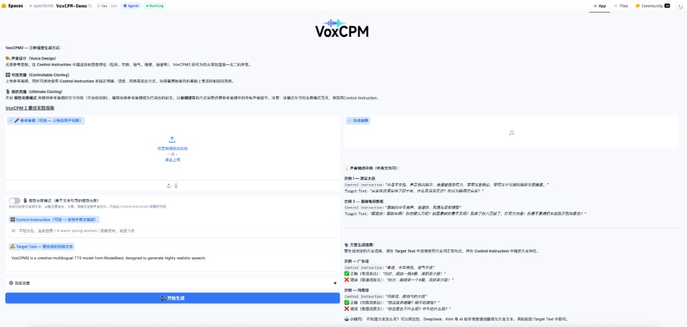

# 上传 5 秒声音就能克隆：VoxCPM2 在线试玩


> 开源 TTS · 在线体验 + 普通人 / 企业能做什么
>
> 技趣星球 · 用技术创造乐趣。
>
> 本文写作时间：2026 年 6 月 21 日。模型版本、在线 Demo 与部署方式可能更新，动手前以 [OpenBMB/VoxCPM](https://github.com/OpenBMB/VoxCPM) 与 [中文 README](https://github.com/OpenBMB/VoxCPM/blob/main/README_zh.md) 为准。

如果你用过系统自带的「机械女声」读文章，大概会同意：**TTS（文字转语音）和「像真人说话」之间，还隔着一条沟。**

最近面壁智能开源的 **[VoxCPM2](https://github.com/OpenBMB/VoxCPM)** 把这条沟填窄了一截：20 亿参数、**30 种语言 + 9 种中文方言**、**48kHz** 输出，还能**用一句话描述凭空设计音色**，或**上传一段参考音频做克隆**。代码和权重 **Apache-2.0**，可商用。

本文不讲论文，只回答三件事：**它到底能做什么、普通人能玩什么、企业部署能干什么**。想零安装先试，文末有在线 Demo 截图。

**难度：⭐⭐** — 打开 Hugging Face（国外 AI 模型社区，常叫 HF）上的在线 Demo 就能试；本地 `pip install` 或 GPU 部署属于 ⭐⭐⭐。

---

## 它是什么？能做什么

可以把 VoxCPM 理解成 **「会模仿、会设计声音的朗读员」**：

- 传统 TTS：选固定音色库，语气变化有限
- **VoxCPM2**：不先把声音切成离散 token，而是用**扩散自回归**直接在连续空间里生成语音，听起来更自然、更有情绪

**VoxCPM2 核心能力一览：**

| 能力 | 干什么 | 要不要参考音频 |
|------|--------|----------------|
| **多语言合成** | 中/英/日/韩/法/德等 **30 种语言**，还支持粤语、四川话等 **9 种方言** | 否 |
| **音色设计** | 用自然语言描述性别、年龄、情绪、语速，**凭空生成新声音** | 否 |
| **可控声音克隆** | 上传一段人声，保留音色，再用指令调情绪、快慢 | 是（短音频即可） |
| **极致克隆** | 给参考音频 + 准确文本，接着参考音频**无缝续读**，细节更像本人 | 是 + 转录文本 |
| **流式合成** | 边生成边播放，适合实时场景 | 视模式而定 |
| **微调** | 5～10 分钟音频即可 LoRA / 全参微调特定说话人 | 自备数据 |

输出 **48kHz** 音频；在 RTX 4090 上实时率（RTF）大约 **0.3**（加速引擎可低至 **~0.13**）。显存大约 **8GB** 量级。

> **合规提醒：** 声音克隆能力很强，**禁止**用于冒充他人、诈骗或虚假信息。官方要求对 AI 生成内容做明确标注。

---

## 普通人可以做什么

**不用写代码、不用买 GPU**，也能先玩起来：

### 1. 在线体验（推荐第一步）

打开 **[Hugging Face · VoxCPM Demo](https://huggingface.co/spaces/OpenBMB/VoxCPM-Demo)**。这是面壁官方挂在 Hugging Face 上的网页试用版：**不用装 Python、不用下模型**，浏览器里填词、点生成就能听。国内打开可能慢，可以换 [面壁官网体验页](https://voxcpm.modelbest.cn/)。

界面大致分三块：**参考音频**、**控制指令**、**目标文本**。右侧有示例和方言说明。



**你可以立刻试：**

| 想试什么 | 怎么填 |
|----------|--------|
| **音色设计** | 不上传参考音频；控制指令写「年轻女性，温柔，略带微笑」；目标文本写一段中文或英文 |
| **声音克隆** | 上传 5～15 秒清晰人声；目标文本写要让 TA 读的话 |
| **可控克隆** | 有参考音频 + 控制指令写「稍快一点，语气欢快一点」 |
| **极致克隆** | 打开「极致克隆模式」，上传参考音频并填对应文本 |
| **方言** | 目标文本用方言写法（如粤语口语），控制指令注明「粤语」 |

Demo 里还有「太后音」「斯内普教授」等**音色描述示例**，以及用 DeepSeek / Kimi 先把普通话改写成方言再粘贴的小技巧——适合当灵感，不必一次生成完美。

### 2. 本地一条命令试音色设计

有 Python 环境、有一块 NVIDIA 显卡（或 Apple Silicon 用 MPS）时：

```bash
pip install voxcpm
```

```bash
voxcpm design \
  --text "你好，这是 VoxCPM2 的音色设计演示。" \
  --control "年轻女声，温暖温柔，略带微笑" \
  --output out.wav
```

生成 `out.wav` 后用任意播放器听。Mac 无独显也能跑 CPU，只是会慢一些。

### 3. 普通人常见用途

- 给短视频 / 播客做**旁白初稿**，再人工微调
- 把文章段落转成**有声版**自己听
- 用**音色设计**给角色配不同声音（玄幻、科普、儿童故事）
- 用**短参考音频**做「像某类声音」的朗读（注意合规，别克隆真人未授权）

---

## 企业级部署可以做什么

当 Demo 不够用、要**并发、要 API、要进产品**时，官方给了两条成熟路径：

| 方案 | 适合谁 | 能做什么 |
|------|--------|----------|
| **[Nano-vLLM-VoxCPM](https://github.com/a710128/nanovllm-voxcpm)** | 需要高吞吐、FastAPI 自建服务 | 批量并发、异步 API；4090 上 RTF ~**0.13** |
| **[vLLM-Omni](https://github.com/vllm-project/vllm-omni)** | 要多租户、要对接现有 OpenAI 客户端 | `vllm serve openbmb/VoxCPM2 --omni`，暴露 **`/v1/audio/speech`**，兼容 OpenAI 调用方式 |

**企业典型场景：**

- **客服 / 外呼**：固定话术 + 可控克隆，统一品牌音色
- **有声内容产线**：批量把文稿转 48kHz 音频，多语言一条链路
- **App 内置朗读**：流式 API，边合成边播放
- **定制发言人**：用 **5～10 分钟**音频 LoRA 微调，适配专属嗓音或领域用语
- **多 GPU 扩容**：vLLM-Omni 侧 continuous batching、PagedAttention，适合线上峰值

国内拉模型可走 **ModelScope**（`OpenBMB/VoxCPM2`），减少 Hugging Face 超时。

部署前建议做：**场景测试 + 安全评估 + AI 生成标识**（官方 README 也这么写）。

---

## 和上一代比一眼

| | **VoxCPM2**（推荐） | VoxCPM1.5 | VoxCPM-0.5B |
|--|---------------------|-----------|-------------|
| 参数量 | 2B | ~0.6B | 0.5B |
| 语言 | **30 + 方言** | 中英 | 中英 |
| 音色设计 / 可控克隆 | ✅ | — | — |
| 采样率 | **48kHz** | 44.1kHz | 16kHz |
| 许可 | Apache-2.0 可商用 | 同左 | 同左 |

新项目直接用 **VoxCPM2** 即可；老项目若已跑 1.5，可按文档迁移。

---

## 资源链接

| 用途 | 链接 |
|------|------|
| 源码 | [github.com/OpenBMB/VoxCPM](https://github.com/OpenBMB/VoxCPM) |
| 中文说明 | [README_zh.md](https://github.com/OpenBMB/VoxCPM/blob/main/README_zh.md) |
| **Hugging Face 在线 Demo** | [huggingface.co/spaces/OpenBMB/VoxCPM-Demo](https://huggingface.co/spaces/OpenBMB/VoxCPM-Demo) |
| 国内体验 | [voxcpm.modelbest.cn](https://voxcpm.modelbest.cn/) |
| 文档 | [voxcpm.readthedocs.io](https://voxcpm.readthedocs.io/zh-cn/latest/) |
| 模型权重 | [Hugging Face](https://huggingface.co/openbmb/VoxCPM2) / [ModelScope](https://modelscope.cn/models/OpenBMB/VoxCPM2) |

---

## 不止 VoxCPM：AI 生成音频的工具越来越多

这两年 **AI 读稿、克隆、配音效** 的开源项目明显变多，也越做越像「能进产品」而不是 Demo 玩具。VoxCPM2 是面壁智能路线；同赛道里还有 OpenMOSS 的 **[MOSS-TTS 家族](https://github.com/OpenMOSS/MOSS-TTS)** —— 覆盖长文本朗读、多说话人对话、音色设计、环境音效、实时流式 TTS 等，48kHz 立体声、Nano 小模型甚至能在 **4 核 CPU** 上流式输出。

如果你已经在用 Agent / OpenClaw 一类工具链，MOSS-TTS 还提供了 **[OpenClaw API Skills](https://github.com/OpenMOSS/MOSS-TTS/blob/main/README_zh.md#openclaw-api-skills)**：在 ClawHub 安装 skill 后，可以直接调 MOSI 的 TTS API，例如 `moss-tts-voice` 生成语音，或 `feishu-voice-tts` 在飞书里发语音消息。API Key 在 [MOSI AI Studio](https://studio.mosi.cn) 申请。不想本地装 GPU，走 **云端 API + Skill** 也是一条路。

不必押宝某一个模型：先在线试听，再按场景选本地部署、API 或 Skill。这类工具半年一换名，隔一阵值得再扫一眼更新日志。

---

## 收个尾

我一般会这么分：

- **只想先听效果**：开 [Hugging Face 在线 Demo](https://huggingface.co/spaces/OpenBMB/VoxCPM-Demo)（或国内 [voxcpm.modelbest.cn](https://voxcpm.modelbest.cn/)）。在「控制指令」里写想要的声音，在「目标文本」里贴一段话，点「开始生成」。
- **想在自己电脑出文件**：`pip install voxcpm`，再跑 `voxcpm design`，得到 wav。
- **要接进产品、扛并发**：看 [Nano-vLLM-VoxCPM](https://github.com/a710128/nanovllm-voxcpm) 或 [vLLM-Omni](https://github.com/vllm-project/vllm-omni)，接口风格和 OpenAI 的语音 API 接近。

VoxCPM2 值得试，主要是因为多语言、音色设计和 48kHz 输出都开源可商用。语音模型更新很快，[MOSS-TTS](https://github.com/OpenMOSS/MOSS-TTS) 也在同一条赛道上；已经在用 Agent 的，可以看看 [OpenClaw API Skills](https://github.com/OpenMOSS/MOSS-TTS/blob/main/README_zh.md#openclaw-api-skills)，用云端 API 省得自己搭 GPU。

---

**你可以立刻做**：打开 [VoxCPM Demo](https://huggingface.co/spaces/OpenBMB/VoxCPM-Demo)，控制指令填「年轻女性，温柔」，目标文本贴 100 字左右，点「开始生成」听一遍。

---

技趣星球 · 用技术创造乐趣。
