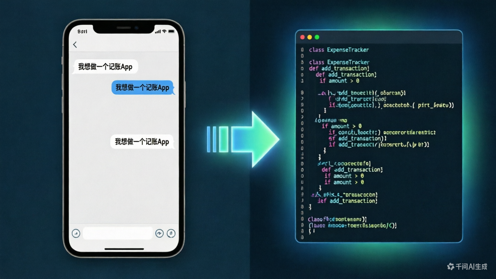
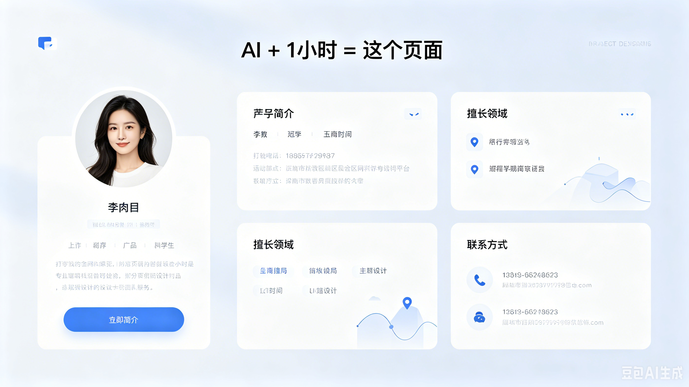
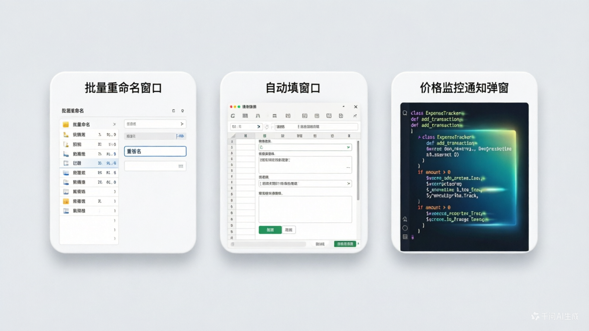
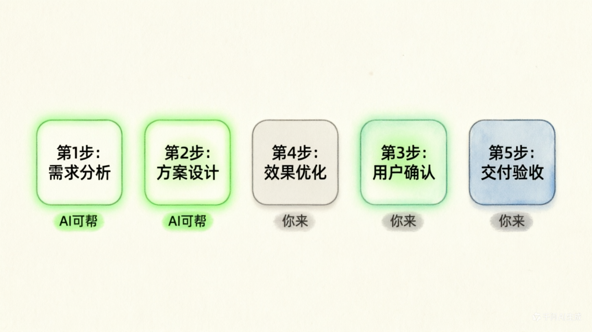
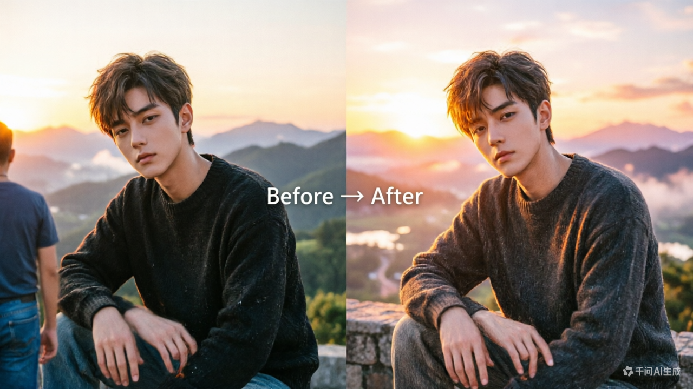
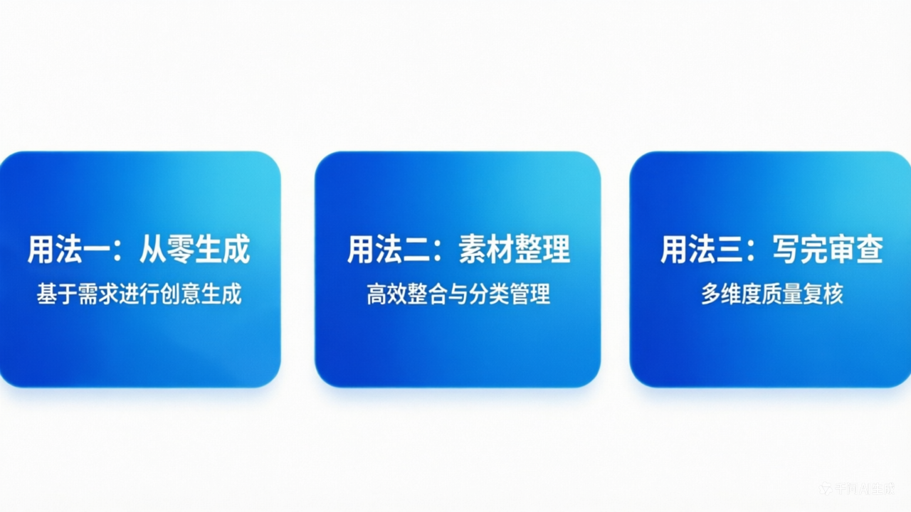

# 别再说「AI 跟我没关系」了：普通人能拿它做的 7 件事


╔══════════════════════════════════════════════════════════════╗
║   📱 App  🌐 网页  🛠 工具  🎵 音乐  🎬 视频  ✨ 特效  📝 报告  ║
╚══════════════════════════════════════════════════════════════╝

你有没有这样想过：

> 「AI 火了一两年了，好像很厉害，但跟我有什么关系？我又不写代码。」

或者更直接一点：

> 「我试过豆包，问了几句，感觉也就那样。」

如果你有这种感觉，不是 AI 不好用，是还没人告诉你它到底能帮你做什么。

**一句话结论：AI 不是程序员专属武器，它是你的私人创作工坊。做 App、搭网站、写工具、出音乐、剪视频、做特效、写报告——你不需要懂任何技术。**

今天就来把这件事说清楚。不画饼，不贩卖焦虑，每一件都是现在打开电脑就能做的事。

---

## 一图看懂：7 大场景速览


| # | 场景 | 你能得到什么 | 上手难度 |
|---|------|-------------|----------|
| 1 | 📱 制作 Android 应用 | 一个能安装到手机的 App | ⭐⭐⭐ |
| 2 | 🌐 制作网页 | 一个别人能访问的个人网站 | ⭐⭐ |
| 3 | 🛠 本地小工具 | 批量处理文件、自动填表的小程序 | ⭐⭐ |
| 4 | 🎵 做音乐 | 一首带歌词、有旋律的原创歌曲 | ⭐ |
| 5 | 🎬 制作视频 | 从脚本到成片的完整视频 | ⭐⭐ |
| 6 | ✨ 做特效 | 照片修图、动态效果、海报设计 | ⭐ |
| 7 | 📝 写报告 | 周报、调研、PPT、商业计划书 | ⭐ |

> 📊 **难度说明**（从零 IT 经验的普通人视角）
>
> ⭐ = 打开网页/App 就能用，不需要学任何东西
>
> ⭐⭐ = 需要装一个免费软件 + 看 5 分钟教程
>
> ⭐⭐⭐ = 需要装软件 + 复制代码 + 可能需要试一两次
>
> ⭐⭐⭐⭐ = 需要多个工具配合 + 有一些踩坑概率
>
> ⭐⭐⭐⭐⭐ = 需要专业知识，不建议零基础硬刚

---

## 场景一：📱 不用写一行代码，AI 帮你做 Android App &nbsp; `⭐⭐⭐`



### 也许你一直以为……

> 「做 App = 程序员 + 花几个月 + 花很多钱」

### 实际情况是——

现在你可以跟 AI 说一段话，它就能生成一个能用的 App。

比如你想做一个「家庭记账本」，你只需要告诉 AI：

```text
我想做一个简单的 Android 记账 App，功能：
1. 能记录收入和支出，选分类（吃饭、交通、购物……）
2. 首页显示本月总支出和剩余预算
3. 能查看历史账单列表
4. 界面简洁大方，白底蓝按钮

请给我完整的代码，并告诉我怎么在手机上安装。
```

**你不需要理解任何一行代码。** 你只需要：

```
① 把AI给的代码复制到工具里
        ↓
② 点一下「打包」
        ↓
③ 手机安装，完成 🎉
```

> 💡 **核心心法**：你负责「想清楚要什么」，AI 负责「把想法变成代码」。越具体的要求，出来的效果越好。

### 会用到的工具

| 工具 | 做什么 | 费用 |
|------|--------|------|
| **Claude Code / Cursor** | AI 写代码的最强主力，说话就能出 App | 有免费额度 |
| **Android Studio** | 把代码打包成 App 装到手机 | 免费 |
| **ChatGPT / Claude / 豆包** | 让 AI 出方案、写代码、改 Bug | 免费额度起步 |

---

## 场景二：🌐 从零到上线，AI 帮你搭一个网页 &nbsp; `⭐⭐`


### 啥都不会？没问题。

你是不是也被人说过「这年头每个人都该有个个人网站」？但一想到要学 HTML、CSS、域名、服务器……算了。

现在不用。你只需要告诉 AI：

```text
帮我做一个个人主页，风格简洁清新。
内容包括：
- 头像和名字
- 一句个人简介
- 我的擅长领域（写作 / 摄影 / 设计）
- 联系方式
- 底部加一句「由 AI 辅助制作」

颜色用浅蓝 + 白色，字体要大一点，适合手机看。
```

**几分钟后，你就有了一页漂亮的个人网站。** 后续要改什么，继续跟 AI 说就行：把背景换成渐变色、加一个作品展示区、加一个留言板……AI 改代码比你改 Word 文档还快。

### 会用到的工具

| 工具 | 做什么 | 费用 |
|------|--------|------|
| **ChatGPT / Claude** | 生成网页代码 | 免费 |
| **GitHub Pages / Vercel** | 免费网页托管，一键上线 | 免费 |
| **VS Code（免费编辑器）** | 复制粘贴代码预览效果 | 免费 |

---

## 场景三：🛠 让 AI 写一个本地小工具 &nbsp; `⭐⭐`

这是 7 个场景里**最实用**的一个。因为小工具解决的是你每天的重复劳动。

### 举几个立刻就能用的例子



| 你每次手动做的事 | AI 帮你做的工具 |
|-----------------|----------------|
| 把 100 张图片重命名 | 一个批量重命名工具，拖进去就行 |
| 把 Excel 数据复制粘贴到 Word 模板 | 一个自动填表脚本 |
| 定期去某个网站看价格变化 | 一个价格监控提醒工具 |
| 把 PDF 里的表格提取出来 | 一个 PDF 表格提取器 |
| 一键把文件夹里的图片全部压缩 | 一个图片批量压缩工具 |

还是那句话：

```text
我想做一个批量重命名图片的工具：
- 支持拖入文件夹
- 可以按「日期+序号」格式重命名
- 支持预览改名效果
- 点一下确认就全部改好
请给我完整的代码。
```

> 🧠 **一个比喻**：AI 写小工具，就像你请了一个「会写程序的秘书」。你描述流程，它把流程变成工具。你不懂编程，但你懂自己的需求——这就够了。

---

## 场景四：🎵 零基础做一首歌 &nbsp; `⭐`


这个场景可能是最让人惊喜的。

你不需要会任何乐器，不需要懂五线谱。AI 能做三件事：

```
  ✍️ 写歌词           🎼 生成旋律          🎤 合成演唱
告诉它主题和风格      选流行/古风/电子     AI用虚拟人声
    ↓                    ↓                把歌词唱出来
  30秒出词             AI出曲子
```

比如你输入：

```text
帮我写一首歌，主题是「加班到深夜的打工人」。
风格：轻快的民谣，带一点自嘲和幽默。
歌词要接地气，不要文绉绉的。
```

> 几分钟后你就会有一首「听起来还像那么回事」的歌。不一定能上排行榜，但足够你发朋友圈收获一堆「这也行？？？」的评论。

### 会用到的工具

| 工具 | 做什么 |
|------|--------|
| **Suno / Udio** | AI 生成音乐（输入歌词直接出歌） |
| **ChatGPT / Claude** | 写歌词主力 |
| **剪映** | 给歌曲配个简单视频，发视频平台 |

---

## 场景五：🎬 从脚本到成片，AI 辅助做视频 &nbsp; `⭐⭐`

做视频最累的从来不是按录制键，而是**前面的策划和后面的剪辑**。

AI 正好在这两步上帮你大忙：

```
  📋 策划 ────→ ✍️ 脚本 ────→ 🎥 录制 ────→ ✂️ 剪辑 ────→ 📤 发布
    ✅ AI可帮      ✅ AI可帮      🙋 你来      ✅ AI可帮      🙋 你来
```



### AI 能帮你做的：

```
❶ 选题策划
「我是做职场干货的博主，目标观众是 25-35 岁上班族。
  帮我列 10 个能引发共鸣的视频选题，每个带一句话标题。」

❷ 写脚本
「帮我写一个 3 分钟的口播脚本，讲『面试时怎么谈薪资』，
  要有开头悬念、中间 3 个方法、结尾行动号召。」

❸ 自动剪辑
- 剪映「智能字幕」：语音自动转字幕，识别准确率很高
- AI 自动切镜头、去口癖、加背景音乐
```

> ⚡ **省流结论**：做视频最磨人的几步，AI 都能帮你。你只需要负责对着镜头说。

---

## 场景六：✨ 不会设计？AI 帮你做特效和设计 &nbsp; `⭐`



不需要学 PS，不需要学 AE。你能做的事包括：

| 你想要的 | 怎么做 |
|---------|--------|
| 把一张老照片变清晰 | 上传到 AI 修图工具 → 一键增强 |
| 去掉照片里的路人 | 圈一下路人 → AI 自动消除 |
| 把照片背景换成海边/雪山 | 选一张图 → AI 自动抠图换背景 |
| 做一张活动海报 | 告诉 AI 主题和文字 → 自动生成设计稿 |
| 让照片里的人跳舞/说话 | 上传照片 → AI 生成动态视频 |

> 💬 你唯一要学的「技能」：**学会把想法说清楚。** 剩下的，AI 干。

---

## 场景七：📝 让 AI 帮你写报告、做 PPT &nbsp; `⭐`

这个场景覆盖了最多的人：上班族、学生、创业者、自由职业者。

### AI 写报告的三种用法

```
┌─────────────────┐    ┌─────────────────┐    ┌─────────────────┐
│   用法 ①        │    │   用法 ②        │    │   用法 ③        │
│   从零生成       │ →  │   素材整理       │ →  │   写完审查       │
│                 │    │                 │    │                 │
│ 告诉AI背景和目标 │    │ 把碎片信息丢给它 │    │ 让它扮演挑剔读者 │
│ 它帮你搭好框架   │    │ 它帮你理清结构   │    │ 挑漏洞和不合理处 │
└─────────────────┘    └─────────────────┘    └─────────────────┘
```



**用法 1：从零生成**
```
我是一名销售主管，需要写一份 Q2 季度工作总结。
内容包括：业绩回顾、团队情况、问题分析、下季度计划。
语气正式但不死板，控制在 1500 字以内。
```

**用法 2：给你零碎信息，让它整理**
```
下面是我这周干的活的碎片：
- 见了 3 个客户，签了 1 家
- 做了竞品分析 PPT（附在附件里）
- 团队开了 2 次会讨论新方案
- 整理了客户反馈，共收到 45 条

请帮我整理成一份周报，结构清晰，发给总监看的。
```

**用法 3：写完让它审**
```
这是我写的一份项目方案，请你扮演挑剔的投资人，
挑出逻辑漏洞、数据不清晰的地方、过度乐观的表述。
```

---

## 🧰 附：AI 工具速查表


### 🗣️ 对话型 AI（聊天、写作、编程、头脑风暴）

> 💡 **普通用户看这里**：国内模型完全够用，免费、直接访问、中文体验好。海外模型能力更强，但需要特殊网络环境且基本收费，有需要再折腾。

**🇨🇳 国内直连（推荐普通用户从这里开始）**

| 工具 | 一句话介绍 | 费用 |
|------|-----------|------|
| **豆包** | 字节出品，中文对话体验好，有 App | 免费 |
| **通义千问** | 阿里出品，支持长文档、图片理解 | 免费 |
| **Kimi** | 月之暗面出品，能读超长文档 | 免费 |
| **DeepSeek** | 国产开源，推理能力强，性价比高 | 免费 |
| **文心一言** | 百度出品，国内生态整合好 | 免费 |
| **混元** | 腾讯出品，微信生态内可用 | 免费 |
| **智谱 GLM / 清言** | 清华系，代码和推理能力强 | 免费额度 |
| **MiMo（小米）** | 小米出品，MiMo V2.5 主打复杂推理和专业任务 | 开放平台体验 |

**🌐 海外模型（需要特殊网络环境，基础功能免费但有限额，进阶功能收费）**

| 工具 | 一句话介绍 | 费用 |
|------|-----------|------|
| **ChatGPT** | OpenAI 出品，最知名，功能全面 | 免费有限额，Plus $20/月 |
| **Claude** | Anthropic 出品，长文写作和代码分析强 | 免费有限额，Pro $20/月 |
| **Gemini** | 谷歌出品，与 Google 全家桶深度整合 | 免费有限额，Advanced 收费 |
| **Grok** | xAI（马斯克）出品，接入 X 平台实时信息 | 需 X Premium 订阅 |
| **Llama（Meta）** | Meta 开源模型，可本地部署，不依赖网络 | 开源免费 |
| **Copilot** | 微软出品，内置于 Windows / Office / Edge | 免费有限额 |

> ⚠️ **注意**：海外模型会检测访问来源，部分 IP 可能无法注册或使用，遇到问题换个节点试试。

> 🔑 **想用海外模型？先解决「通道」问题。** 简要说明见系列第 2 篇文末；也可关注后回复 **`KXSW`** 获取订阅地址（仅限个人学习新技术，请遵守法律法规）。

> 📌 **这个表会过时。** AI 发展太快，每隔几个月就有新模型冒出来，各家侧重点也不一样——有的擅长写作，有的擅长推理，有的擅长代码。不用追着每个都试，找一两个顺手的用熟就够了。我最近在体验小米新出的 **MiMo V2.5**，主打复杂推理和专业任务，感兴趣可以用我的邀请码 `3LTVTC` 注册 [MiMo 开放平台](https://platform.xiaomimimo.com?ref=3LTVTC)，新用户双方各得 ¥10 体验金（注册后在控制台左下方填入，40 天有效）。
>
> 另外，**DeepSeek V4 Pro 五月有限时折扣**，现在用是个好时机。这类消息稍纵即逝，后续有新模型上线、免费额度、限时折扣，我都会第一时间发出来——关注博主不吃亏。

### 🎨 AI 绘画 & 设计

| 工具 | 一句话介绍 |
|------|-----------|
| **Midjourney** | 艺术风格最强，出图质量高 |
| **即梦 / 堆友** | 字节系，国内方便，免费额度多 |
| **Canva AI** | 自带 AI 设计功能，做海报/PPT |
| **通义万相** | 阿里出品，中文提示词友好 |

### 🎬 AI 视频 & 音频

| 工具 | 一句话介绍 |
|------|-----------|
| **剪映** | 内置 AI 字幕、AI 剪辑 |
| **Suno** | AI 音乐生成，输入歌词出歌 |
| **可灵** | 快手的 AI 视频生成 |
| **HeyGen** | 数字人播报，照片开口说话 |

### 🛠 AI 编程（做 App / 网页 / 小工具）

| 工具 | 一句话介绍 |
|------|-----------|
| **Claude Code** | 编程能力最强，命令行里说话就能写项目 |
| **Cursor** | AI 编程工坊，所见即所得，新手友好 |
| **GitHub Copilot** | 微软 OpenAI Codex 驱动，VS Code 里直接用 |
| **Replit** | 在线编程，浏览器里就能做，零安装 |

---

## ⚠️ 说点实在的：AI 也有软肋

在兴奋地打开工具之前，有几件事你要知道：

### ❌ 不要做这些

```
┌─────────────────────────────────────────────────────────────┐
│  🔒 不要把身份证、合同、客户名单直接发给 AI                   │
│     ——你的数据可能被用于训练                                  │
├─────────────────────────────────────────────────────────────┤
│  🔍 不要 100% 相信 AI 给的事实                                │
│     ——数字、政策、法律条款，要二次核对                         │
├─────────────────────────────────────────────────────────────┤
│  📝 不要指望一次对话就出完美成品                               │
│     ——AI 是好的第一稿，但你需要把关                           │
├─────────────────────────────────────────────────────────────┤
│  😌 不要觉得「不会用 = 笨」                                   │
│     ——会用 AI 不是什么高级技能，就是一个新工具                  │
└─────────────────────────────────────────────────────────────┘
```

### ✅ 记住这条金线

> **你负责判断、把关、做决定。AI 负责打草稿、跑腿、做重复劳动。**

---

## 📌 今天的小结

今天只需要记住三件事：

- **AI 不是程序员专属**——做 App、搭网站、写工具、出音乐、剪视频、做特效、写报告，普通人全都能上手
- **你只需要学会「描述需求」**——把你想做的事说清楚，AI 就能帮你做出来
- **从今天就能开始**——打开任何一个免费 AI 工具，用文中的提示词试一次

现在就可以试：打开豆包或 Kimi，把下面这句话发给它，看看它给你什么：

```text
帮我写一份这周的工作周报框架，我是做销售的，本周见了 3 个客户。
```

不用想太多，发出去就是了。

> 下一期：**[AI 名词大白话扫盲](../ai-terms-plain-language/index.md)**——搞懂大模型、Prompt、Agent 都在说什么。
>
> 📌 关注后回复「**工具箱**」获取本文所有工具的官网链接合集。
>
> 📌 需网络通道配置：回复 **`KXSW`**（学习用途，详见第 2 篇附节）。

*有问题？评论区告诉我，下篇可能就从你的问题写起。*

*如果这篇对你有用，转发给你那个「还在犹豫要不要试试 AI」的朋友。*

---

*本文插画由 [即梦 AI](https://jimeng.jianying.com) 和 [通义万相](https://tongyi.aliyun.com/wanxiang) 生成。*
